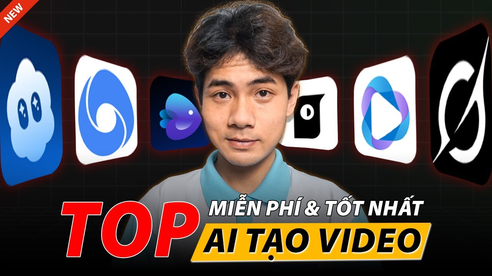

# 6 App Tạo Video AI Tốt Nhất 2025: Cái Nào Thực Sự Đáng Tiền?

---

## 🔥 Hook

<iframe width="100%" class="aspect-video mt-4 mb-8 rounded-lg shadow-lg" src="https://www.youtube.com/embed/bIgtrveSh1M" frameborder="0" allowfullscreen></iframe>

**Sora ra mắt với tất cả sự kỳ vọng — rồi người dùng thực tế quay sang dùng Kling và Veo3 nhiều hơn.** Đó không phải ngẫu nhiên.

---

## 📍 Context

Thị trường video AI đang bùng nổ theo đúng nghĩa đen: chỉ trong 6 tháng đầu 2025, ít nhất 4 model lớn ra mắt hoặc nâng cấp đáng kể — Kling 2.5/2.6/3.0, Veo3, Seedance 2.0, Sora. Nhưng nhiều app ≠ nhiều lựa chọn tốt hơn.

Với người làm content thực chiến — affiliate, ads, review sản phẩm — câu hỏi không phải *"app nào ngầu nhất"*, mà là *"app nào ra video dùng được ngay, không mất cả buổi sáng để fix"*.

Bài này sẽ trả lời thẳng vào câu hỏi đó.

---

## 📋 Danh Sách

---

### 1. 🎬 Kling 2.5 / 2.6 / 3.0 — Ngựa chiến thực chiến nhất hiện tại

**Điểm nổi bật:**
Kling của Kuaishou là model hiếm hoi có *vòng lặp upgrade nhanh* — từ 2.5 lên 3.0 chỉ trong vài tháng, mỗi version đều sửa được pain point thực. Kling 2.6 xử lý chuyển động tay và khuôn mặt tốt hơn 2.5 rõ rệt. Kling 3.0 nâng độ dài clip và độ nhất quán nhân vật lên đáng kể.

**Ví dụ cụ thể:**
Làm video unboxing sản phẩm Shopee? Kling render cảnh tay cầm sản phẩm, xoay sản phẩm — thứ mà nhiều tool khác vẫn bị biến dạng kiểu "bàn tay 7 ngón". Motion physics của Kling 3.0 đủ tốt để dùng cho ads không cần disclaimer.

**Khi nào nên dùng:**
- Video sản phẩm ngắn (15–30 giây) cho TikTok/Reels
- Content lifestyle, fashion, F&B
- Cần render nhanh, volume lớn trong ngày

> ⚠️ Kling vẫn gặp khó với cảnh group nhiều người — nếu cần 3+ nhân vật tương tác, kỳ vọng thấp vào.

---

### 2. 🌐 Veo3 (Google) — Khi âm thanh quan trọng hơn bạn nghĩ

**Điểm nổi bật:**
Veo3 là tool duy nhất trong list này *generate audio cùng lúc với video* — nhạc nền, tiếng động, thậm chí lời thoại. Đây là lợi thế cực kỳ lớn mà nhiều người chưa khai thác hết.

Theo so sánh thực tế từ nhiều creator (bao gồm video "VEO3 vs Sora vs Grok" đang viral), Veo3 vượt Sora về *cinematic feel* và *audio sync* trong phần lớn test case.

**Ví dụ cụ thể:**
Tạo một clip 8 giây quảng cáo nước hoa: cảnh chai lọ dưới ánh sáng vàng, tiếng nhạc ambient nhẹ, voiceover thì thầm — Veo3 làm được trong một lần prompt, không cần ghép âm thanh riêng.

**Khi nào nên dùng:**
- Short-form ads cần cảm giác "brand film"
- Content cần mood cụ thể (ASMR, luxury, cinematic)
- Khi bạn không có budget thuê sound designer

> ⚠️ Veo3 nặng về compute, thời gian render lâu hơn Kling. Không phù hợp khi cần xuất 20 clip trong một ngày.

---

### 3. 🍌 Seedance 2.0 (ByteDance) — Tân binh đáng theo dõi

**Điểm nổi bật:**
ByteDance ra mắt Seedance 2.0 quốc tế ngay lúc OpenAI đang chịu áp lực cạnh tranh — timing không phải ngẫu nhiên. Seedance 2.0 được đánh giá xử lý *motion fluidity* tốt, đặc biệt với cảnh người chuyển động (đi, chạy, nhảy).

ByteDance có dataset khổng lồ từ TikTok — điều này cho Seedance 2.0 lợi thế tự nhiên với *vertical short-form content*.

**Ví dụ cụ thể:**
Cảnh người đi dạo phố, ánh đèn ban đêm — Seedance 2.0 render chuyển động tự nhiên hơn hẳn so với các model cũ. Phù hợp với style "street cinematic" đang trend trên TikTok VN.

**Khi nào nên dùng:**
- TikTok content cần chuyển động người thực tế
- Thử nghiệm A/B với chi phí thấp hơn Veo3
- Cần video dọc 9:16 chuẩn mobile

> ⚠️ Seedance 2.0 vẫn còn mới — consistency giữa các lần render chưa ổn định bằng Kling. Test kỹ trước khi dùng cho campaign lớn.

---

### 4. ✈️ Runway Gen-3 — Không phải hot nhất, nhưng controllable nhất

**Điểm nổi bật:**
Runway không phải model mạnh nhất về visual quality năm 2025 nữa — nhưng nó vẫn là tool *dễ kiểm soát kết quả nhất*. Motion brush, camera control, inpainting video — những feature này vẫn ít tool khác làm được mượt như vậy.

Theo VnExpress, Runway vẫn nằm trong top 3 tool thay thế Sora được ưa chuộng — không phải vì nó "đẹp hơn", mà vì người dùng biết mình sẽ nhận được gì.

**Ví dụ cụ thể:**
Bạn có footage thực, muốn AI extend thêm 3 giây hoặc thay background? Runway làm điều này đáng tin hơn hầu hết đối thủ. Đặc biệt hữu ích khi kết hợp footage quay tay với AI.

**Khi nào nên dùng:**
- Hybrid workflow: kết hợp video thực + AI
- Cần edit frame-level (không chỉ text-to-video)
- Agency cần deliverable nhất quán cho client

> ⚠️ Giá Runway cao hơn mặt bằng. Nếu chỉ cần text-to-video thuần, Kling hoặc Veo3 cost-effective hơn.

---

### 5. 📝 Pictory — Cho content volume, không phải cinematic

**Điểm nổi bật:**
Pictory chơi ở phân khúc khác hoàn toàn: *text-to-video với stock footage + voiceover*. Không phải AI generate from scratch — nhưng nếu bạn cần tạo 10 video giải thích sản phẩm mỗi ngày, Pictory là pipeline nhanh nhất.

Pictory mạnh về *script-to-video workflow*: paste blog post hoặc script → tự động ghép cảnh, thêm subtitle, xuất video có caption.

**Ví dụ cụ thể:**
Affiliate marketer cần video review sản phẩm cho YouTube với format "Top 5 lý do nên mua X" — Pictory có thể tạo khung xương trong 10 phút, bạn chỉ cần fine-tune.

**Khi nào nên dùng:**
- YouTube content dài (3–10 phút) cần volume
- Repurpose blog post → video
- Khi ngân sách thấp nhưng cần output đều đặn

> ⚠️ Output của Pictory trông như "video template" — khó cạnh tranh về aesthetics với AI-generated content từ Kling hay Veo3.

---

### 6. 🚫 Sora (OpenAI) — Tại sao nó KHÔNG đứng đầu list này

**Điểm nổi bật:**
Sora ra mắt với hype cực lớn cuối 2024. Visual quality ấn tượng trong demo. Nhưng thực tế dùng hàng ngày? Slow render, quota thấp ở plan phổ thông, và quan trọng nhất: *người dùng thực tế đang chọn Kling và Veo3 nhiều hơn* — đây là tín hiệu thị trường không thể bỏ qua.

**Ví dụ cụ thể:**
Các so sánh head-to-head năm 2025 (VEO3 vs Sora vs Grok) đều cho thấy Veo3 vượt Sora về cinematic output, còn Kling vượt về tốc độ và controllability. Sora vẫn tốt ở một số cảnh cụ thể — nhưng không đủ để justify nếu bạn đang optimize workflow.

**Khi nào nên dùng:**
- Bạn đã quen ecosystem OpenAI và muốn giữ workflow thống nhất
- Cần output cho portfolio cá nhân, không cần volume
- Khi các tool kia đang downtime và bạn cần backup

> Sora không tệ. Nó chỉ chưa xứng với kỳ vọng — và trong thị trường này, "chưa xứng kỳ vọng" đồng nghĩa với "không phải lựa chọn đầu tiên".

---

## ❓ FAQ — Hỏi Đáp Nhanh Về Thị Trường AI Video 2025

**1. Tool nào hỗ trợ Tiếng Việt (prompt) tốt nhất?**
Thực tế là: **Không tool nào cả.** Dù các trang chủ có dịch ra tiếng Việt, lõi AI bên dưới vẫn được huấn luyện chủ yếu bằng Tiếng Anh (và Tiếng Trung với trường hợp Kling/Seedance). Nếu bạn gõ Prompt tiếng Việt, hệ thống thường dùng Google Translate ngầm để dịch sang tiếng Anh rồi mới gen. Để video chuẩn nhất, hãy tập thói quen dịch Prompt sang tiếng Anh (hoặc nhờ ChatGPT dịch hộ).

**2. Tôi chỉ có ngân sách nhỏ, nên nuôi tài khoản tool nào?**
Nếu ngân sách chỉ quanh mức 300k - 500k/tháng, bạn không nên đăng ký thẳng các nền tảng quốc tế (thường tốn tối thiểu $15 - $20, tức 400-500k chưa kể phí quẹt thẻ mập mờ). Giải pháp tiết kiệm nhất hiện nay là mua gói credit tại các nền tảng tổng hợp (API Aggregator) ở Việt Nam. Bạn có 500k nhưng có thể dùng cả Kling, Veo3 và Seedance tuỳ thích mà không lo bị khoá thẻ.

**3. Tool nào render video trên 1 phút tốt nhất?**
Hiện nay hầu hết AI chỉ xử lý tốt nhất ở mức 5-10s. Kling 3.0 hỗ trợ ghép nối prompt để kéo dài video lên 3 phút, nhưng độ nhất quán (Consistency) sẽ giảm dần về cuối. Các editor chuyên nghiệp thường gen nhiều đoạn 5s sau đó ráp lại trên CapCut để kể chuyện thay vì ép AI tạo hẳn 1 video dài.

---

## 💎 Pro-Tips: Lời Khuyên Tối Ưu Cho Content Creator

1. **Test Prompt Bằng Image Trước (Mồi Ảnh):** Đừng gõ chữ thẳng vào mục Text-to-Video. Cách đỉnh cao nhất là dùng Midjourney hoặc Flux để tạo ra 1 bức ảnh tĩnh cực kỳ sắc nét. Sau đó tải ảnh đó lên các tool dùng tính năng Image-to-Video. Điều này giúp bạn làm chủ 100% ánh sáng, khuôn mặt nhân vật mà không phó mặc cho AI tự biên tự diễn.
2. **Luôn Upscale (Phóng To) Sau Cùng:** Đừng ép app Video AI tạo thẳng ra độ phân giải 4K (chi phí token cực kỳ đắt). Hãy gen ở mức 720p hoặc 1080p, nếu ưng chuyển động rồi mới vứt qua Topaz Video AI để kích nét lên 4K. Vừa rẻ vừa chuyên nghiệp.

---

## 💡 Takeaway

**Pattern bạn cần nhớ:**

> **Không có tool nào thắng tất cả — nhưng có tool phù hợp với từng workflow.**

- **Cần speed + volume** → Kling 2.6/3.0
- **Cần cinematic + audio** → Veo3
- **Cần controllability** → Runway
- **Cần TikTok-native** → Seedance 2.0
- **Cần script-to-video nhanh** → Pictory

Bài học thực tế nhất: *đừng dùng một tool cho tất cả mọi thứ*. Người làm content thắng trong 2025 là người biết ghép đúng tool vào đúng bước trong pipeline — không phải người trung thành với một app.

Một lưu ý quan trọng: AI tạo video mạnh đến đâu, nội dung vẫn phải trung thực. Case nữ YouTuber dùng AI dựng video fake gây sốc ở Đà Lạt là bài học đắt giá — platform ngày càng siết, và reputation mất là mất lâu dài.

---

## 🚀 CTA

**Kling 2.5/2.6/3.0, Veo3, và Seedance 2.0 đều có trên [tramsangtao.com](https://tramsangtao.com)** — không cần đăng ký tài khoản riêng từng platform, không cần VPN, không cần thẻ visa quốc tế.

Nếu bạn đang phân vân giữa Kling và Veo3 cho campaign tiếp theo, cách nhanh nhất là **thử cùng một prompt trên cả hai** — mất 10 phút, tiết kiệm được quyết định sai cả tuần.

→ **[Thử ngay tại tramsangtao.com](https://tramsangtao.com)**

---

*Cập nhật lần cuối: 2025 | Dựa trên test thực tế và so sánh cộng đồng creator VN*