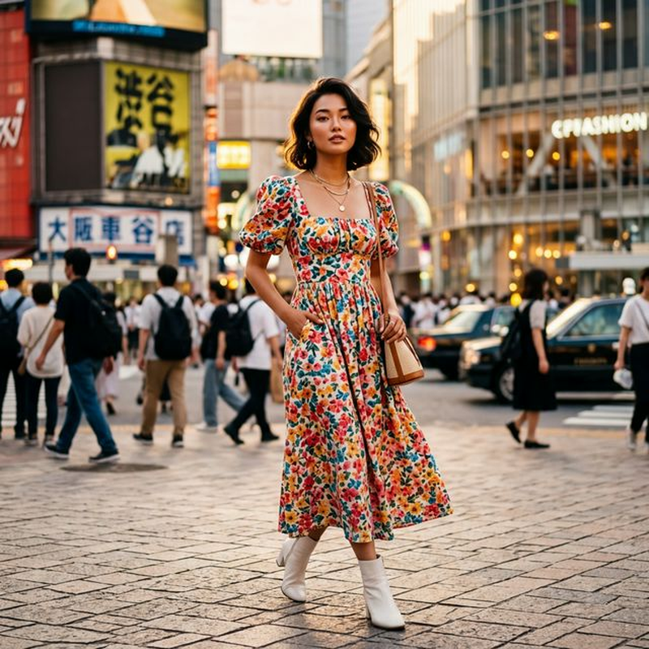
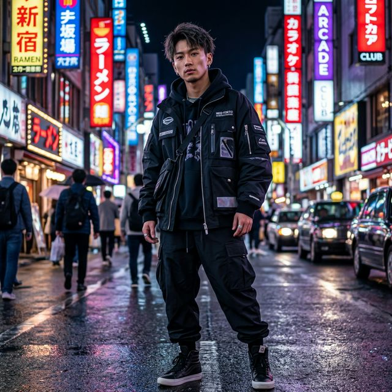
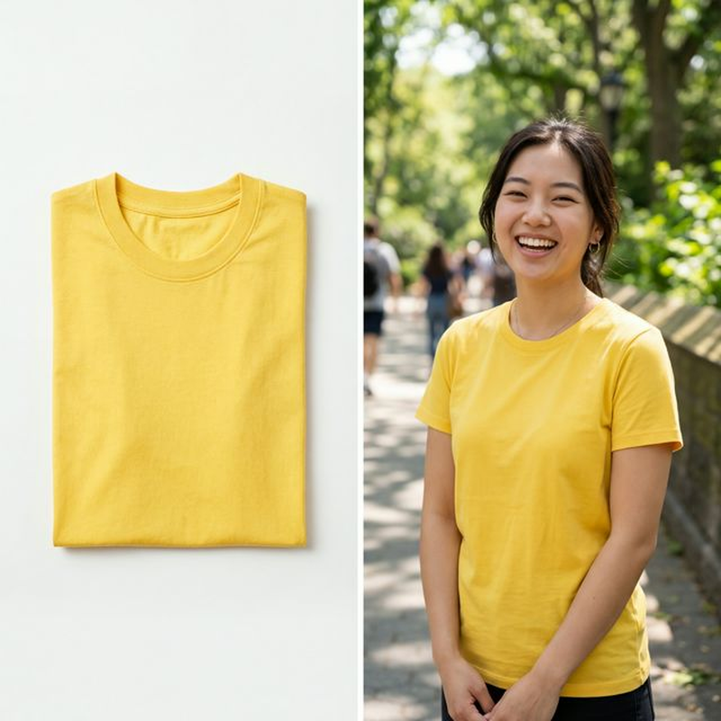
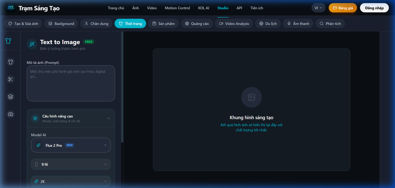

# Cách Tạo Ảnh Mẫu AI Thời Trang & Lookbook 0 Đồng (Tiết Kiệm Tới Vài Triệu Đồng)

Chi phí thuê người mẫu thật, trang điểm, ekip chụp ảnh, studio, và hậu kỳ cho một bộ sưu tập thời trang thường tiêu tốn hàng chục đến hàng trăm triệu đồng. Đây là bài toán cực kỳ đau đầu cho các chủ shop online, local brand, hay nhà bán hàng trên Shopee/TikTok Shop.

Bài viết này sẽ hướng dẫn bạn cách **tạo ảnh model AI thời trang chuyên nghiệp** bằng công nghệ FLUX, Seedream và Nano Banana Pro trên [Trạm Sáng Tạo](https://tramsangtao.com). Thật tuyệt vời khi bạn có thể tự tay sản xuất hàng loạt Lookbook tại nhà thay thế hoàn toàn những buổi photoshoot đắt đỏ và tốn thời gian. Đặc biệt, hệ thống đang cho phép **dùng thử miễn phí 0 đồng** để bạn an tâm trải nghiệm ngay!

---

## Tại Sao Mẫu Ảnh AI Đang Thay Thế Người Mẫu Thật?

Việc sử dụng **người mẫu AI thời trang Việt Nam** mang lại 3 lợi ích khổng lồ:

1. **Chi phí bằng 0 (hoặc cực kỳ rẻ):** Không cần trả cát-xê 5-10 triệu/buổi cho mẫu, không tiền make-up, không thuê studio. Chi phí tạo 1 bức ảnh AI chỉ khoảng ~200 - 350 VNĐ.
2. **Thời gian real-time:** Ra mắt thiết kế mới buổi sáng, buổi chiều bạn đã có 100 tấm ảnh người mẫu đa dạng phong cách, concept từ châu Á đến châu Âu, từ street-style đến luxury.
3. **Không dính phốt / scandal:** Người mẫu ảo luôn hoàn hảo và không bao giờ gặp rắc rối đời tư làm ảnh hưởng đến thương hiệu của bạn.

---

## So Sánh Các Giải Pháp Hình Ảnh Cho Shop Thời Trang

Nếu bạn đang bán hàng trên Shopee/TikTok, bạn có 3 lựa chọn chính để làm hình ảnh sản phẩm:

| Tiêu chí | Thuê Mẫu Thật & Studio | Midjourney (AI ngoại) | Trạm Sáng Tạo (FLUX & Nano Banana) |
|---|---|---|---|
| **Mục đích** | Hình ảnh truyền thống | Tạo nghệ thuật | **Tạo Lookbook & Chụp sản phẩm** |
| **Độ chân thực mặt** | Người thật 100% | Cực nét nhưng hay bị ảo | **Rất giống người thật (Photorealistic)** |
| **Giữ thiết kế quần áo**| Chính xác 100% | Dễ bị AI tự vẽ lại sai | **Tool Inpainting giữ 100% chuẩn xác** |
| **Tính chủ động** | Chờ lịch mẫu, nháy, sửa ảnh | Tự làm bất cứ lúc nào | **Giao diện Tiếng Việt dễ dùng, 10s/ảnh** |
| **Chi phí** | Hàng chục triệu/đợt | $10 - $30/tháng | **Cực rẻ: Nano Banana chỉ 12 credits/ảnh** |

**Kết luận:** Với các Local Brand cần hình ảnh sang xịn mịn chạy Ads nhưng muốn tối ưu ngân sách tối đa, các model AI trên [Trạm Sáng Tạo](https://tramsangtao.com/image) là lựa chọn tuyệt vời nhất. Cụ thể, model **Nano Banana Pro** cho ra chất lượng xuất sắc với mức giá siêu bèo (chỉ từ ~200 VNĐ/ảnh).

*Mẫu nam Châu Á cực ngầu được sinh ra từ model Nano Banana Pro.*

---

## 3 Bước Tạo Ảnh Mặc Quần Áo AI Chuyên Nghiệp (Virtual Try-on)

Tính năng "Thay đồ cho người mẫu ảo" (Virtual Try-on) trên Trạm Sáng Tạo giúp biến một tấm ảnh quần áo trải sàn/treo móc thành ảnh ai đó đang mặc.

### Bước 1: Chuẩn Bị Nguyên Liệu

- Một tấm ảnh quần áo của bạn chụp nền trơn (ảnh treo móc hoặc trải sàn).
- Hoặc, ảnh người mẫu đang mặc nhưng bạn muốn đổi bối cảnh, đổi mặt người mẫu (từ mẫu Tây sang mẫu Á).

*Chỉ từ 1 chiếc áo chụp trải sàn, AI tự động mặc lên người mẫu thật rạng rỡ.*

### Bước 2: Chọn Model và Tùy Chỉnh

Truy cập [Trạm Sáng Tạo - Mục Ảnh](https://tramsangtao.com/image). Bạn có thể chọn các model sau tuỳ nhu cầu:
- **Nano Banana Pro**: Giải pháp tiết kiệm (chỉ 12 credits), tốc độ siêu nhanh mà da dẻ mẫu vẫn cực kỳ chân thực.
- **FLUX 1.1 Pro**: Chuyên trị các chi tiết khó (vải ren, ngón tay), độ nét đỉnh cao.
- **Seedream**: Cực kỳ phù hợp cho phong cách ảnh tỷ lệ vàng, nghệ thuật.

- Chọn tab **Tạo ảnh từ ảnh (Image-to-Image)**.
- Upload ảnh quần áo của bạn.

### Bước 3: Nhập Prompt Tiếng Việt

Phần lớn các AI khác yêu cầu bạn viết prompt tiếng Anh rất mệt mỏi. Với Trạm Sáng Tạo, bạn dùng thẳng tiếng Việt, AI sẽ tự động hiểu và tối ưu hóa.

**Ví dụ Prompt sinh ảnh mẫu:**
> *"Một người mẫu nữ Việt Nam 22 tuổi, xinh đẹp tự nhiên, body chuẩn, đang mặc chiếc váy [như trong ảnh tải lên]. Chụp ngoài trời, ánh sáng hoàng hôn golden hour, phong cách lookbook Hàn Quốc, ảnh chụp bằng Leica 50mm f/1.4 cực nét."*

Nhấn **Tạo Ảnh** và chưa đầy 10 giây sau, bạn đã có một bức ảnh lookbook đẳng cấp studio.

*Tuỳ chọn model FLUX Pro trên giao diện tiếng Việt.*

---

## Mẹo Nâng Cao: Thay Nền Ảnh Sản Phẩm AI (Background Thay Thế)

Đôi khi bạn đã có ảnh người mẫu mặc đồ rất đẹp, nhưng nền đằng sau lại lộn xộn (chụp ở xưởng, chụp ở phòng kho)? 

Bạn không cần biết Photoshop để cắt ghép mệt mỏi:
1. Dùng tính năng **Remove Background AI** miễn phí tích hợp sẵn trên [Trạm Sáng Tạo tiện ích](https://tramsangtao.com/tools).
2. Tải ảnh đã tách nền lên lại mục **Tạo Ảnh**.
3. Nhập câu lệnh bối cảnh mới: *"Người mẫu đang đứng trên bãi biển cát trắng nước trong xanh..."*. AI sẽ tự sinh ra nền mới, đổ bóng (shadow) ánh sáng khớp 100% với góc chiếu của người mẫu, vô cùng tự nhiên.

---

## Câu Hỏi Thường Gặp (FAQ)

### Tạo ảnh model AI có vi phạm bản quyền không?
Hình ảnh tạo ra từ AI do bạn gõ prompt là tác phẩm unique mới hoàn toàn. Hiện tại, pháp luật chưa cấm việc sử dụng người mẫu ảo cho mục đích thương mại, rất nhiều brand lớn trên thế giới đã và đang dùng để chạy quảng cáo.

### AI có làm sai lệch thiết kế, màu sắc quần áo của tôi không?
Nếu bạn chỉ gõ text (Text-to-Image), AI có thể tự vẽ sai. Nhưng nếu bạn dùng tính năng **Virtual Try-on** hoặc **Inpaint** (Tạo ảnh từ ảnh) trên Trạm Sáng Tạo, AI sẽ bám sát 100% họa tiết, màu sắc và phom dáng của sản phẩm gốc.

### FLUX hay Nano Banana Pro tốt hơn Midjourney trong việc tạo ảnh thời trang không?
FLUX 1.1 Pro và Nano Banana hiện tại được công nhận là các model hiểu cấu trúc khuôn mặt người Châu Á và body tỷ lệ chuẩn nhất. Render ngón tay và mắt ít bị lỗi hơn Midjourney v6. Đặc biệt, Nano Banana làm da (skin texture) rất nịnh mắt, lên ảnh lookbook đẹp ngay không cần filter chỉnh màu thêm.

---

## Kết Luận

Kỷ nguyên AI Lookbook đã mở ra cơ hội bình đẳng cho mọi shop online nhỏ lẻ có thể so kè mặt hình ảnh với các thương hiệu lớn. Thay vì tốn hàng chục triệu thuê studio, mẫu Á/Âu đắt đỏ, bạn chỉ cần trả vỏn vẹn **chưa tới 300 VNĐ** cho một bức ảnh model chuẩn xịn trên Trạm Sáng Tạo. Tuyệt vời hơn, bạn hoàn toàn có thể bắt đầu với gói **dùng thử miễn phí 0 đồng** dành cho tài khoản mới.

> 📸 **[Nhận Quà Dùng Thử & Tạo Ảnh Model AI Ngay Tại Trạm Sáng Tạo](https://tramsangtao.com/image)** — Nâng cấp gian hàng Shopee/TikTok của bạn ngay hôm nay!
