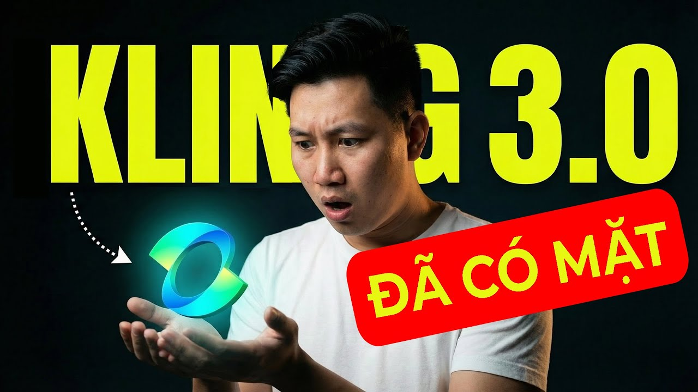

# Cách Đăng Ký Kling AI: Hướng Dẫn Thực Tế Từng Bước (Không Bỏ Sót Chi Tiết Nào)

---

## Intro

<iframe width="100%" class="aspect-video mt-4 mb-8 rounded-lg shadow-lg" src="https://www.youtube.com/embed/rP2VsvuKe5k" frameborder="0" allowfullscreen></iframe>

Bạn đã nghe về Kling AI — công cụ tạo video AI đang được Bloomberg nhắc tên cùng với Runway như một trong những đối thủ nặng ký nhất sau khi Sora bị OpenAI khai tử. Và bạn muốn thử.

Vấn đề là: giao diện tiếng Anh, thanh toán quốc tế, không biết bắt đầu từ đâu. Nhiều người dừng lại ở bước đăng ký.

Bài này giải quyết đúng cái đó.

**Bạn học được gì:** Đăng ký tài khoản Kling AI hoạt động được — không bị lỗi verify, không bị stuck ở bước thanh toán.

**Mất bao lâu:** 10–15 phút nếu chuẩn bị đủ thứ.

**Cần gì:** Email, số điện thoại (hoặc Google account), và một phương thức thanh toán quốc tế nếu muốn dùng bản trả phí.

> **Lưu ý thực tế:** Nếu bạn chỉ muốn dùng Kling để test trước khi bỏ tiền ra, có cách khác — đọc phần CTA ở cuối.

---

## Prerequisites — Chuẩn Bị Trước Khi Làm

Đừng bắt đầu nếu thiếu những thứ này. Mất 5 phút kiểm tra, tiết kiệm 30 phút xử lý lỗi sau đó.

- **Email hoạt động được** — Gmail khuyến khích, tránh email công ty có filter chặn mail nước ngoài
- **Số điện thoại nhận SMS** — số VN (+84) dùng được, nhưng đôi khi cần thử lại nếu không nhận được OTP
- **VPN (tùy)** — Kling AI hiện accessible trực tiếp từ VN, nhưng nếu gặp lỗi load thì bật VPN Singapore là fix nhanh nhất
- **Phương thức thanh toán (nếu dùng bản trả phí):** Visa/Mastercard quốc tế, hoặc dùng Payoneer/Wise nếu không có thẻ ngoại tệ

---

## Các Bước Đăng Ký

### Bước 1: Vào đúng địa chỉ

Truy cập **kling.ai**.

Nghe đơn giản, nhưng đây là bước nhiều người làm sai đầu tiên — gõ "Kling AI" lên Google, click vào link quảng cáo hoặc trang clone, rồi thắc mắc sao giao diện trông lạ.

**Tip:** Bookmark lại sau khi vào đúng. Không mất gì cả.

---

### Bước 2: Chọn phương thức đăng ký

Kling AI cho bạn 3 lựa chọn:

- **Google** — nhanh nhất, 1 click
- **Email + mật khẩu** — kiểm soát hơn
- **Apple ID** — dành cho người dùng Mac/iOS

**Khuyến nghị thực tế:** Dùng Google nếu bạn muốn nhanh. Dùng email riêng nếu bạn quản lý nhiều tài khoản tool AI — dễ phân biệt và không bị lẫn lộn với tài khoản Google cá nhân.

---

### Bước 3: Xác minh email (nếu đăng ký bằng email)

Sau khi điền email và tạo mật khẩu, Kling AI gửi mail xác nhận.

- Kiểm tra **hòm thư Spam** nếu không thấy trong 2 phút
- Subject line thường là: *"Verify your email address"* hoặc tương tự
- Click vào link trong mail — link có hiệu lực khoảng 15–30 phút

**Lỗi hay gặp:** Gmail doanh nghiệp (G Suite) đôi khi chặn mail từ domain nước ngoài. Nếu sau 5 phút không thấy gì, đổi sang Gmail cá nhân.

---

### Bước 4: Hoàn thiện profile cơ bản

Sau khi vào được dashboard, Kling có thể yêu cầu bạn điền thêm:

- Username (đặt gì cũng được, có thể đổi sau)
- Mục đích sử dụng — chọn **Content Creation** hoặc **Marketing** là phù hợp nhất với người làm affiliate/content

**Tại sao quan trọng:** Một số nền tảng AI dùng thông tin này để filter nội dung và cấp quyền truy cập một số tính năng. Điền thực tế, không cần nghĩ nhiều.

---

### Bước 5: Kiểm tra gói Free và giới hạn

Kling AI hoạt động theo hệ thống **credits**. Tài khoản free được cấp một lượng credits nhất định khi đăng ký.

Sau khi đăng ký xong, vào phần **Subscription** hoặc **Account** để xem:

- Bạn đang có bao nhiêu credits
- Credits dùng để làm gì (tạo video tốn nhiều hơn tạo ảnh)
- Các gói trả phí có gì thêm

**Đừng nâng cấp ngay.** Dùng credits free để test workflow trước. Xem bạn thực sự cần model nào, độ phân giải nào — rồi mới quyết định mua.

---

### Bước 6: Tạo video/ảnh đầu tiên để xác nhận tài khoản hoạt động

Bước này nhiều người bỏ qua, nhưng quan trọng.

Vào **Create → Video** hoặc **Image**, nhập một prompt đơn giản bằng tiếng Anh, submit.

Nếu hệ thống nhận job và bắt đầu xử lý → tài khoản hoạt động bình thường.

Nếu báo lỗi ngay lập tức → có vấn đề cần fix (xem phần Troubleshooting).

---

### Bước 7 (Tùy chọn): Nâng cấp lên gói trả phí

Nếu bạn đã test xong và muốn dùng thật, vào **Pricing**.

Khi thanh toán:
- Dùng **Visa/Mastercard quốc tế** — thanh toán trực tiếp
- Nếu thẻ bị từ chối: kiểm tra xem thẻ có bật tính năng thanh toán quốc tế chưa (gọi ngân hàng hoặc bật trong app)
- Payoneer và Wise card thường work tốt với các nền tảng AI nước ngoài

---

## Kết Quả Mong Đợi

Khi làm đúng, đây là những gì bạn thấy:

✅ Đăng nhập được vào dashboard tại kling.ai  
✅ Thấy số credits trong tài khoản  
✅ Submit được một prompt và thấy job đang chạy (trạng thái "Processing" hoặc "Generating")  
✅ Nhận được output đầu tiên — dù prompt test đơn giản đến mức nào

Nếu bạn thấy cả 4 điều trên → xong. Tài khoản sạch, sẵn sàng dùng.

---

## Troubleshooting — 3 Lỗi Phổ Biến

### Lỗi 1: Không nhận được email xác nhận

**Nguyên nhân:** Mail bị chặn hoặc vào spam.

**Fix:**
1. Kiểm tra thư mục Spam/Junk
2. Nếu không thấy sau 5 phút → quay lại trang đăng ký, chọn "Resend verification email"
3. Vẫn không được → đổi sang Gmail cá nhân và đăng ký lại

---

### Lỗi 2: Trang load chậm hoặc trắng xóa

**Nguyên nhân:** Đôi khi có vấn đề kết nối từ VN đến server Kling AI.

**Fix:**
1. Bật VPN, chọn server **Singapore** hoặc **Nhật Bản**
2. Reload trang
3. Nếu dùng VPN rồi mà vẫn lỗi → thử trình duyệt khác (Chrome hoặc Edge thường ổn hơn Firefox với các tool AI)

---

### Lỗi 3: Thẻ bị từ chối khi thanh toán

**Nguyên nhân:** Thẻ chưa bật thanh toán quốc tế, hoặc ngân hàng block giao dịch lạ.

**Fix:**
1. Gọi hotline ngân hàng hoặc bật trong app mobile banking → cho phép thanh toán quốc tế online
2. Thử lại sau 10 phút
3. Nếu vẫn lỗi → dùng Wise Virtual Card (tạo tài khoản Wise, nạp USD, lấy số thẻ ảo để thanh toán)

---

## 💡 Pro-Tips: Mẹo Tối Ưu Credit Kling AI Dành Cho Người Mới

Khi mới đăng ký, bạn sẽ được thưởng một lượng credit miễn phí có giới hạn. Đừng lãng phí chúng vào những thao tác test vô nghĩa. Dưới đây là chiến thuật sử dụng khôn ngoan nhất:

### 1. Test Bằng Image-to-Video Thay Vì Text-to-Video
Text-to-Video thường mất nhiều lần gen để tạo ra nhân vật hoặc bối cảnh đúng ý. Hãy dùng công cụ tạo ảnh (Midjourney, ChatGPT, hoặc công cụ tạo ảnh của Kling) để lấy ra một bức ảnh gốc chuẩn 100% rồi dùng tính năng **Image-to-Video**. Cách này giúp bạn kiểm soát hoàn toàn đầu ra, đỡ tốn credit làm lại.

### 2. Ưu Tiên Model 1.0 (Standard) Cho Bước Lên Ý Tưởng
Kling có các model mới như 1.5 hoặc PRO tiêu tốn lượng credits lớn hơn. Nếu bạn chỉ đang test Animation (chuyển động của camera, nhịp điệu ánh sáng), hãy chọn Model cũ hoặc chất lượng Standard. Khi đã ưng chuyển động, hãy dùng upscaler hoặc tạo lại bằng PRO.

### 3. Tận Dụng Tính Năng "Motion Brush" (Cọ Chuyển Động)
Kling khác biệt nhờ tính năng cho phép bạn vẽ hướng di chuyển trực tiếp lên ảnh. Hãy thành thạo tính năng này thay vì gõ text một cách mù quáng. Việc vẽ chính xác sẽ giảm thiểu 80% rủi ro AI cho đối tượng chuyển động sai lệch so với kỳ vọng.

---

## ❓ FAQ - Câu Hỏi Thường Gặp Khi Đăng Ký Kling AI

**1. Đăng ký Kling AI có bắt buộc phải liên kết thẻ nội địa trung quốc không?**
Không. Cập nhật mới nhất từ phiên bản toàn cầu (Global) tại `kling.ai` cho phép người dùng đăng ký hoàn toàn qua Email hoặc tài khoản Google mà không cần Số điện thoại hoặc Thẻ ngân hàng Trung Quốc.

**2. Tôi có thể dùng Kling AI trên điện thoại di động không?**
Có. Giao diện Web của Kling AI tương thích khá tốt với Mobile Browser (Safari/Chrome). Tuy nhiên, để điều khiển các tính năng nâng cao như Motion Brush, trải nghiệm trên Máy tính (Desktop/Laptop) vẫn chuyên nghiệp và nhanh gọn hơn nhiều.

**3. Mất bao lâu để xử lý xong một video 5 giây?**
Với tài khoản Free, thời gian chờ có thể xếp hàng (queue) từ 2 đến 10 phút tùy độ quá tải của Server. Nếu nâng cấp lên gói Pro, kết quả xử lý ưu tiên thường trả về trong chưa tới 60 giây.

**4. Kling AI có hỗ trợ xuất video 1080p hoặc 4K không?**
Bản miễn phí sẽ giới hạn độ phân giải ở mức cơ bản (thường là 720p). Bạn có thể dùng các tool như Topaz Video AI để upscale, hoặc mua gói trả phí của Kling để xuất thẳng kết quả 1080p siêu nét.

---

## Còn Một Cách Khác — Thử Kling Ngay Trên tramsangtao.com

Đăng ký Kling AI trực tiếp tốn thời gian, đôi khi vướng thanh toán quốc tế, và bạn phải tự quản lý credits.

Trên **[tramsangtao.com](https://tramsangtao.com)**, bạn dùng được Kling 2.5, 2.6, và 3.0 — cùng với Veo3, Seedance 2.0, FLUX, Nano Banana Pro — trong một nền tảng, thanh toán bằng VND, không cần thẻ quốc tế.

Nếu bạn đang làm affiliate, content, hay test sản phẩm AI cho client — đây là cách tiết kiệm thời gian nhất để bắt đầu ngay hôm nay, không mất công setup.

**→ Thử ngay tại tramsangtao.com**