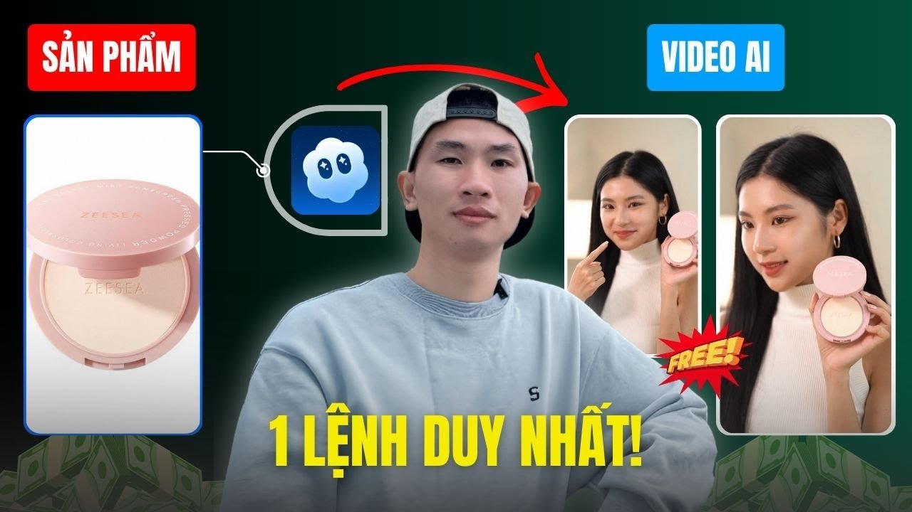
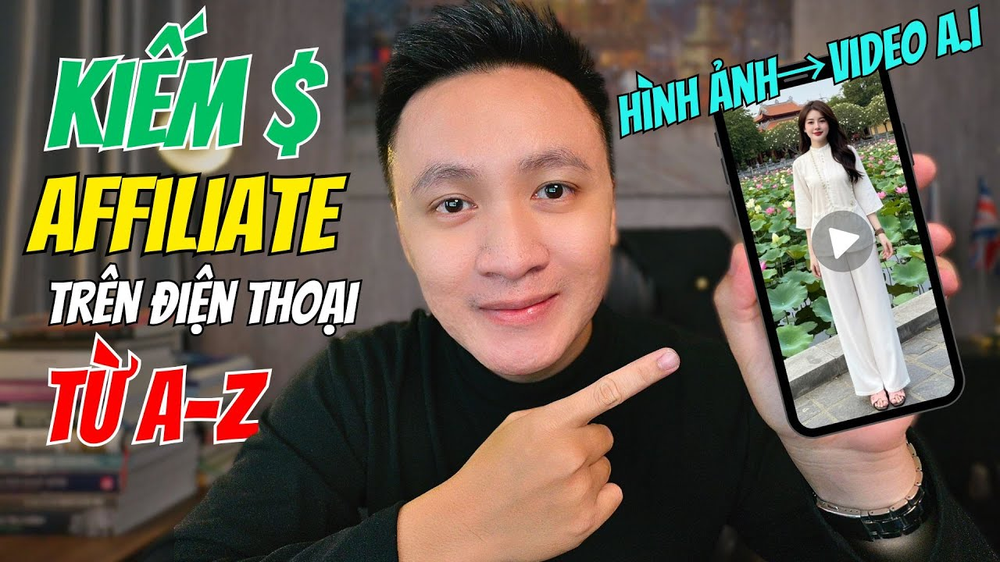

# Cách Dùng AI Tạo Video TikTok Từ Đầu Đến Khi Đăng — Không Cần Quay Tay

---

## Intro

<iframe width="100%" class="aspect-video mt-4 mb-8 rounded-lg shadow-lg" src="https://www.youtube.com/embed/zQuCjEQborE" frameborder="0" allowfullscreen></iframe>


Bài này dạy bạn quy trình tạo video TikTok bằng AI từ A đến Z — từ lúc chưa có ý tưởng đến khi xuất file sẵn sàng đăng.

**Mất bao lâu?** Lần đầu khoảng 45–60 phút. Từ lần thứ hai trở đi: 15–20 phút/video.

**Cần gì?** Tài khoản tramsangtao.com, prompt tiếng Anh cơ bản (hoặc dùng ChatGPT dịch), không cần máy xịn, không cần biết edit.

**Quan trọng hơn:** Bạn không cần *quay* video. Bạn cần *thiết kế* video — đó là sự khác biệt mà 80% người làm TikTok hiện tại vẫn chưa hiểu.

---

## Prerequisites — Chuẩn Bị Trước Khi Bắt Đầu




Trước khi vào bước 1, check các mục này:

- [ ] **Tài khoản tramsangtao.com** đã active và có credit
- [ ] **Biết mình muốn làm niche gì** — thời trang, ẩm thực, affiliate review sản phẩm, hay viral clip giải trí? Chọn trước, đừng để bước prompt mới nghĩ
- [ ] **Có sẵn 1 concept** — dù chỉ là câu mô tả 1–2 dòng kiểu *"cô gái đứng trong cánh đồng hoa anh đào, gió thổi, ánh chiều tà"*
- [ ] **CapCut hoặc app edit tương đương** để gắn caption/nhạc sau khi có video AI (bước cuối)
- [ ] **Kết nối internet ổn định** — render video AI tốn thời gian, đừng làm lúc mạng chập chờn

---

## Steps


### Bước 1 — Xác định format video bạn cần tạo

**Làm gì:** Quyết định video của bạn thuộc loại nào trước khi chọn model.

TikTok thực ra chỉ có vài dạng ăn view:
- **Clip cinematic / aesthetic** — cảnh đẹp, nhân vật đẹp, dùng cho branding hoặc hook đầu video
- **Nhân vật thực hiện hành động** — nhảy, đi, quay đầu nhìn camera
- **Product showcase** — sản phẩm được chiếu sáng, xoay 360, đặt trong bối cảnh đẹp
- **Storytelling ngắn** — chuỗi cảnh kể một mini-story 15–30 giây

**Tại sao phải chọn trước?** Vì mỗi loại dùng model khác nhau. Chọn sai model = mất credit, mất thời gian, video ra không dùng được.

**Tip tránh lỗi:** Đừng cố nhét tất cả vào 1 video. TikTok hoạt động tốt nhất với video đơn giản, tập trung vào 1 khoảnh khắc.

---

### Bước 2 — Chọn model phù hợp trên tramsangtao.com

**Làm gì:** Đăng nhập tramsangtao.com, vào phần **Video**, chọn model theo bảng sau:

| Mục tiêu | Model nên dùng | Lý do |
|---|---|---|
| Clip cinematic chất lượng cao, movement mượt | **Kling 2.5 / 2.6** | Sinh chuyển động tự nhiên, ít artifact |
| Realistic nhất, muốn thử nghiệm | **Kling 3.0** | Mới nhất, chi tiết sắc nét hơn |
| Video có âm thanh / lời thoại AI | **Veo3** | Tích hợp audio generation từ Google |
| Video cần style sáng tạo, hiệu ứng độc | **Seedance 2.0** | Xử lý motion sáng tạo tốt |
| Cần ảnh portrait làm thumbnail hoặc frame tĩnh | **Nano Banana Pro** | Tối ưu cho mặt người, skin tone tự nhiên |

**Tip tránh lỗi:** Nếu bạn mới bắt đầu, đừng đi thẳng Kling 3.0 hay Veo3 vì credit đắt hơn. Test concept với Kling 2.5 trước, confirm thấy ổn rồi mới render version cao hơn.

---

### Bước 3 — Viết prompt video hiệu quả

**Làm gì:** Đây là bước quyết định 70% kết quả. Một prompt tốt cho video AI cần có đủ 4 yếu tố:

```
[Nhân vật / chủ thể] + [Hành động] + [Bối cảnh] + [Camera / ánh sáng]
```

**Ví dụ prompt yếu:**
> *"cô gái đẹp đứng trong rừng"*

**Ví dụ prompt mạnh:**
> *"A Vietnamese woman in a white ao dai standing in a cherry blossom forest, petals falling slowly around her, she turns her head to look at the camera with a slight smile, golden hour lighting, shallow depth of field, cinematic 4K, slow motion"*

**Cấu trúc prompt chuẩn để copy về dùng:**

```
[Mô tả nhân vật] + [hành động cụ thể] + [bối cảnh chi tiết], 
[điều kiện ánh sáng], [style camera: close-up / wide shot / tracking shot], 
[tốc độ: slow motion / real-time], cinematic, 4K, TikTok vertical format
```

**Tại sao cần thêm "TikTok vertical format"?** Vì mặc định nhiều model render 16:9. Ghi rõ để nhắc hệ thống ưu tiên tỉ lệ 9:16.

**Tip tránh lỗi:**
- Viết prompt bằng tiếng Anh — tất cả model trên tramsangtao.com hiểu tiếng Anh tốt hơn tiếng Việt đáng kể
- Không dùng từ mơ hồ như *"beautiful"*, *"amazing"* — thay bằng mô tả cụ thể: *"high cheekbones, natural makeup, confident expression"*
- Nếu bí ý tưởng: vào TikTok search hashtag niche của bạn, chọn 3 video ăn view, rồi *mô tả lại* cảnh đó bằng tiếng Anh thành prompt

---

### Bước 4 — Upload ảnh reference (nếu có)

**Làm gì:** Nếu bạn muốn nhân vật trong video trông giống một người thật (ví dụ: avatar thương hiệu, hoặc ảnh sản phẩm cụ thể), dùng tính năng **Image-to-Video** thay vì text-to-video thuần túy.

Quy trình:
1. Dùng **FLUX** hoặc **Nano Banana Pro** tạo ảnh nhân vật trước trên tramsangtao.com
2. Export ảnh đó
3. Upload vào model video (Kling 2.5/2.6 đều hỗ trợ Image-to-Video)
4. Thêm prompt mô tả **hành động** bạn muốn nhân vật thực hiện

**Tại sao làm vậy?** Text-to-video đôi khi tạo nhân vật không ổn định — mặt thay đổi giữa các frame. Khi có ảnh reference, model "ghim" nhân vật theo ảnh gốc, kết quả nhất quán hơn nhiều.

**Tip tránh lỗi:** Ảnh reference nên có nền sạch hoặc nền trung tính. Ảnh background lộn xộn sẽ khiến model "bối rối" và sinh ra video kỳ lạ.

---

### Bước 5 — Cấu hình render và chạy

**Làm gì:** Trước khi nhấn Generate, kiểm tra lại:

- **Duration:** TikTok hook tốt nhất là 3–6 giây cho 1 clip AI. Đừng cố render 30 giây một lần — chất lượng sẽ giảm và bạn khó kiểm soát
- **Aspect ratio:** 9:16 (vertical)
- **Resolution:** Chọn cao nhất có thể trong mức credit cho phép

Nhấn Generate, đợi render xong (thường 1–3 phút tùy model và queue).

**Tại sao clip ngắn lại tốt hơn?** Video TikTok thực chất là ghép nhiều clip ngắn lại. Render 5 clip 5 giây rồi nối = kiểm soát từng cảnh, dễ sửa từng phần. Render 1 clip 25 giây mà hỏng giữa chừng = mất toàn bộ.

**Tip tránh lỗi:** Render xong, xem preview kỹ trước khi tải về. Check: nhân vật có bị biến dạng tay/ngón tay không? Chuyển động có tự nhiên không? Nếu không ổn → điều chỉnh prompt, không phải render lại y chang.

---

### Bước 6 — Ghép clip, thêm nhạc và caption

**Làm gì:** Mang các clip AI vừa tạo vào CapCut (hoặc app edit quen tay):

1. Ghép các clip theo thứ tự câu chuyện
2. Thêm nhạc trending (vào TikTok Creative Center xem nhạc đang viral trong niche)
3. Thêm caption — **đây là bước nhiều người bỏ qua và đó là sai lầm lớn**. TikTok ưu tiên video có caption vì giúp người xem không âm thanh vẫn hiểu nội dung
4. Thêm hook text ở 2–3 giây đầu nếu cần

**Tip tránh lỗi:** Đừng để transition phức tạp. Video AI đã đẹp rồi — transition cầu kỳ thêm vào thường làm giảm cảm giác cinematic. Cut thẳng hoặc fade đơn giản là đủ.

---

### Bước 7 — Export và đăng

**Làm gì:** Export 1080×1920 (9:16), 30fps là đủ cho TikTok. Đăng trong khung giờ audience của bạn active — không có khung giờ "magic" universal, nhưng thường 7–9 sáng và 8–11 tối Việt Nam là window an toàn để test.

Viết caption TikTok ngắn, dùng 3–5 hashtag liên quan thay vì nhồi 30 hashtag.

---

## Kết Quả Mong Đợi


Khi làm đúng quy trình trên, video của bạn trông như thế nào?

- **Hình ảnh sắc nét**, không bị mờ hay artifact rõ ràng
- **Chuyển động tự nhiên** — nhân vật di chuyển mượt, không bị "glitch" tay hay mặt
- **Tỉ lệ đúng** 9:16, không bị crop mất phần trên/dưới khi đăng TikTok
- **Nhất quán** nếu bạn làm nhiều clip trong 1 series — nhân vật trông giống nhau qua các video

Một video AI làm đúng sẽ khó phân biệt với video quay thật trong điều kiện bình thường. Người xem TikTok không dừng lại để phân tích kỹ thuật — họ chỉ cảm nhận: *có đẹp không, có cuốn không*.

---

## Troubleshooting — 3 Lỗi Phổ Biến




### Lỗi 1: Nhân vật bị biến dạng tay, ngón tay kỳ lạ

**Triệu chứng:** Video ra nhưng tay nhân vật có 6–7 ngón, hoặc cánh tay bị xoắn không tự nhiên.

**Fix:**
- Trong prompt, tránh mô tả hành động cầm nắm phức tạp (cầm điện thoại, chỉ tay...)
- Dùng Image-to-Video thay vì text-only
- Nếu vẫn lỗi: crop cảnh để không thấy tay trong frame, hoặc chọn cảnh wide-shot để tay nhỏ lại

---

### Lỗi 2: Video không ra format 9:16 dù đã ghi trong prompt

**Triệu chứng:** Video render ra 16:9 hoặc 1:1.

**Fix:**
- Kiểm tra lại setting aspect ratio trong giao diện tramsangtao.com — đây là setting ưu tiên hơn prompt text
- Nếu vẫn sai: crop lại trong CapCut, chọn "TikTok 9:16" template

---

### Lỗi 3: Video đẹp nhưng không có view

**Triệu chứng:** Kỹ thuật ổn, video ra mượt, nhưng đăng lên TikTok chỉ có vài chục view.

**Fix:** Đây không phải lỗi kỹ thuật — đây là lỗi content strategy.
- 3 giây đầu có hook chưa? Nếu mở đầu chỉ là cảnh đẹp không có lý do để xem tiếp → người ta scroll qua
- Caption có đặt câu hỏi hoặc tạo tò mò không?
- Nhạc có đang trending không?

Video AI đẹp chỉ là điều kiện cần. Nội dung (câu chuyện, hook text, âm thanh) mới là điều kiện đủ. Nếu video đẹp mà không có view, hãy thay câu hook ở 3 giây đầu tiên!

---

## 📈 Case Study: Xây Kênh TikTok "Chữa Lành" Đạt 10K Follower Trong 1 Tháng Bằng AI

Một Creator mới bắt tay vào làm kênh chủ đề "Trích Dẫn Động Lực & Chữa Lành":
- **Pain Point:** Ngại xuất hiện trước ống kính. Dùng video Stock (như Pexels) thì trùng lặp quá nhiều khiến TikTok đánh lỗi vi phạm bản quyền nội dung (Unoriginal content) và bóp tương tác.
- **Giải Pháp:** Sử dụng Kling 3.0 kết hợp với Capcut. 
  - *Bước 1:* Dùng ChatGPT viết/sưu tầm 10 câu quote chữa lành ngắn.
  - *Bước 2:* Dùng prompt: *"Anime style, a girl sitting by the window looking at the rain, lofi aesthetic, slow motion"* ném vào Kling 3.0.
  - *Bước 3:* Đưa vào Capcut, ốp filter màu vintage, chọn nhạc lo-fi không bản quyền và dán Quote dọc màn hình.
- **Kết Quả & ROI:** Chi phí tạo 30 video chưa đến 100k VNĐ. Mỗi ngày mất 15 phút để làm. Kênh không bị quét bản quyền, đạt mốc 10k follower nhanh chóng và mở khóa gắn link Affiliate/TikTok Shop.

---

## 💎 Pro-Tips: Làm TikTok AI Không Phải Ai Cũng Biết

1. **Hiểu Luật "1 Giây Vàng":** Khán giả quyết định xem tiếp video của bạn trong 1 giây đầu. Đừng dùng AI render cảnh quá chậm ở Frame đầu tiên. Ngay Frame số 1 phải có điểm nhấn (màu sắc gắt, hành động nhanh, hoặc dán 1 dòng chữ cực tò mò).
2. **Không Bao Giờ Bỏ Qua Thumbnail (Ảnh Bìa):** TikTok cho bạn chọn bìa video khi đăng. Hãy lướt thanh timeline và chọn chính xác Frame đẹp nhất mà AI render ra để làm bìa thu hút click vào hồ sơ.
3. **Bí Mật Của Dân Pro - Upscale Video:** Dù bạn dùng AI sinh video ở 1080p, đôi khi file xuất ra vẫn hơi "nhòe" nếu phong cảnh quá chi tiết. Hãy tạt qua các app như Wink, Meitu hoặc chính tính năng Enhance của CapCut để làm nét lại trước khi đăng. Nó tốn thêm 1 phút nhưng tạo cảm giác "Premium" cho kênh của bạn.