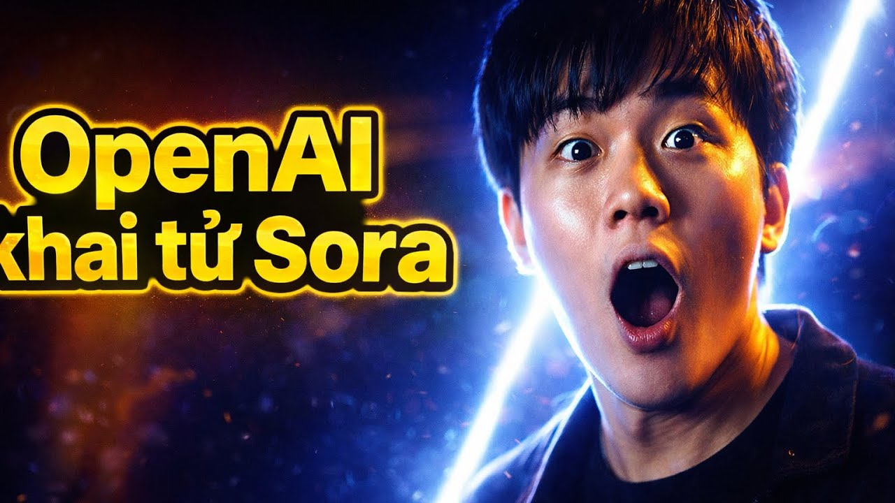
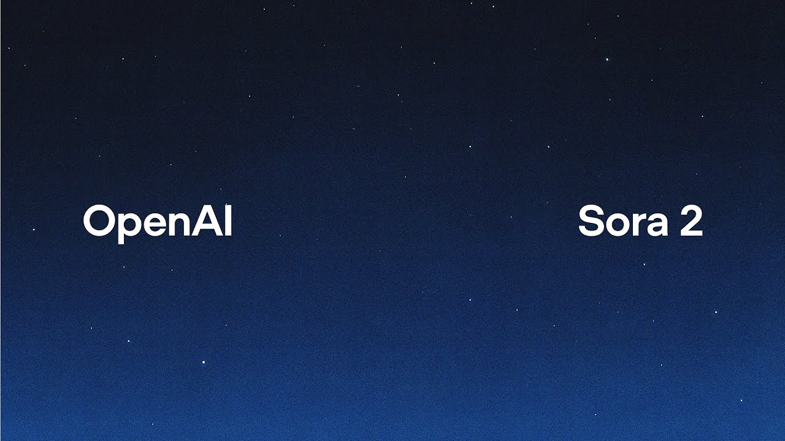

# Cách Dùng Sora Tạo Video AI — Và Tại Sao Bạn Nên Nhìn Ra Ngoài Sora Ngay Bây Giờ

Bạn Google "cách dùng Sora tạo video", đọc vài bài hướng dẫn, rồi mở app ra thử — và phát hiện ra rằng Sora không còn hoạt động theo cách bạn nghĩ nữa. Hoặc tệ hơn: bạn vẫn chưa tiếp cận được nó dù đã mất cả buổi sáng tìm cách đăng ký.

Chuyện đó không phải lỗi của bạn. OpenAI đã chính thức "khai tử" Sora vào đầu năm 2025, sau một thời gian dài loay hoay cạnh tranh với các đối thủ mạnh hơn, nhanh hơn, và thực dụng hơn. Cái tên Sora từng gây sốt cộng đồng AI toàn cầu — nhưng thực tế vận hành thì khác xa expectation.

Bài này sẽ vẫn giải thích đầy đủ về Sora — nó là gì, nó hoạt động ra sao, prompt viết thế nào. Nhưng đồng thời mình sẽ nói thẳng: nếu bạn đang làm affiliate, content creator, hay chạy quảng cáo, thì năm 2025 có những lựa chọn thực tế hơn nhiều. Và bạn cần biết điều đó trước khi mất thêm thời gian.

---

## Sora Là Gì — Và Chuyện Gì Đã Xảy Ra

<iframe width="100%" class="aspect-video mt-4 mb-8 rounded-lg shadow-lg" src="https://www.youtube.com/embed/OY2x0TyKzIQ" frameborder="0" allowfullscreen></iframe>

Sora được OpenAI ra mắt ngày 16/2/2024. Đây là mô hình text-to-video đầu tiên của OpenAI, cho phép nhập một đoạn mô tả văn bản và nhận lại video ngắn dưới 1 phút. Demo ban đầu cực kỳ ấn tượng: cảnh quay điện ảnh mượt mà, độ chân thực cao, ánh sáng tự nhiên.

Vấn đề là từ lúc ra mắt đến lúc người dùng phổ thông thực sự dùng được, có một khoảng cách rất lớn. Sora rollout nhỏ giọt, hạn chế truy cập, chỉ mở cho một nhóm người dùng ChatGPT Plus và Pro. Trong thời gian đó, **Kling AI, Runway, Google Veo** liên tục cập nhật và vượt mặt Sora trên nhiều tiêu chí thực tế.

VnExpress từng đưa tin: Kling AI, Google Veo và Runway được người dùng đánh giá có nhiều tính năng nổi trội hơn Sora. Sau đó, OpenAI quyết định đóng cửa dự án Sora — một quyết định không bất ngờ với ai theo dõi thị trường video AI.

Vậy bài hướng dẫn "cách dùng Sora tạo video" mà bạn cần đọc không nên chỉ nói về một công cụ đã đi vào lịch sử.

---

## Cách Sora Tạo Video — Cơ Chế Cơ Bản Bạn Cần Biết

Dù Sora không còn hoạt động rộng rãi, hiểu cơ chế của nó vẫn hữu ích — vì hầu hết các công cụ video AI hiện đại đều vận hành theo logic tương tự.

**Sora dùng mô hình diffusion + transformer.** Thay vì tạo video frame-by-frame, nó hiểu cả không gian 3D và thời gian trong một cảnh quay. Điều này giúp đối tượng di chuyển tự nhiên, ánh sáng thay đổi nhất quán.

Khi bạn nhập prompt, Sora phân tích:
- **Subject** (chủ thể chính là gì)
- **Action** (chủ thể đang làm gì)
- **Environment** (bối cảnh xung quanh)
- **Camera style** (góc quay, chuyển động camera)
- **Mood** (ánh sáng, màu sắc, cảm xúc tổng thể)

Prompt càng rõ ràng ở 5 yếu tố trên, kết quả càng khớp với ý định.

**Ví dụ prompt yếu:**
> "Một cô gái đi trên phố"

**Ví dụ prompt mạnh:**
> "A young Vietnamese woman in her 20s walks through a busy Hanoi street market at golden hour, slow-motion tracking shot, warm orange lighting, crowded background with street vendors, cinematic depth of field"

Logic prompt này không chỉ đúng với Sora — nó đúng với Kling, Veo3, Seedance, tất cả các công cụ video AI đang hoạt động hiện tại. Học cách viết prompt video tốt là kỹ năng có thể chuyển đổi qua nhiều nền tảng.

---

## Công Cụ Thực Tế Thay Sora Năm 2025 — Đừng Trung Thành Với Thứ Không Còn

Đây là phần nhiều người né tránh viết vì ngại "dìm hàng". Nhưng sự thật là: nếu bạn Google "cách dùng Sora tạo video" để tìm công cụ làm việc ngay hôm nay, bạn cần biết đang có gì trên thị trường.

### Kling AI 2.5 / 2.6 / 3.0

Kling là công cụ video AI do Kuaishou (Trung Quốc) phát triển. Từ phiên bản 2.5 trở lên, Kling đã vượt qua Sora về độ nhất quán nhân vật, chuyển động tự nhiên, và khả năng kiểm soát camera.

**Dùng tốt nhất cho:** Video sản phẩm, video thời trang, demo concept, content lifestyle. Phiên bản 3.0 hỗ trợ video dài hơn và kiểm soát motion chi tiết hơn.

**Ví dụ use case affiliate:** Bạn làm affiliate cho một thương hiệu mỹ phẩm. Thay vì thuê người quay, bạn dùng Kling tạo video người mẫu đang dùng sản phẩm — 10-15 giây, đủ để làm creative cho Meta Ads.

### Veo3 — Google's Answer

Google Veo3 là model video AI mạnh nhất của Google, tích hợp khả năng sinh âm thanh tự nhiên cùng hình ảnh. Điểm khác biệt: Veo3 hiểu ngữ cảnh phức tạp, cảnh nhiều nhân vật, và chi tiết kiến trúc tốt hơn nhiều công cụ khác.

**Dùng tốt nhất cho:** Video storytelling dài hơn, explainer video, cảnh quay có nhiều yếu tố chuyển động đồng thời.

### Seedance 2.0

Seedance ít được nói đến hơn nhưng đang được nhiều creator chú ý vì độ ổn định cao và khả năng giữ nhất quán nhân vật qua nhiều shot — điều các công cụ khác vẫn đang vật lộn.

---

## Viết Prompt Video AI Hiệu Quả — Framework 5 Lớp

Dù bạn dùng công cụ nào, một prompt video tốt cần có đủ 5 lớp thông tin này:

**Lớp 1 — Nhân vật/Chủ thể:**
Mô tả cụ thể. Không phải "một người đàn ông" mà là "a 35-year-old man in a navy suit, short hair, confident posture."

**Lớp 2 — Hành động:**
Động từ cụ thể, có trạng thái: "slowly walks towards the camera, pauses, looks directly into lens" thay vì "đi bộ."

**Lớp 3 — Môi trường:**
Địa điểm + thời gian + thời tiết: "modern minimalist coffee shop interior, midday, soft diffused natural light from large windows."

**Lớp 4 — Camera:**
"close-up tracking shot," "bird's eye view," "smooth dolly zoom," "handheld documentary style" — đây là chi tiết tạo ra sự khác biệt lớn nhất về cảm giác điện ảnh.

**Lớp 5 — Mood/Style:**
"warm and nostalgic," "cold and clinical," "energetic and fast-paced," "cinematic 4K."

**Prompt đầy đủ ví dụ cho video quảng cáo:**
> "A confident Vietnamese woman in her late 20s, wearing a white linen shirt, holds a skincare bottle up to natural window light, slowly rotates the product, close-up tracking shot, bright airy atmosphere, soft bokeh background, lifestyle commercial style, 4K"

Đây là prompt style bạn có thể dùng ngay trên Kling hoặc Veo3.

---

## Những Lỗi Phổ Biến Khi Tạo Video AI — Và Cách Tránh

Có một số lỗi mà người mới làm video AI gần như ai cũng mắc ít nhất một lần:

**Lỗi 1: Prompt quá ngắn**
"Một bữa sáng ngon lành" không đủ để AI tạo ra thứ bạn muốn. Bữa sáng kiểu nào? Góc quay nào? Ánh sáng ra sao? Thiếu context = AI đoán mò.

**Lỗi 2: Yêu cầu quá nhiều thứ trong 1 shot**
Video AI hiện tại vẫn xử lý tốt nhất khi mỗi shot có 1-2 chủ thể chính. Nhét 5 người vào một cảnh phức tạp, kết quả thường bị lỗi.

**Lỗi 3: Không specify camera movement**
Đây là lỗi khiến video trông "static" dù nội dung ổn. Luôn thêm ít nhất 1 yếu tố camera movement vào prompt.

**Lỗi 4: Kỳ vọng perfect ngay lần đầu**
Video AI tốt nhất cũng cần iteration. Tạo 5-10 version, chọn cái tốt nhất, refinement tiếp. Không phải 1 prompt = 1 video hoàn hảo.

**Lỗi 5: Dùng 1 model cho tất cả use case**
Kling mạnh về nhân vật. Veo3 mạnh về cảnh phức tạp. Seedance ổn định về consistency. Chọn đúng tool cho đúng mục đích.

---

---

## 📈 Case Study: Agency Bất Động Sản "Quay Xe" Từ Sora Sang Kling 3.0 Bất Đắc Dĩ

Một Creative Agency chuyên làm Video phối cảnh 3D cho các dự án Bất động sản gặp khủng hoảng khi Sora bị khai tử:
- **Pain Point:** Đã trót vẽ ra viễn cảnh với khách hàng là "sắp tới bên em có công nghệ AI làm video thực tế ảo siêu rẻ". Khi Sora đóng cửa, team phải quay về dùng Lumion/Unreal Engine render máy tính mất hàng tuần trời, chi phí đội lên gấp 4 lần.
- **Giải Pháp:** Chuyển hướng sang Workflow lai: Thiết kế một vài tấm ảnh Render 3D tĩnh bằng Midjourney/Flux. Sau đó, đẩy những tấm ảnh này vào tính năng Image-to-Video của Kling 3.0 với prompt: *"Drone shot flying forward slowly over the modern villa, golden hour lighting, cinematic, realistic lighting"*. 
- **Kết Quả & ROI:** Từ những tấm ảnh Render tĩnh cứng đơ, Kling 3.0 biến chúng thành những thước phim Drone mượt mà. Thời gian xuất file giảm từ 5 ngày xuống còn chưa tới 1 tiếng. Chi phí trả cho nền tảng so với khấu hao máy tính card đồ họa cấu hình cao là một "món hời" khổng lồ.

---

## 💎 Pro-Tips: Chuyển Hệ Nhất Định Cần Biết Bíp Này

1. **Đừng Bê Nguyên Prompt Của Sora Sang Tool Khác:** Sora từng rất giỏi hiểu các prompt mang tính miêu tả tiểu thuyết ("Một chiếc lá rơi buồn bã"). Nhưng Kling hay Veo3 lại thích sự rõ ràng của điện ảnh ("Close up shot, a falling leaf, slow motion"). Hãy học cách viết lệnh như một Đạo diễn thay vì một Nhà văn.
2. **Khái Niệm Khung Hình Đầu Bị "Cháy":** Rất nhiều model AI khi khởi tạo video bị nhắm mắt hoặc nhòe ở 1-2 frame đầu tiên. Giải pháp là lúc đưa vào app Capcut, hãy cắt bỏ 0.5 giây đầu và 0.5 giây cuối của mọi clip AI gen ra. Video của bạn sẽ trông "perfect" từ đầu đến cuối mà người xem không hề nhận ra sự chắp vá.

---

## FAQ — Những Câu Hỏi Hay Gặp

**Sora có còn hoạt động không?**
OpenAI đã đóng cửa Sora vào 2025. Hiện tại không có cách truy cập Sora chính thức cho người dùng phổ thông. Các lựa chọn thực tế hiện tại là Kling, Veo3, Seedance.

**Cần biết gì để bắt đầu làm video AI?**
Bạn chỉ cần biết viết prompt tiếng Anh ở mức cơ bản. Không cần kỹ năng kỹ thuật gì. Kỹ năng quan trọng nhất là biết mô tả visual — cái này học được trong vài ngày thực hành.

**Video AI có dùng được cho quảng cáo thật không?**
Được. Nhiều marketer Việt Nam đang dùng video từ Kling làm creative cho Meta Ads, TikTok Ads. Kết quả tùy thuộc vào chất lượng prompt và cách dùng video. Không phải tất cả đều chạy tốt, nhưng tỷ lệ thành công đang tăng rõ rệt theo từng phiên bản model mới.

**Mỗi video AI mất bao lâu để tạo?**
Tùy model và độ tải server, thường từ 30 giây đến 5 phút cho một clip 5-15 giây. Kling và Seedance thường nhanh hơn Veo3 trong điều kiện bình thường.

**Chi phí tạo video AI tốn bao nhiêu?**
Tuỳ nền tảng. Trên tramsangtao.com, bạn có thể xem chi tiết gói giá tại trang /pricing — có gói theo nhu cầu từ người dùng thử đến creator dùng hàng ngày.

---

## Thử Ngay Thay Vì Đọc Thêm

Nếu bạn đã đọc đến đây, bạn hiểu đủ để bắt đầu. Bước tiếp theo không phải đọc thêm 5 bài nữa — mà là mở một prompt ra và tạo thử một video.

Tramsangtao.com hiện có đủ các model video AI đang hoạt động: Kling 2.5, 2.6, 3.0, Veo3, Seedance 2.0 — tất cả trong một nền tảng, không cần tạo tài khoản riêng trên từng service nước ngoài, không cần VPN, không cần thẻ ngoại tệ.

Xem chi tiết gói sử dụng tại **tramsangtao.com/pricing** — có gói thử để bạn test trước khi quyết định.

Prompt đầu tiên của bạn không cần hoàn hảo. Cứ viết, tạo, xem kết quả, điều chỉnh. Đó là cách duy nhất để học video AI nhanh.