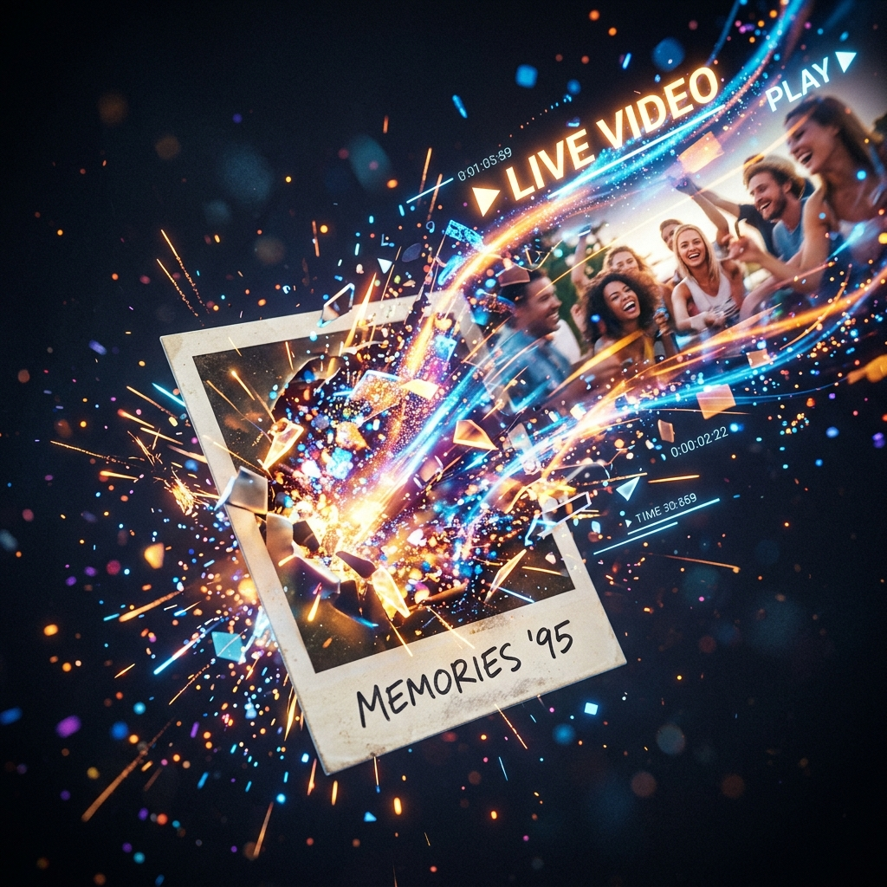

# Cách Tạo Video AI Từ Ảnh: Từ Ảnh Tĩnh Đến Video Chuyển Động Trong 15 Phút

---

## Intro

<iframe width="100%" class="aspect-video mt-4 mb-8 rounded-lg shadow-lg" src="https://www.youtube.com/embed/bIgtrveSh1M" frameborder="0" allowfullscreen></iframe>


Bạn có một ảnh sản phẩm, ảnh chân dung, hoặc ảnh phong cảnh — và bạn muốn nó *chuyển động*.

Không phải để flex công nghệ. Mà vì video đang ăn hết traffic của ảnh tĩnh trên mọi nền tảng — TikTok, Reels, thậm chí Facebook feed. Một ảnh sản phẩm đứng yên bị scroll qua trong 0.3 giây. Một video 5 giây từ chính ảnh đó? Cơ hội còn lại lâu hơn nhiều.

Bài này dạy bạn chính xác quy trình tạo video AI từ ảnh có sẵn, dùng Kling hoặc Seedance 2.0 trên tramsangtao.com.

**Mất bao lâu?** 15–20 phút cho video đầu tiên. Lần sau rút xuống còn 5 phút.

**Cần gì?** Tài khoản tramsangtao.com + 1 ảnh đầu vào chất lượng ổn + biết mình muốn ảnh đó *làm gì*.

---

## Prerequisites — Chuẩn Bị Trước Khi Bắt Đầu


Đừng bỏ qua phần này. 80% video ra tệ là do ảnh đầu vào tệ — không phải do model.

**1. Ảnh đầu vào:**
- Độ phân giải tối thiểu: 720px ở cạnh ngắn nhất. Tốt nhất: 1080px trở lên
- Tỷ lệ khuyến nghị: 16:9 (landscape), 9:16 (portrait/vertical), hoặc 1:1 — tùy nền tảng bạn đăng
- Tránh: ảnh bị noise nhiều, bị blur, hoặc có watermark chồng lên vùng cần chuyển động
- Format: JPG hoặc PNG đều được

**2. Biết output của mình dùng ở đâu:**
- TikTok/Reels → cần 9:16, độ dài 5–10 giây
- YouTube Shorts → 9:16, tối đa 60 giây
- Facebook feed / quảng cáo → 1:1 hoặc 4:5
- Thumbnail animated → 16:9, 3–5 giây

**3. Có sẵn ý tưởng chuyển động:**
Model không đọc được suy nghĩ. Bạn cần biết mình muốn *phần nào* của ảnh chuyển động, theo *hướng* nào, với *cảm xúc* gì. Ghi ra trước — dù chỉ một câu.

---

## Các Bước Thực Hiện


### Bước 1: Chọn Model Phù Hợp Với Mục Đích

Trước khi upload bất cứ thứ gì, hãy quyết định model nào bạn sẽ dùng. Đây là quyết định quan trọng nhất mà hầu hết mọi người bỏ qua.

**Kling 2.5 / 2.6 / 3.0:**
- Mạnh về chuyển động tự nhiên, giữ nhân vật coherent (không bị méo mặt)
- Tốt cho: ảnh người, ảnh sản phẩm cần chuyển động mềm mại
- Kling 3.0 hiện là phiên bản mới nhất — chất lượng chuyển động tốt hơn hẳn 2.5

**Seedance 2.0:**
- Mạnh về cảnh quay phức tạp, ánh sáng, và chuyển động cinematic
- Tốt cho: ảnh phong cảnh, ảnh có nhiều yếu tố môi trường (nước, lửa, mây, gió)
- Nếu ảnh của bạn trông như một still frame từ phim → dùng Seedance

> **Tip:** Đừng dùng Kling cho ảnh phong cảnh rồi thắc mắc sao nước không chảy đẹp. Đúng tool, đúng việc.

---

### Bước 2: Chuẩn Bị và Upload Ảnh

1. Vào **tramsangtao.com** → chọn tab **Video AI** → chọn model đã quyết định ở Bước 1
2. Upload ảnh đầu vào. Hệ thống sẽ preview ảnh của bạn
3. Kiểm tra: ảnh có bị crop không mong muốn không? Tỷ lệ hiển thị có đúng không?

**Tại sao quan trọng:** Model sẽ animate *chính xác* những gì nó thấy trong frame. Nếu ảnh bị crop mất phần quan trọng, video output cũng mất phần đó.

> **Tip tránh lỗi:** Nếu ảnh bạn là 4:3 nhưng muốn output 16:9 — đừng để hệ thống tự crop. Hãy tự crop/pad ảnh trước bằng Canva hoặc Photoshop, kiểm soát phần nào bị mất trước khi upload.

---

### Bước 3: Viết Prompt Chuyển Động (Motion Prompt)

Đây là bước quyết định 70% chất lượng output. Và cũng là bước hầu hết người dùng làm sơ sài nhất.

**Công thức cơ bản:**

```
[Chủ thể] + [hành động cụ thể] + [hướng/tốc độ] + [yếu tố môi trường] + [cảm xúc/tone]
```

**Ví dụ thực tế:**

❌ Prompt tệ: *"make it move"* / *"animate this"*

✅ Prompt tốt (ảnh cà phê):
> *"Steam rising slowly from the coffee cup, camera slightly pulling back, warm morning light flickering softly, calm and cozy atmosphere"*

✅ Prompt tốt (ảnh chân dung):
> *"Subject turns head slightly to the right, hair moves gently in breeze, eyes blink naturally once, soft smile appears, golden hour lighting"*

✅ Prompt tốt (ảnh phong cảnh biển):
> *"Ocean waves moving slowly toward shore, foam dissolving on sand, clouds drifting left, seagulls in background flying, cinematic slow motion"*

**Lưu ý về ngôn ngữ:** Viết prompt bằng tiếng Anh để model hiểu tốt hơn — đây là thực tế kỹ thuật, không phải sính ngoại.

> **Tip:** Mô tả chuyển động từ chi tiết lớn → chi tiết nhỏ. Từ cái dễ thấy nhất đến cái tinh tế. Model đọc prompt theo thứ tự ưu tiên.

---

### Bước 4: Cài Đặt Thông Số Output

Sau khi nhập prompt, bạn sẽ thấy các tùy chọn:

**Độ dài video:**
- 5 giây: đủ cho social media content, load nhanh, giá credit thấp hơn — nên test bằng độ dài này trước
- 10 giây: phù hợp quảng cáo, storytelling
- Không cần thiết phải dùng 10 giây nếu ý tưởng của bạn chỉ cần 5

**Tỷ lệ khung hình:**
- Chọn đúng với nơi bạn đăng (xem Prerequisites)

**Mức độ chuyển động (nếu có tùy chọn):**
- Thấp: giữ ảnh gốc gần với original, chuyển động tinh tế
- Cao: chuyển động mạnh hơn, nhưng rủi ro distortion tăng lên
- Khuyến nghị lần đầu: để ở mức trung bình

> **Tip tránh lỗi:** Đừng bật "high motion" cho ảnh chân dung người ở lần đầu thử. Mặt người bị distort trông rất khó chịu và không dùng được. Test thấp trước, tăng sau.

---

### Bước 5: Generate và Đánh Giá Output

Nhấn **Generate**. Tùy độ phức tạp, video sẽ xử lý trong 1–5 phút.

**Khi video xong, đánh giá theo thứ tự này:**

1. **Chủ thể có bị distort không?** — Đặc biệt với mặt người, chữ trong ảnh, logo sản phẩm. Nếu có → xem Troubleshooting
2. **Chuyển động có tự nhiên không?** — Có giật cục không? Có "bơi" không?
3. **Có đúng với prompt không?** — Nếu bạn yêu cầu "camera pull back" mà video không có → prompt chưa đủ mạnh

> **Tip:** Xem video ít nhất 3 lần trước khi quyết định dùng hay generate lại. Lần đầu xem tổng thể, lần hai xem chi tiết, lần ba xem như người dùng lần đầu không biết gì về ảnh gốc.

---

### Bước 6: Tải Về và Xử Lý Final

1. Tải video về (MP4)
2. Nếu cần: thêm nhạc, caption, hoặc logo bằng CapCut/DaVinci/Canva
3. Nếu video dùng cho quảng cáo paid: giữ 3 giây đầu mạnh nhất vì đó là thời gian quyết định hook

---

## Kết Quả Mong Đợi — Trông Như Thế Nào Khi Làm Đúng




Khi quy trình đúng, video output của bạn sẽ:

- **Giữ nguyên nhận dạng** của chủ thể — sản phẩm trông đúng như trong ảnh gốc, mặt người không bị biến dạng
- **Chuyển động có chủ đích** — không phải "lung lay random" mà là chuyển động phục vụ story bạn muốn kể
- **Ánh sáng nhất quán** — không bị flicker hay thay đổi màu đột ngột giữa chừng
- **Vòng lặp tốt** (nếu bạn dùng cho social): 5 giây đầu và cuối có thể nối liền mà không bị giật

Nếu video của bạn đạt 3/4 tiêu chí trên ở lần generate đầu tiên — bạn đang đi đúng hướng.

---

## Troubleshooting — 3 Lỗi Phổ Biến


### Lỗi 1: Mặt người bị méo, biến dạng giữa chừng

**Nguyên nhân:** Motion intensity quá cao, hoặc ảnh gốc có độ phân giải thấp.

**Fix:**
- Giảm mức độ chuyển động xuống "low" hoặc "medium"
- Thêm vào prompt: *"face remains stable and unchanged, subtle movement only"*
- Dùng ảnh gốc chất lượng cao hơn (tối thiểu 1080px)
- Cân nhắc chuyển sang Kling thay vì các model khác nếu ảnh là chân dung người

---

### Lỗi 2: Video ra nhưng gần như không có gì chuyển động

**Nguyên nhân:** Prompt quá mơ hồ, hoặc motion level để quá thấp.

**Fix:**
- Rewrite prompt — cụ thể hơn về *cái gì* chuyển động, *theo hướng nào*
- Tăng motion level lên một bậc
- Thêm cụm từ action mạnh hơn vào prompt: *"dramatic movement"*, *"visible motion"*, *"dynamic flow"*

---

### Lỗi 3: Chuyển động có nhưng không ăn khớp với ảnh gốc (nền bị "bơi", vật thể xuất hiện không có trong ảnh)

**Nguyên nhân:** Model đang "hallucinate" — tự thêm thứ không có. Thường xảy ra khi ảnh gốc không đủ rõ hoặc prompt có yếu tố mâu thuẫn.

**Fix:**
- Thêm vào đầu prompt: *"stay true to the original image"*, *"no new elements added"*
- Kiểm tra lại ảnh gốc — có vùng nào blur hay noise nặng không? Model hay "tưởng tượng" vào những vùng đó
- Thử generate lại với seed khác (nếu platform hỗ trợ)

---

---

## 📈 Case Study: Biến Ảnh Tĩnh Thành Video "Triệu View" Bán Hàng Shopee Affiliate

Một nhà sáng tạo nội dung chuyên làm Affiliate cho mảng Decor (trang trí nhà cửa) trên TikTok gặp rào cản về việc không có tiền nhập mẫu sẵn:
- **Pain Point:** Phải lấy ảnh tiệm bán hàng trên Taobao/1688 về ghép thành slide nhạc. Kiểu nội dung này bị TikTok bóp tương tác nặng vì đánh dấu là "Slideshow/Low-quality content".
- **Giải Pháp:** Sử dụng tính năng Image-to-Video của Kling 3.0. Bạn tải 1 tấm ảnh góc làm việc có setup đèn LED xịn từ shop. Đưa vào Kling với prompt: *"Soft warm light glowing from the LED lamp, camera slow panning from left to right, dust particles in the air, cozy aesthetic."*
- **Kết Quả & ROI:** Từ 1 tấm ảnh tĩnh đơn điệu, Kling tạo ra một góc phòng 3D sâu thẳm, ánh sáng lung linh huyền ảo với bụi bay lơ lửng. Người xem tưởng bạn tự setup góc quay thật chứ không phải ảnh tải từ mạng xuống. Thay vì làm Slideshow xàm chán, bạn ghép 4 video quay cận này lại. Tỷ lệ giữ chân người xem tăng gấp 3, kéo theo tỷ lệ nhấp vào Link Bio mua hàng cực kỳ ấn tượng.

---

## 💎 Pro-Tips: Sống Sót Khỏi Nhạc "Nước Cất" Khi Biến Ảnh Thành Video

1. **Làm Chủ Padding & Cropping:** Đừng để AI tự động cắt mất mặt nhân vật! Nếu ảnh gốc là hình vuông 1:1, nhưng bạn muốn video TikTok 9:16, hãy mở Canva hoặc Photoshop, tự tay "bù thêm" viền xung quanh ảnh (Padding) thành khung 9:16 bằng các công cụ Generative Fill hoặc ghép màu trơn. AI sẽ hiểu và render hoàn hảo.
2. **Kỹ Thuật "Nâng Cấp Ánh Sáng":** Bạn có 1 tấm ảnh chụp bằng điện thoại ngoài trời hơi tối tăm? Đừng chỉnh sáng bằng App! Hãy đưa thẳng vào Seedance 2.0 hoặc Kling, và thêm vào prompt cụm từ: *"Professional studio lighting, volumetric light, cinematic golden hour"*. AI không chỉ cho ảnh chuyển động mà còn thay luôn dàn "đèn chiếu bóng" chuyên nghiệp vào video cho bạn.

---

## Thử Ngay

Bạn vừa đọc xong lý thuyết. Phần còn lại là thực hành — và thực hành thì chỉ mất 15 phút.

Lấy một ảnh bạn đang có — ảnh sản phẩm, ảnh cá nhân, ảnh content bất kỳ — và thử quy trình này ngay hôm nay.

**→ [Tạo video AI từ ảnh tại tramsangtao.com](https://tramsangtao.com)**

Kling 3.0 và Seedance 2.0 đều có sẵn. Upload ảnh, viết prompt theo công thức ở Bước 3, generate, xem kết quả.

Nếu video đầu tiên chưa đạt — đừng đổi ảnh. Hãy sửa prompt trước. 90% trường hợp, đó là chỗ cần fix.