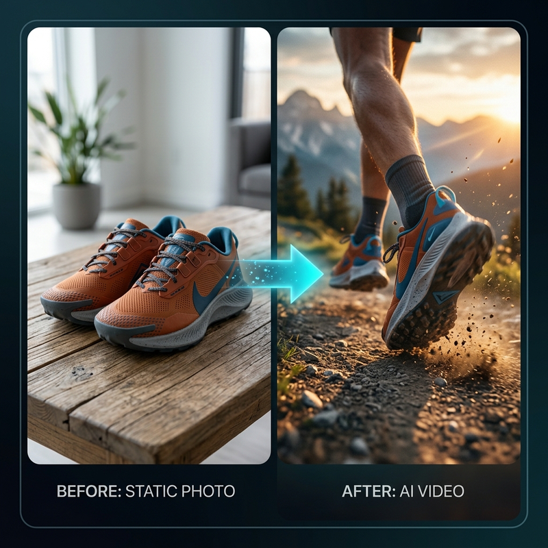
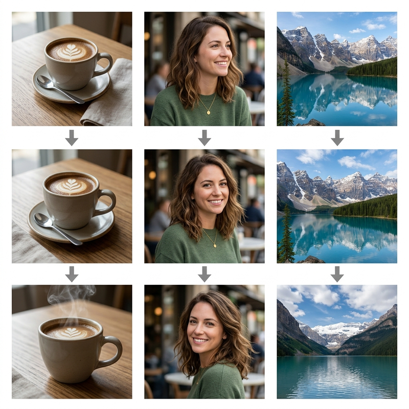
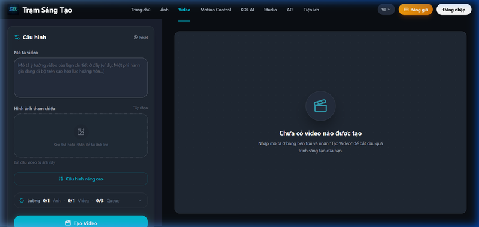
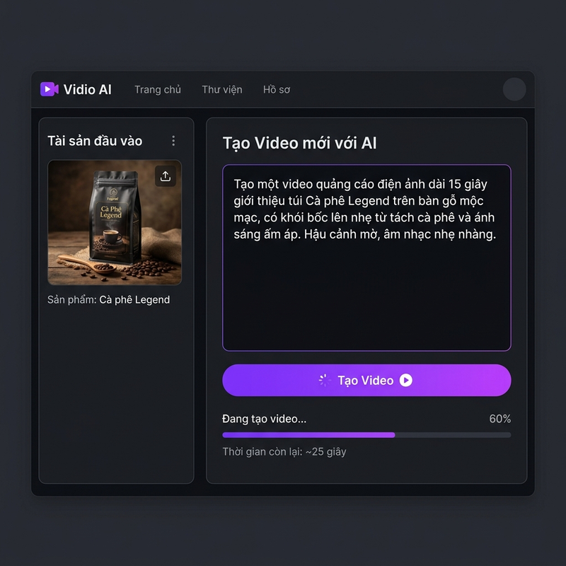
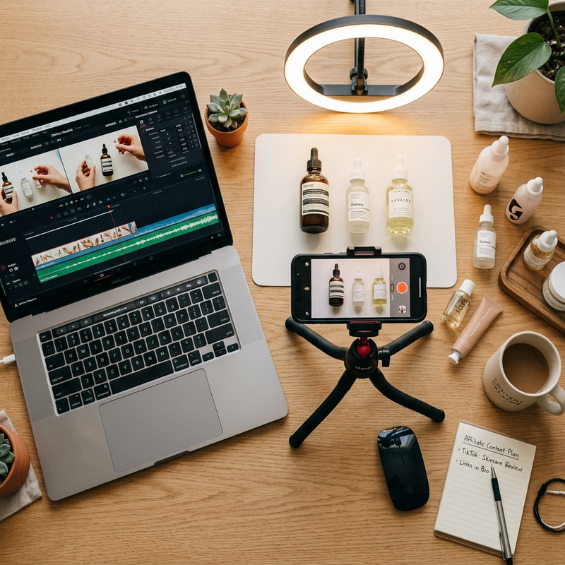
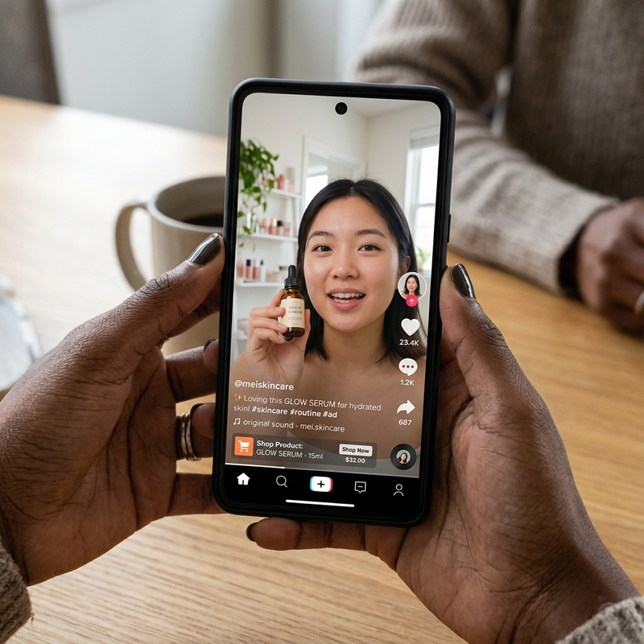

# Cách Tạo Video AI Từ Ảnh: Hướng Dẫn Toàn Diện Cho Người Mới 2026



Bạn có **1 tấm ảnh sản phẩm**, và bạn muốn biến nó thành video review cuốn hút cho TikTok. Bạn có **1 bức chân dung**, và bạn muốn nhân vật trong đó bước đi, quay đầu, mỉm cười. Bạn có **1 bức phong cảnh**, và bạn muốn mây bay, nước chảy, ánh sáng thay đổi theo thời gian thực.

Tất cả những điều trên giờ đây đều có thể làm được — chỉ cần 1 ảnh, 1 dòng mô tả, và đúng công cụ AI.

Bài viết này là **hướng dẫn toàn diện nhất bằng tiếng Việt** về cách tạo video AI từ ảnh năm 2026. Từ người chưa biết gì đến creator chuyên nghiệp, bạn sẽ tìm thấy đúng phương pháp phù hợp với mình.

---

## Video AI Từ Ảnh Là Gì? (Image-to-Video)

**Image-to-Video (I2V)** là công nghệ sử dụng trí tuệ nhân tạo để phân tích một bức ảnh tĩnh, hiểu nội dung trong đó (người, vật, bối cảnh), và tạo ra chuyển động tự nhiên — biến ảnh thành video 5-15 giây.

Khác với cách làm video truyền thống (cần quay phim, dàn dựng, biên tập), I2V chỉ cần:

- **1 ảnh đầu vào** (ảnh sản phẩm, chân dung, phong cảnh...)
- **1 prompt mô tả** (tùy chọn) — ví dụ: "cô gái quay đầu mỉm cười, tóc bay nhẹ trong gió"
- **AI sẽ tự tạo** chuyển động, vật lý ánh sáng, và camera movement


*Từ ảnh tĩnh → video AI chỉ trong 30 giây: cà phê bốc khói, chân dung cử động, phong cảnh sống động.*

### Ai Cần Tạo Video AI Từ Ảnh?

- **Affiliate marketer:** Biến 1 ảnh sản phẩm thành 100 video review, đăng TikTok Shop hàng loạt mà không cần quay
- **Content creator TikTok/Reels:** Tạo video ngắn eye-catching, thu hút view mà không cần lộ mặt
- **Chủ shop online:** Video sản phẩm chuyên nghiệp từ ảnh chụp smartphone, không cần studio
- **Designer/Filmmaker:** Tạo storyboard, concept video, hoặc moodboard động cho khách hàng
- **Người làm YouTube:** Tạo b-roll, intro, hoặc video minh họa từ ảnh stock

---

## 5 Công Cụ Tạo Video AI Từ Ảnh Tốt Nhất 2026

Thị trường AI video đang bùng nổ. Dưới đây là 5 công cụ hàng đầu, xếp hạng theo **chất lượng output + khả năng tiếp cận cho người Việt:**

### 1. Kling AI 3.0 (Kuaishou)

**Điểm mạnh:** Chất lượng 4K/60fps, audio tích hợp (lip sync 5 ngôn ngữ), multi-shot với character consistency. Hiện tại là model I2V mạnh nhất về mặt kỹ thuật.

**Hạn chế:** Giao diện tiếng Anh/Trung, thanh toán bằng Visa/Mastercard quốc tế, giá gốc khá cao (~$10/tháng cho bản Standard).

**Phù hợp cho:** Creator cần chất lượng cao nhất, sẵn sàng trả bằng thẻ quốc tế.

→ *Đọc chi tiết: [Kling AI Review 2026](/drafts/kling-ai-review)*

### 2. Google Veo 3.1

**Điểm mạnh:** Độ phân giải 4K gốc, vật lý ánh sáng cực chân thực, tích hợp trong hệ sinh thái Google (YouTube, Google Ads).

**Hạn chế:** Truy cập hạn chế (chủ yếu qua Google AI Studio hoặc Vertex AI), giá cao cho dùng thương mại.

**Phù hợp cho:** Dự án quảng cáo chuyên nghiệp, sản xuất video thương mại cần chất lượng tuyệt đối.

### 3. Seedance 2.0 (ByteDance)

**Điểm mạnh:** Character consistency xuất sắc, multi-shot storytelling tự động, free tier trên Dreamina.

**Hạn chế:** Giao diện toàn tiếng Trung (Jimeng AI), cần tài khoản Trung Quốc để dùng đầy đủ, không có audio tích hợp.

**Phù hợp cho:** Người có tài khoản Trung Quốc, hoặc dùng qua nền tảng trung gian.

→ *Đọc chi tiết: [Seedance AI Review 2026](/drafts/seedance-ai-review)*

### 4. OpenAI Sora 2

**Điểm mạnh:** Vật lý chân thực nhất (nước, lửa, khói), prompt hiểu ngữ cảnh phức tạp, tích hợp ChatGPT Plus.

**Hạn chế:** Chỉ dùng được qua ChatGPT Plus ($20/tháng), giới hạn số lượng video/ngày, chưa hỗ trợ batch processing.

**Phù hợp cho:** Creator cần video cinematic, sẵn sàng trả $20/tháng cho ChatGPT Plus.

### 5. Trạm Sáng Tạo (Tất Cả Trong Một)


*Workspace tạo video AI trên Trạm Sáng Tạo — chọn model, upload ảnh, nhập prompt, và nhấn tạo.*

**Điểm mạnh:** Tập hợp **tất cả model** trên (Kling 2.5/2.6/3.0, Veo 3, Sora 2) vào 1 giao diện duy nhất. 100% tiếng Việt, thanh toán MoMo, giá rẻ hơn 2-3 lần so với dùng trực tiếp.

**Hạn chế:** Không phải model gốc (đi qua API), nên đôi khi tốc độ xử lý chậm hơn vài giây so với dùng trực tiếp.

**Phù hợp cho:** Người Việt muốn dùng nhiều model AI mà không cần thẻ quốc tế, tài khoản nước ngoài.

**Giá tham khảo:**

| Gói | Giá | Credits | Ước tính |
| --- | --- | --- | --- |
| **Starter** | 99.000đ | 2.000 | ~33 video Kling hoặc ~250 ảnh AI |
| **Pro** | 179.000đ | 4.000 | ~66 video Kling |
| **Business** | 449.000đ | 11.000 | ~183 video Kling |
| **Unlimited Kling 2.5** | 899.000đ/tháng | Không giới hạn | Video 5s & 10s, 720p |

---

## Bảng So Sánh Tổng Hợp

| Tiêu chí | Kling 3.0 | Veo 3.1 | Seedance 2.0 | Sora 2 | Trạm Sáng Tạo |
| --- | --- | --- | --- | --- | --- |
| **Chất lượng tối đa** | 4K/60fps | 4K | 2K | 1080p | Tùy model chọn |
| **Audio tích hợp** | Có (lip sync) | Có | Không | Có | Tùy model |
| **Multi-shot** | Có | Có | Có (tốt nhất) | Hạn chế | Có |
| **Giá khởi điểm** | ~$7/tháng | ~$20/tháng | ~$10/tháng | $20/tháng (ChatGPT+) | 99k VNĐ (~$4) |
| **Thanh toán VN** | ❌ Visa/MC | ❌ Visa/MC | ❌ Alipay | ❌ Visa/MC | ✅ MoMo, Bank VN |
| **Tiếng Việt** | ❌ | ❌ | ❌ | ❌ | ✅ 100% |
| **Tổng hợp model** | Chỉ Kling | Chỉ Veo | Chỉ Seedance | Chỉ Sora | Kling + Veo + Sora + Flux + ... |

---

## Cách Viết Prompt Tạo Video AI Hiệu Quả

Prompt (câu mô tả) quyết định 80% chất lượng video AI. Dưới đây là công thức viết prompt hiệu quả:


*Nhập prompt mô tả → AI tự tạo video từ ảnh. Prompt càng chi tiết, video càng chất lượng.*

### Công Thức Prompt 5 Thành Phần

```
[Chủ thể] + [Hành động] + [Bối cảnh] + [Phong cách] + [Camera]
```

**Ví dụ:**

| Prompt | Kết quả mong đợi |
| --- | --- |
| "Cô gái mặc áo dài trắng đi dọc con phố cổ Hà Nội, ánh nắng chiều vàng, quay chậm theo chân" | Video cinematic, ánh sáng golden hour, tracking shot |
| "Close-up đôi giày sneaker trên bàn gỗ, camera zoom chậm, ánh sáng studio, nền mờ" | Video sản phẩm chuyên nghiệp kiểu quảng cáo |
| "Em bé ngồi trên ghế sofa cười, tay vẫy, camera tĩnh, ánh sáng tự nhiên trong phòng" | Video gia đình tự nhiên, warm tone |

### 7 Mẹo Viết Prompt "Chạy" Tốt

1. **Mô tả hành động cụ thể** — "quay đầu sang trái" thay vì "cử động"
2. **Nêu rõ hướng camera** — "zoom in", "tracking shot", "camera tĩnh", "slow pan left"
3. **Chỉ định ánh sáng** — "golden hour", "studio lighting", "neon city lights"
4. **Dùng tiếng Anh** cho prompt (phần lớn model AI hiểu tiếng Anh tốt hơn tiếng Việt)
5. **Giữ prompt ngắn gọn** — 1-2 câu, 20-40 từ là lý tưởng
6. **Tránh phủ định** — nói "camera tĩnh" thay vì "không rung camera"
7. **Thử nhiều lần** — cùng 1 prompt, mỗi lần AI tạo ra kết quả khác nhau. Chạy 2-3 lần rồi chọn bản tốt nhất

### Prompt Tiếng Việt Có Được Không?

Có, nhưng hạn chế. Hầu hết model (Kling, Veo, Sora) hiểu tiếng Anh tốt hơn tiếng Việt rất nhiều. Nếu bạn dùng Trạm Sáng Tạo, giao diện sẽ tiếng Việt nhưng **prompt nên viết bằng tiếng Anh** để có kết quả tốt nhất.

> **Mẹo:** Dùng ChatGPT/Gemini để dịch ý tưởng từ tiếng Việt sang prompt tiếng Anh. Ví dụ: nhập "tạo video cô gái đi dạo phố cổ Hà Nội lúc chiều" → AI sẽ gợi ý prompt chuẩn.

---

## Ứng Dụng Thực Tế: 4 Kịch Bản Phổ Biến Nhất

### Kịch Bản 1: Làm Video Affiliate Không Cần Lộ Mặt


*Chỉ cần 1 ảnh sản phẩm + AI = video review chuyên nghiệp, đăng TikTok Shop không cần quay.*

Đây là use case phổ biến nhất của video AI tại Việt Nam. Quy trình:

1. **Chụp/lấy ảnh sản phẩm** từ nhà cung cấp (1 ảnh nền trắng là đủ)
2. **Upload lên công cụ I2V** → AI tự tạo video xoay sản phẩm, zoom chi tiết
3. **Ghép text overlay** (tên sản phẩm, giá, link) bằng CapCut
4. **Đăng lên TikTok Shop** kèm link affiliate

**Kết quả:** 1 ảnh → 5-10 video khác nhau (đổi prompt, đổi góc camera) → đăng 5-10 TikTok/ngày mà không cần quay 1 giây nào.

→ *Đọc chi tiết: [Video AI Cho Affiliate TikTok Shop](/drafts/video-ai-affiliate-tiktok-shop)*

### Kịch Bản 2: Tạo Video Ngắn TikTok/Reels Viral


*Video AI chất lượng cao đăng TikTok — thu hút view mà không cần lộ mặt hay setup quay phim.*

Muốn video AI "viral" trên TikTok? Đây là 3 dạng content đang hot:

- **Dance/Nhảy:** Upload ảnh chân dung → dùng Motion Control áp chuyển động nhảy TikTok → đăng kèm nhạc trending
- **Before/After:** Ảnh "trước khi" → video "sau khi" biến đổi (skincare, thời trang, decor)
- **Story ngắn:** Tạo chuỗi video 3-4 cảnh kể câu chuyện mini (dùng multi-shot của Kling 3.0 hoặc Seedance)

→ *Đọc chi tiết: [Cách Tạo Video AI Nhảy TikTok](/drafts/video-ai-nhay-tiktok)*

### Kịch Bản 3: Video Sản Phẩm Cho Shop Online

Chủ shop có 100 sản phẩm nhưng không thể quay video cho từng cái? AI giải quyết:

1. **Chụp ảnh sản phẩm** bằng điện thoại (nền sáng, góc rõ ràng)
2. **Prompt:** "Product rotating 360 degrees on white background, smooth motion, studio lighting"
3. **AI tạo video** xoay sản phẩm 360°, zoom vào chi tiết
4. **Upload lên Shopee/Lazada/TikTok Shop** → tỷ lệ chuyển đổi tăng 20-40% so với ảnh tĩnh

### Kịch Bản 4: Tạo Video Không Cần Quay (Zero-Camera Content)

Bạn hoàn toàn có thể tạo kênh YouTube/TikTok **mà không cần quay 1 giây nào:**

1. **Tạo ảnh bằng AI** (Flux, Nano Banana) — nhân vật, bối cảnh, sản phẩm
2. **Biến ảnh thành video** bằng I2V (Kling, Veo)
3. **Thêm giọng đọc** bằng TTS tiếng Việt (ElevenLabs, Viettel AI)
4. **Ghép và edit** bằng CapCut → upload

> Toàn bộ pipeline trên có thể chạy trên [Trạm Sáng Tạo](https://tramsangtao.com) — tạo ảnh (tab Ảnh), biến thành video (tab Video), thậm chí tạo KOL ảo lip sync (tab KOL AI).

---

## Lưu Ý Quan Trọng Khi Tạo Video AI Từ Ảnh

### Chất Lượng Ảnh Đầu Vào Quyết Định Tất Cả

- **Ảnh rõ nét, phân giải cao** → video AI sẽ rõ và đẹp
- **Ảnh mờ, pixel, chụp lệch** → video AI cũng sẽ mờ và lỗi
- Tối thiểu **720p** (1280×720), lý tưởng **1080p trở lên**
- Tránh ảnh có watermark, logo, hoặc text overlay

### Thời Lượng Tối Đa

Tất cả model AI hiện tại đều giới hạn **5-15 giây/clip**. Nếu cần video dài hơn:
- Tạo nhiều clip 10 giây → ghép bằng CapCut
- Hoặc dùng feature multi-shot để tạo video nhiều cảnh liên tục

### Chi Phí Thực Tế

| Nhu cầu | Công cụ gợi ý | Chi phí hàng tháng |
| --- | --- | --- |
| Thử nghiệm (5-10 video/tháng) | Trạm Sáng Tạo Starter | 99.000đ |
| Creator trung bình (30-50 video/tháng) | Trạm Sáng Tạo Pro | 179.000đ |
| Affiliate scale (100+ video/tháng) | Trạm Sáng Tạo Business hoặc Unlimited | 449.000đ - 899.000đ |
| Chất lượng cao nhất | Kling 3.0 trực tiếp + ChatGPT Plus | ~$30/tháng (~750.000đ) |

---

## Hướng Dẫn Sử Dụng Trạm Sáng Tạo (Step-by-Step)

*Phần này đang được cập nhật với hướng dẫn chi tiết từng bước kèm ảnh chụp màn hình. Quay lại sau để xem hướng dẫn đầy đủ!*

<!--
TODO: Bổ sung step-by-step screenshots:
1. Đăng ký tài khoản
2. Nạp credits qua MoMo
3. Chọn tab Video → chọn model (Kling 2.6 hoặc 3.0)
4. Upload ảnh đầu vào
5. Nhập prompt
6. Nhấn tạo → chờ kết quả
7. Download video thành phẩm
-->

---

## FAQ — Câu Hỏi Thường Gặp

### Tạo video AI từ ảnh có miễn phí không?

Một số tool có free tier giới hạn:
- **Dreamina (Seedance):** 2-3 video ngắn miễn phí/ngày
- **Kling AI:** 66 credits miễn phí/ngày (có watermark)
- **Trạm Sáng Tạo:** Gói dùng thử 99k (hoàn tiền 7 ngày nếu không ưng)

Để sử dụng sản xuất thực tế (không watermark, chất lượng cao), bạn sẽ cần trả phí từ 99k-200k VNĐ/tháng.

### Có cần biết tiếng Anh không?

Nếu dùng trực tiếp Kling, Veo, Sora → cần tiếng Anh cơ bản để setup tài khoản và viết prompt. Nếu dùng Trạm Sáng Tạo → giao diện 100% tiếng Việt, nhưng prompt nên viết tiếng Anh cho kết quả tốt nhất.

### Video AI có bị phát hiện là fake không?

Video AI chất lượng cao từ Kling 3.0 hoặc Veo 3 gần như không thể phân biệt bằng mắt thường với video quay thật. Tuy nhiên:
- Clip dài hơn 5 giây đôi khi có hiện tượng "biến dạng" nhẹ ở tay, ngón tay
- Mắt nhân vật có thể chớp không tự nhiên
- Text trong video (biển hiệu, chữ) thường bị sai

### Ảnh chụp bằng điện thoại có dùng được không?

Hoàn toàn được! Miễn là ảnh đủ sáng, rõ nét, và phân giải tối thiểu 720p. Ảnh chụp iPhone/Samsung đời mới đều đủ tiêu chuẩn.

### Tạo bao nhiêu video từ 1 ảnh?

Không giới hạn. Từ 1 ảnh, bạn có thể tạo hàng chục video khác nhau bằng cách:
- Thay đổi prompt (góc camera khác, hành động khác)
- Chọn model khác (Kling cho chất lượng cao, Kling Turbo cho nhanh)
- Thay đổi thời lượng (5s vs 10s)

### Làm video review sản phẩm bằng AI có vi phạm chính sách TikTok/Shopee không?

Hiện tại (03/2026), TikTok và Shopee **chưa cấm** video sản phẩm tạo bằng AI. Tuy nhiên:
- Không nên gắn tag "video thật" nếu dùng AI
- Video AI chỉ nên dùng để **giới thiệu sản phẩm**, không đưa claim sai sự thật
- Nên thêm 1-2 clip quay thật xen kẽ để tăng trust

---

## Kết Luận

Tạo video AI từ ảnh không còn là "công nghệ tương lai" — nó đang xảy ra ngay bây giờ, và hàng nghìn creator Việt Nam đã dùng nó để scale content, tiết kiệm thời gian, và tăng doanh thu.

**3 điều bạn cần nhớ:**
1. **Chọn đúng công cụ** — Kling 3.0 cho chất lượng cao nhất, Trạm Sáng Tạo cho tiện lợi và giá tốt nhất
2. **Viết prompt tốt** — mô tả cụ thể hành động, camera, ánh sáng
3. **Thực hành nhiều** — mỗi lần tạo video, bạn sẽ học được cách viết prompt tốt hơn

> **[Bắt Đầu Tạo Video AI Ngay Tại Trạm Sáng Tạo](https://tramsangtao.com/video)** — Hỗ trợ Kling, Veo, Sora và nhiều model khác. Giao diện tiếng Việt, thanh toán MoMo. **Dùng thử 99k, hoàn tiền 7 ngày nếu không ưng ý!**

---

## Bài Viết Liên Quan

- [Kling AI Review 2026: Tính Năng, Giá, Và Cách Dùng](/drafts/kling-ai-review)
- [Seedance AI Là Gì? Review Chi Tiết Seedance 2.0](/drafts/seedance-ai-review)
- [So Sánh 7 Công Cụ Tạo Video AI Tốt Nhất 2026](/drafts/so-sanh-tool-tao-video-ai)
- [Video AI Cho Affiliate TikTok Shop](/drafts/video-ai-affiliate-tiktok-shop)
- [Cách Tạo Video AI Nhảy TikTok Triệu View](/drafts/video-ai-nhay-tiktok)
- [Cách Tạo KOL Ảo TikTok Từ A-Z](/drafts/kol-ai-tiktok)
