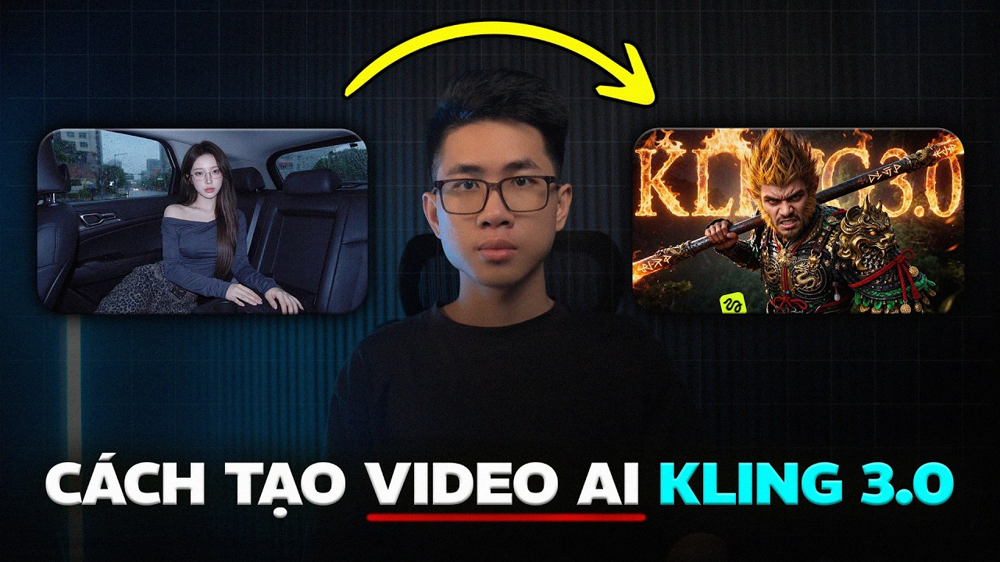

---
title: "Kling AI Giá Bao Nhiêu? Đừng Mua Nhầm Gói Mắc Hơn Mức Bạn Cần"
slug: "kling-ai-gia-bao-nhieu-bang-gia-2025"
meta_title: "Kling AI Giá Bao Nhiêu? So Sánh Các Gói 2024"
meta_description: "Kling AI giá bao nhiêu? Breakdown chi tiết các gói Free, Standard, Pro, Premier và lời khuyên chọn đúng gói cho người làm content tại Việt Nam."
tags:
  - Kling AI
  - AI tạo video
  - giá Kling AI
  - công cụ AI
  - content creator
status: draft
---

# Kling AI Giá Bao Nhiêu? Đừng Mua Nhầm Gói Mắc Hơn Mức Bạn Cần

Bạn vừa xem một clip video AI trôi mượt trên TikTok, tra Google, phát hiện ra đó là Kling AI — rồi click vào trang chính thức và... bị chóng mặt với bảng giá đô la, credit point, tier subscription chồng chất nhau. Quen không?

Vấn đề không phải Kling AI đắt hay rẻ. Vấn đề là bảng giá của họ được thiết kế cho thị trường quốc tế, tính bằng USD, yêu cầu thẻ ngoại tệ, và nếu bạn không dùng đủ credit mỗi tháng thì tiền bay mà không có video nào ra hồn. Với người làm content ở Việt Nam — đặc biệt affiliate marketer hay freelancer cần output đều đặn nhưng không phải ngày nào cũng cần — đây là cái bẫy rất dễ dính.

Bài này sẽ breakdown thẳng: Kling AI giá bao nhiêu trên thị trường quốc tế, bạn thực sự cần bao nhiêu, và tại sao nhiều người VN đang chọn cách tiếp cận khác để dùng Kling mà không bị lãng phí tiền.

---

## Kling AI Giá Gốc Trên Trang Chủ: Con Số Thực Tế

<iframe width="100%" class="aspect-video mt-4 mb-8 rounded-lg shadow-lg" src="https://www.youtube.com/embed/rP2VsvuKe5k" frameborder="0" allowfullscreen></iframe>

Tính đến thời điểm bài này được viết, Kling AI (do Kuaishou phát triển) có các gói chính như sau khi tính ra giá USD:

- **Free**: Giới hạn ~66 credit/tháng, chỉ dùng được model cũ, watermark
- **Standard (~$8-10/tháng)**: Khoảng 660 credit, dùng được model trung bình
- **Pro (~$28-35/tháng)**: ~3.300 credit, unlock model cao hơn
- **Premier (~$90+/tháng)**: Credit lớn, priority queue

Nghe có vẻ ổn? Nhưng chú ý: **1 video 5 giây bằng Kling 2.0 ở chế độ standard tốn khoảng 30-60 credit**. Nếu bạn chạy gói Standard với 660 credit, bạn chỉ làm được tối đa 10-20 video ngắn mỗi tháng. Với content creator làm affiliate cần 30-50 clip/tháng, gói này không đủ. Mà nhảy lên Pro thì lại tốn gần $35/tháng — khoảng 900.000đ — chỉ để làm video AI.

Chưa kể: credit không rollover. Tháng nào không dùng hết là mất.

---

## Kling 2.5, 2.6, 3.0 — Khác Gì Nhau Và Ảnh Hưởng Gì Đến Giá?

Đây là chỗ nhiều người bị nhầm. Kling không chỉ có một model — hiện tại có **Kling 2.5, Kling 2.6, và Kling 3.0**, mỗi version có khả năng khác nhau và tốn credit khác nhau.

**Kling 2.5** vẫn là workhorse đáng tin — xử lý motion tốt, ít hallucination, phù hợp với product video, lifestyle content. Chi phí credit ở mức trung bình.

**Kling 2.6** cải thiện đáng kể về coherence (nhân vật không bị "tan chảy" giữa chừng), tốt hơn cho video có người thật hoặc cần continuity dài hơn. Tốn credit hơn một chút.

**Kling 3.0** — flagship mới nhất, motion cực mượt, hiểu prompt phức tạp hơn, nhưng tốn credit nhiều nhất. Không phải clip nào cũng cần dùng 3.0.

**Bài học thực tế**: Nếu bạn làm content sản phẩm beauty, fashion, food — Kling 2.5 đủ dùng và tiết kiệm hơn đáng kể. Chỉ khi cần cinematic quality hoặc motion phức tạp mới cần leo lên 2.6 hoặc 3.0.

---

## Tại Sao Mua Trực Tiếp Kling AI Không Phải Lúc Nào Cũng Là Lựa Chọn Tốt Nhất?

Hãy tính thẳng. Nếu bạn:

- Không có thẻ Visa/Mastercard quốc tế → thanh toán trực tiếp là vấn đề
- Làm việc theo dự án, không cần dùng đều mỗi tháng → subscription là lãng phí
- Muốn test nhiều model khác nhau (Kling + Veo3 + Seedance) thay vì lock-in một nền tảng
- Cần hóa đơn VND hoặc ví dụ như muốn dùng tiền từ affiliate commission

...thì model subscription trực tiếp từ Kling không phải cách tối ưu.

Đây là lý do nền tảng như **tramsangtao.com** tồn tại và đang được nhiều content creator VN chọn: thay vì subscribe từng nền tảng riêng lẻ, bạn nạp credit một lần, dùng được Kling 2.5/2.6/3.0, Veo3, Seedance 2.0, FLUX cho ảnh, Nano Banana Pro cho portrait — tất cả trong một chỗ, không subscription, không credit bị mất cuối tháng.

Tư duy "pay per use" phù hợp hơn với cách người VN làm content: dự án về thì dùng nhiều, tháng chạy campaign thì cần nhiều credit, tháng slow thì không cần ép xài cho đủ gói.

---

## Ai Thực Sự Cần Dùng Kling AI Và Nên Chọn Mức Nào?

Không phải ai cũng cần Kling 3.0 với gói Premier. Thực tế, phần lớn người làm nội dung affiliate, marketing tại Việt Nam rơi vào ba nhóm:

### Nhóm 1: Content Creator làm TikTok/Reels

Bạn cần 20-40 clip/tháng, mỗi clip 5-10 giây, chủ yếu là sản phẩm hoặc lifestyle. **Kling 2.5 là đủ.** Không cần chạy 3.0 cho mỗi clip quảng cáo son môi hay thực phẩm chức năng. Ưu tiên output volume hơn là perfection từng frame.

### Nhóm 2: Agency hoặc Freelancer nhận dự án

Nhu cầu không đều — tháng 2 dự án tháng 0 dự án. Subscription cố định là rủi ro. Mô hình credit linh hoạt phù hợp hơn nhiều. Kling 2.6 là sweet spot cho dạng này vì balance giữa quality và cost.

### Nhóm 3: Brand/Marketer cần hero content

Campaign lớn, cần video cinematography chất lượng cao, khách hàng review kỹ. Đây là nhóm nên cân nhắc Kling 3.0 — nhưng cũng nên tính: một hero video tốt tốn 3.0 credit, còn 20 video thường thì dùng 2.5. Đừng dùng đại bác bắn muỗi.

---

## So Sánh Nhanh: Kling vs Veo3 vs Seedance — Khi Nào Dùng Cái Nào?

Câu hỏi này thực ra quan trọng hơn "Kling AI giá bao nhiêu" — vì đôi khi không dùng Kling mới là quyết định đúng.

| | Kling 2.5/2.6/3.0 | Veo3 (Google) | Seedance 2.0 |
|---|---|---|---|
| **Mạnh ở** | Motion mượt, nhân vật nhất quán | Hiểu ngôn ngữ tự nhiên, cinematic lighting | Tốc độ render nhanh, style đa dạng |
| **Phù hợp** | Product video, lifestyle, fashion | Storytelling, brand narrative | Social content nhanh, A/B testing |
| **Hạn chế** | Prompt cần cụ thể, không quá abstract | Chưa tốt với motion phức tạp | Chưa mạnh bằng Kling về character consistency |

Nếu bạn đang làm video kể chuyện thương hiệu với nhiều dialogue và cảnh khác nhau → Veo3 đáng thử. Nếu cần test 10 variation của một clip quảng cáo nhanh → Seedance 2.0 phù hợp hơn. Và khi cần motion chất lượng cao, nhân vật nhất quán → Kling là lựa chọn.

Không có model nào "tốt nhất" — chỉ có model phù hợp với use case cụ thể.

---

## 🧐 Case Study: Bài Toán ROI Của Một TikTok Shop Chủ Lực

Để bạn dễ hình dung, hãy giải bài toán chi phí của một kênh TikTok chuyên Review Đồ Gia Dụng:
- **Mục tiêu:** 20 video ra mắt vào tháng Tới.
- **Cách làm cũ (Tự quay dựng):** Thuê mẫu (2tr/ngày), Thuê Studio (1tr/ngày), Quay phim + Dựng (3tr/video). Tổng chi phí ước tính: ~65 triệu VNĐ cho 20 video.
- **Cách làm AI (Dùng Kling 2.5/2.6):** 
  - Mua model Ảo (dùng Nano Banana tạo 1 nhân vật cố định): Tốn ~50 credits.
  - Render 20 video x 3 lần test/video = 60 lần render.
  - Dùng Kling 2.5: 60 x 50 credits = 3.000 credits.
  - Tổng chi phí credits (sau hao hụt): Chưa tới 1 triệu VNĐ (nếu quy đổi từ API).
- **Kết quả:** Về mặt Visual, video có thể không bằng 100% người thật, nhưng ROI (Lợi nhuận ròng/Chi phí) cao hơn gấp 60 lần. Chủ shop có thể lấy 64 triệu còn lại để vã Ads (Chạy quảng cáo).

---

## 💎 Pro-Tips: Dùng Kling Sao Cho Không Rớt 1 Đồng Oan Uổng

1. **Test Mù Quáng Bằng 3.0 Là Tự Sát Tài Chính:** Rất nhiều Newbie thấy Kling 3.0 ra mắt là auto bật 3.0 để gõ prompt `a cat playing piano`. Đừng! Hãy dùng 2.5 để test prompt (tốn 1/3 giá tiền). Khi con mèo đàn Piano đúng góc quay bạn muốn, hãy copy hạt giống (Seed) đó, và ném sang 3.0 để render bản Final thật nét.
2. **Loại Bỏ Góc Dừa (Negative Prompt):** Bất kỳ một credit nào bay đi cho một video AI làm sai ý (mọc thêm ngón tay, vật thể thứ 3 bay lượn) đều là tiền. Luôn chuẩn hóa bộ Negative Prompt (Ví dụ: `deformed, extra fingers, messy, messy background, worst quality, low quality, glitch`) và copy-paste vào mọi lúc.
3. **Cắt Ngắn Lại:** Kling thường có tính năng kéo dài video (Extend) tự động nếu clip có dấu hiệu ngắt. Việc này độn thêm tiền render. Chỉ render 5s trước, nếu đoạn cuối 5s có vẻ ăn tiền mới bấm Extend.

---

## FAQ — Những Câu Hỏi Hay Gặp Về Kling AI Giá Cả

**Kling AI có bản miễn phí không?**
Có, nhưng rất hạn chế — khoảng 66 credit/tháng, chỉ dùng model cũ, video có watermark. Đủ để test xem Kling có phù hợp với bạn không, không đủ để dùng thực tế.

**Dùng Kling AI trên tramsangtao.com có rẻ hơn mua trực tiếp không?**
Tùy cách bạn dùng. Nếu bạn dùng đều đặn mỗi tháng và cần volume lớn, gói trực tiếp từ Kling có thể hợp lý hơn. Nhưng nếu bạn dùng không đều, muốn linh hoạt chuyển giữa nhiều model, hoặc không có thẻ quốc tế — credit trên tramsangtao.com tiết kiệm và đơn giản hơn nhiều.

**Kling 3.0 có đáng dùng hơn 2.5 không?**
Với hầu hết nội dung social media — không nhất thiết. Kling 3.0 tốt hơn về cinematic quality và xử lý prompt phức tạp, nhưng tốn credit nhiều hơn. Cho video sản phẩm thông thường, Kling 2.5 vẫn cho ra kết quả ổn và tiết kiệm hơn đáng kể.

**Credit Kling có hết hạn không?**
Trên trang chính thức của Kling: credit subscription không rollover, hết tháng là mất. Trên tramsangtao.com thì khác — credit nạp vào không bị expire theo tháng, dùng khi nào cũng được.

**Tôi cần bao nhiêu credit để làm 30 video/tháng cho TikTok?**
Phụ thuộc vào độ dài và model dùng. Ước tính thô: 30 clip 5-8 giây bằng Kling 2.5 tiêu khoảng 900-1.500 credit. Nên tính toán dựa trên use case cụ thể của bạn trước khi mua gói.

---

## Kết: Đừng Để Bảng Giá USD Làm Khó Bạn

Kling AI tốt — đó là sự thật. Nhưng cách mua và cách dùng mới quyết định bạn có lời hay không. Nếu bạn cứ subscribe gói $35/tháng mà tháng nào cũng dùng không hết credit, bạn đang trả tiền cho những video không bao giờ được tạo ra.

Cách tiếp cận thực tế hơn: dùng nền tảng tổng hợp cho phép bạn access Kling 2.5/2.6/3.0 cùng với Veo3, Seedance 2.0, FLUX và Nano Banana Pro — theo model pay-per-use, không lock-in subscription, không mất credit cuối tháng.

**Xem bảng giá chi tiết và thử các model tại [tramsangtao.com/pricing](https://tramsangtao.com/pricing)** — có thể tự test trước khi nạp tiền nhiều. Biết mình cần gì trước khi chi tiền mới là cách làm đúng.