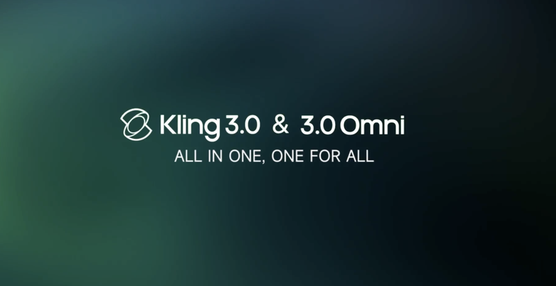
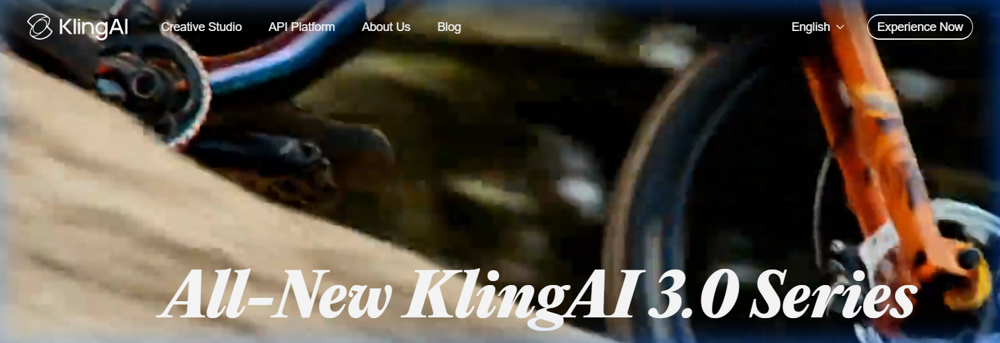
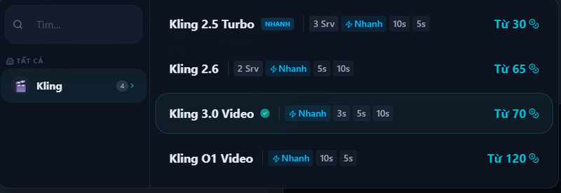
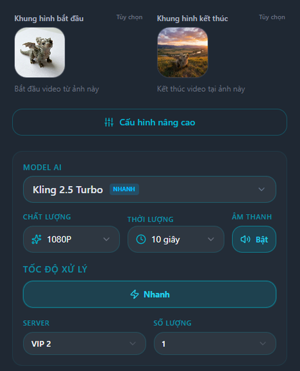

# Kling AI Review 2026: Tính Năng, Giá, Và Cách Dùng Tiếng Việt

Kling AI là một trong những AI video generator mạnh nhất hiện tại — ngang hàng Sora của OpenAI nhưng đã mở rộng thương mại từ lâu. Nếu bạn đang tìm tool tạo video AI chất lượng cao, bài review này sẽ phân tích tất cả những gì bạn cần biết về Kling AI trong năm 2026.

Và quan trọng hơn: cách dùng Kling AI **bằng tiếng Việt, giá rẻ hơn 2-3 lần** qua Trạm Sáng Tạo.

*Xem demo chính thức Kling AI 3.0 — chất lượng 4K/60fps, multi-shot, audio tích hợp.*

---

## Kling AI Là Gì?

Kling AI là nền tảng tạo video bằng trí tuệ nhân tạo do **Kuaishou** (công ty mẹ của Kwai/TikTok Trung Quốc) phát triển. Ra mắt từ 2024, Kling nhanh chóng trở thành đối thủ trực tiếp của Sora, Runway và Pika nhờ chất lượng video vượt trội. Phiên bản mới nhất là **KlingAI 3.0 Series** với nhiều cải tiến về chất lượng và tốc độ.

**Những gì Kling AI có thể làm:**

- **Text-to-Video:** Nhập prompt text → AI tạo video 1080p lên đến 10 giây
- **Image-to-Video:** Upload ảnh tĩnh → AI tạo video chuyển động từ ảnh đó
- **Motion Control:** Áp chuyển động từ video mẫu lên ảnh tĩnh (nhảy, đi, nói chuyện)
- **Lip Sync:** Nhân vật trong video hát nhép hoặc nói theo audio
- **Camera Control:** Kiểm soát góc camera: zoom, pan, orbit, dolly
- **Video Extension:** Kéo dài video ngắn thành video dài hơn

---

## Tính Năng Chi Tiết

### Text-to-Video

Kling AI tạo video từ prompt text với chất lượng thuộc top đầu hiện nay. Điểm mạnh:

- Độ phân giải lên đến **1080p** (nhiều tool đối thủ chỉ 720p)
- Video dài tối đa **10 giây** (đủ cho TikTok, Reels)
- Hiểu prompt phức tạp: mô tả scene, nhân vật, ánh sáng, chuyển động
- Consistent character — nhân vật giữ được diện mạo xuyên suốt video

**Hạn chế:** Prompt bằng tiếng Anh cho kết quả tốt hơn tiếng Việt. Trên Trạm Sáng Tạo, giao diện hỗ trợ nhập prompt tiếng Việt và tự động tối ưu.

### Image-to-Video

Đây là tính năng được dùng nhiều nhất. Upload ảnh → AI "làm sống" bức ảnh thành video chuyển động tự nhiên.

Ứng dụng thực tế:
- Tạo video review sản phẩm từ 1 ảnh chụp
- Biến ảnh chân dung thành video giới thiệu
- Tạo video quảng cáo từ ảnh sản phẩm

### Motion Control

Tính năng giúp Kling nổi bật hơn hẳn đối thủ. Upload ảnh + video chuyển động mẫu → AI áp chuyển động lên nhân vật trong ảnh.

- Phân tích xương khớp 3D từ video mẫu
- Giữ nguyên chi tiết khuôn mặt, trang phục
- Output 1080p, chuyển động mượt mà

Đây chính là tính năng tạo video AI nhảy TikTok mà bạn thấy viral khắp nơi. Xem [hướng dẫn chi tiết tạo video AI nhảy](/blog/video-ai-nhay-tiktok-trieu-view-2026).

### Lip Sync

Nhân vật trong video có thể hát nhép hoặc nói chuyện theo file audio đầu vào. Phù hợp cho:
- Video KOL AI
- Content hát nhép theo nhạc trending
- Video giới thiệu sản phẩm có lời thuyết minh

---

## Kling AI Giá Bao Nhiêu?

### Giá gốc (kling.ai trực tiếp):

| Gói | Giá | Credits/tháng | Lưu ý |
|---|---|---|---|
| Free | $0 | Có credits nhưng không dùng được | Phải nạp sub mới dùng được |
| Standard | $6.99/tháng | 660 credits | ~8-22 video |
| Pro | $25.99/tháng | 3.000 credits | ~37-100 video |
| Premier | $64.99/tháng | 8.000 credits | ~100-266 video |
| Ultra | $127.99/tháng | 26.000 credits | ~325-866 video |

**Vấn đề khi dùng Kling trực tiếp:**
- Giao diện **tiếng Anh và tiếng Trung** — không thân thiện cho người Việt
- Thanh toán **Visa/Mastercard** quốc tế — nhiều người Việt không có
- **Không có support tiếng Việt** — gặp lỗi phải tự xử lý hoặc chờ email
- Prompt tiếng Việt cho kết quả kém hơn tiếng Anh
- Giá gốc không rẻ: $6.99-$25.99/tháng cho gói dùng được

### Dùng Kling AI qua Trạm Sáng Tạo — Rẻ Hơn, Dễ Hơn

[Trạm Sáng Tạo](https://tramsangtao.com) tích hợp Kling AI (cùng engine, cùng chất lượng) với mức giá thấp hơn đáng kể. Đặc biệt, bạn có thể **chọn đúng model Kling mình cần** — từ Kling 2.5 Turbo tiết kiệm đến Kling 3.0 mới nhất:

*Giao diện chọn model Kling trên Trạm Sáng Tạo: Kling 2.5 Turbo từ 30 credits, Kling 3.0 Video từ 70 credits — tất cả tiếng Việt.*

**Giá theo model (tính trên credits Trạm Sáng Tạo):**

| Model | Credits/video | Chi phí ước tính |
|---|---|---|
| Kling 2.5 Turbo | Từ 30 credits | ~1.000 VND/video |
| Kling 2.6 | Từ 65 credits | ~2.100 VND/video |
| Kling 3.0 Video | Từ 70 credits | ~2.200 VND/video |
| Kling O1 Video | Từ 120 credits | ~3.500 VND/video |

> Tính theo gói Tiết Kiệm 199.000 VND = 4.500 credits → ~1.000 VND mỗi video Kling 2.5 Turbo.

**Gói tháng Trạm Sáng Tạo:**

| Gói | Giá | Credits | Ước tính số video Kling |
|---|---|---|---|
| Trải Nghiệm | 99.000 VND | 2.000 | ~25-65 video |
| Tiết Kiệm | 199.000 VND | 4.500 | ~55-150 video |
| Sáng Tạo | 499.000 VND | 13.000 | ~160-430 video |

**Tại sao dùng Trạm Sáng Tạo thay vì Kling trực tiếp?**

- **Giá siêu rẻ:** Chỉ ~1.000 VND/video với Kling 2.5 Turbo — rẻ hơn Kling gốc nhiều lần
- **Chọn đúng model cần:** 4 model Kling (2.5, 2.6, 3.0, O1) — không bị ép dùng 1 model
- **Giao diện 100% tiếng Việt** — mọi nút, tooltip, hướng dẫn đều tiếng Việt
- **Team support người Việt** hỗ trợ chat trực tiếp — không phải chờ email tiếng Anh
- **Thanh toán Momo, chuyển khoản ngân hàng VN** — ai cũng thanh toán được
- **Video hướng dẫn tiếng Việt** trên YouTube
- **Tích hợp nhiều model** — không chỉ Kling mà còn FLUX, Veo3, Higgsfield... trên 1 nền tảng

---

## Kling AI So Với Đối Thủ

| Tiêu chí | Kling AI | Sora (OpenAI) | Runway Gen-3 | Pika 2.0 |
|---|---|---|---|---|
| **Chất lượng** | ⭐⭐⭐⭐⭐ | ⭐⭐⭐⭐⭐ | ⭐⭐⭐⭐ | ⭐⭐⭐ |
| **Motion Control** | ✅ Có | ❌ Không | ❌ Không | ❌ Không |
| **Lip Sync** | ✅ Có | ❌ Không | ❌ Không | ❌ Không |
| **Max resolution** | 1080p | 1080p | 1080p | 720p |
| **Max length** | 10s | 20s | 10s | 5s |
| **Giá** | Từ $6.99/tháng | $20/tháng | $12/tháng | $8/tháng |
| **Dùng qua TST** | ✅ 99k VND | ❌ | ❌ | ❌ |

**Nhận xét:** Kling AI có lợi thế lớn với **Motion Control và Lip Sync** — hai tính năng mà Sora, Runway, Pika đều chưa có. Kết hợp với giá rẻ hơn khi dùng qua Trạm Sáng Tạo, đây là lựa chọn giá trị nhất cho người Việt.

---

## Cách Dùng Kling AI Tiếng Việt Trên Trạm Sáng Tạo

### Bước 1: Đăng ký tài khoản

Truy cập [tramsangtao.com](https://tramsangtao.com) → đăng ký bằng email hoặc Google. Nạp credits qua Momo hoặc chuyển khoản ngân hàng.

### Bước 2: Chọn tính năng

Trên menu chính, chọn tính năng bạn muốn dùng:

*Menu chính Trạm Sáng Tạo: Ảnh, Video, Motion Control, KOL AI, API, Tiện ích — tất cả tiếng Việt.*
- **Video** → Text-to-Video hoặc Image-to-Video
- **Motion Control** → Tạo video nhảy, chuyển động theo mẫu
- **Ảnh** → Tạo ảnh AI

### Bước 3: Nhập input

- **Text-to-Video:** Nhập mô tả scene bằng tiếng Việt hoặc tiếng Anh
- **Image-to-Video:** Upload ảnh + nhập prompt mô tả chuyển động
- **Motion Control:** Upload ảnh nhân vật + video chuyển động mẫu

### Bước 4: Chọn cài đặt và render

Trạm Sáng Tạo cho phép tùy chỉnh chi tiết trước khi render:

*Settings đầy đủ: khung hình bắt đầu/kết thúc, model AI, chất lượng 1080P, thời lượng 10 giây, âm thanh bật/tắt, tốc độ xử lý.*

- **Khung hình bắt đầu/kết thúc (Start & End Frame):** Chọn ảnh đầu và cuối video — AI sẽ tạo chuyển động nối liền hai khung hình
- **Chất lượng:** 1080P (sắc nét, đăng TikTok không bể pixel)
- **Thời lượng:** 5 giây hoặc 10 giây
- **Âm thanh:** Bật/tắt — AI tự tạo âm thanh phù hợp nội dung video
- **Tốc độ xử lý:** Nhanh hoặc Tiêu chuẩn
- Bấm **Tạo video** → chờ 2-5 phút → tải về

> Gặp khó khăn? Chat với team support người Việt ngay trên website.

---

## Kling AI Phù Hợp Với Ai?

**Content creator TikTok/YouTube:**
- Tạo video nhảy AI viral
- Lip sync theo nhạc trending
- Video review sản phẩm từ 1 ảnh

**Người làm affiliate/bán hàng online:**
- Tạo hàng loạt video review sản phẩm
- Video quảng cáo TikTok Shop
- Ảnh → video sản phẩm chuyên nghiệp

**Marketer & Agency:**
- Video quảng cáo nhanh, chi phí thấp
- KOL AI / virtual influencer
- Content đa nền tảng

**Người mới bắt đầu:**
- Dùng Trạm Sáng Tạo — giao diện tiếng Việt, có hướng dẫn, có support

---

## Câu Hỏi Thường Gặp (FAQ)

### Kling AI có miễn phí không?

Kling gốc có gói Free nhưng chỉ được 66 credits/tháng — tạo được 1-2 video. Trên Trạm Sáng Tạo, gói Trải Nghiệm 99.000 VND/tháng cho 2.000 credits — đủ tạo 15-30 video chất lượng cao.

### Kling AI có hỗ trợ tiếng Việt không?

Kling gốc không có giao diện tiếng Việt. Dùng qua [Trạm Sáng Tạo](https://tramsangtao.com) để có giao diện 100% tiếng Việt, support người Việt, và video hướng dẫn tiếng Việt.

### Chất lượng video Kling AI trên Trạm Sáng Tạo có khác Kling gốc không?

Không. Trạm Sáng Tạo sử dụng API chính thức của Kling AI — cùng engine, cùng chất lượng output, cùng 1080p. Chỉ khác giao diện tiếng Việt và giá rẻ hơn.

### Kling AI so với Sora cái nào tốt hơn?

Cả hai đều top đầu về chất lượng. Kling thắng ở **Motion Control và Lip Sync** — hai tính năng Sora chưa có. Sora thắng ở video dài hơn (20s vs 10s). Về giá, Kling (qua TST) rẻ hơn nhiều: 99k vs $20/tháng.

### Tôi không rành công nghệ, có dùng được Kling AI không?

Dùng qua Trạm Sáng Tạo thì hoàn toàn được. Giao diện tiếng Việt, chỉ cần 3-4 bước, có video hướng dẫn YouTube, và team support chat trực tiếp khi cần.

---

## Kết Luận

Kling AI là AI video generator mạnh nhất năm 2026 với tính năng Motion Control và Lip Sync mà không đối thủ nào có. Tuy nhiên, thay vì dùng Kling gốc (tiếng Anh, giá cao, khó thanh toán), **dùng qua Trạm Sáng Tạo là lựa chọn thông minh hơn cho người Việt**:

- ✅ Cùng chất lượng Kling AI gốc
- ✅ Giao diện tiếng Việt 100%
- ✅ Giá rẻ hơn 2-3 lần
- ✅ Thanh toán Momo, ngân hàng VN
- ✅ Support người Việt chat trực tiếp

> 🚀 **[Dùng thử Kling AI tiếng Việt ngay tại tramsangtao.com](https://tramsangtao.com/video)** — Gói Trải Nghiệm chỉ 99.000 VND/tháng.
