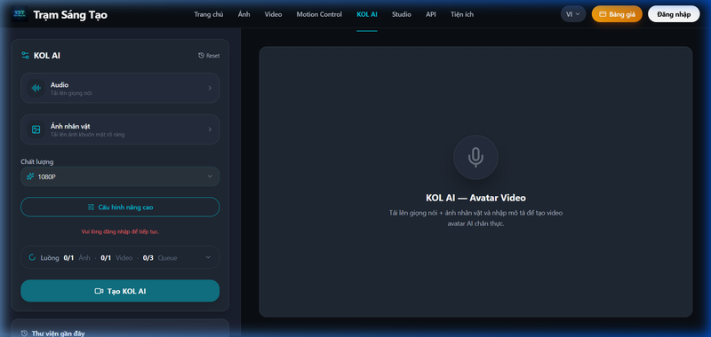

# KOL AI Là Gì? Cách Tạo KOL Ảo TikTok Từ A-Z

Có bao giờ bạn lướt TikTok và thấy những trai xinh, gái đẹp chia sẻ kiến thức cực trôi chảy — nhưng khi nhìn kỹ lại, họ **không phải là người thật**? Chào mừng bạn đến với thế giới của **KOL AI** (hay còn gọi là KOL Ảo), xu hướng hái ra tiền đang bùng nổ trong năm 2026.

Bạn ngại đứng trước ống kính? Đầu tư thiết bị quay phim 30 triệu đồng là quá sức? Hay bạn là dân cày Affiliate muốn nhân bản 10 kênh TikTok cùng lúc với 10 "gương mặt đại diện" khác nhau để vít Ads?

Bài viết này sẽ giải mã **KOL AI là gì** và hướng dẫn **cách tạo KOL ảo TikTok từ A-Z** bằng công cụ AI trên [Trạm Sáng Tạo](https://tramsangtao.com). Đây là "vũ khí bí mật" dành riêng cho Content Creator, người làm Affiliate (TikTok Shop, Shopee) và chủ shop online muốn sở hữu đại sứ thương hiệu riêng dẫu không có vốn.

---

## KOL AI (KOL Ảo) Là Gì?

**KOL AI** (Key Opinion Leader AI) hay **KOL Ảo** là những nhân vật hoàn toàn do trí tuệ nhân tạo (AI) vẽ ra. Mặc dù là đồ họa, họ có tên tuổi, phong cách sống, gu thời trang và sở hữu tài khoản mạng xã hội (TikTok, Instagram) hệt như một người nổi tiếng thật.

Tại Việt Nam, các agency và người làm MMO đang tích cực dùng KOL AI để:
- Làm TikToker chia sẻ tin tức, đọc truyện, tâm sự.
- Xây kênh Affiliate bán quần áo, mỹ phẩm (gắn link TikTok Shop).
- Làm đại sứ thương hiệu "ảo" để giảm rủi ro scandal.

---

## Lợi Thế "Đè Bẹp" KOL Thật Đi Kể Lại

Sự trỗi dậy của KOL AI không phải là ngẫu nhiên. Họ giải quyết được vô số bài toán nhức nhối của việc xây kênh truyền thống:

1. **Chi phí 0 Đồng (Zero Setup):** Không tốn tiền mua máy ảnh, không cần thuê người mẫu, makeup hay set up ánh sáng. Chi phí duy nhất là tiền render video trên server AI (chỉ khoảng ~1.000 VNĐ cho mỗi video clip chất lượng cao).
2. **Không Bao Giờ Mệt Mỏi hay Đòi Tăng Lương:** KOL AI có thể "quay" 50 video quảng cáo mỗi ngày mà không phàn nàn. 
3. **Hoàn Toàn Không Sợ Lên Án / Phốt Đời Tư:** Bạn nắm 100% quyền kiểm soát hình ảnh nhân vật, điều mà không agency nào dám cam đoan khi ký hợp đồng với người nổi tiếng thật.
4. **Không Cần Lộ Mặt:** Tuyệt vời cho sinh viên, dân văn phòng làm nghề tay trái không muốn đồng nghiệp, người thân soi xét.

---

## 3 Bước Tạo KOL AI Tiếng Việt Trực Tiếp Trên Trạm Sáng Tạo

Đa phần các tool tạo Avatar AI hiện tại như HeyGen, Synthesia khá đắt đỏ (từ $29/tháng) và tính phí bằng "phút credit" rất hao mòn, chưa kể giao diện toàn tiếng Anh cứng nhắc. 

Tại Việt Nam, bạn có thể tự làm 1 KOL AI chạy bằng engine Kling lip-sync siêu mượt thông qua tính năng **KOL AI** của [Trạm Sáng Tạo](https://tramsangtao.com/kol-ai) với mức giá **rẻ hơn 3-5 lần**. Tất cả giao diện 100% Tiếng Việt cực kỳ thân thiện.

### Bước 1: Tạo Gương Mặt Đại Diện (Avatar Ảnh)

Đầu tiên, KOL của bạn cần một "giao diện" cố định. 

Vào menu **Ảnh**, nhập prompt mô tả nhân vật bạn muốn (Ví dụ: *"1 cô gái Việt Nam, tóc ngắn cá tính, mặc đồ minimalism, đang ngồi trong quán cafe..."*). 
- Dùng model **FLUX 1.1 Pro** hoặc **Nano Banana Pro** để ra kết quả mặt chân thực nhất.
- Bấm tạo và lưu tấm ảnh ưng ý nhất lại làm "ảnh gốc" (Source Image). Lời khuyên là hãy tạo khuôn mặt nhìn thẳng vào khung hình để AI nhận diện khẩu hình miệng tốt nhất.

*KOL ảo nam dựng theo phong cách chuyên gia đang giải thích kiến thức, cực kỳ phù hợp làm kênh Podcast hoặc tin tức.*

### Bước 2: Soạn Kịch Bản và Âm Thanh

Bạn có kịch bản chữ? Hãy dùng các tool TTS (Text-to-Speech) như Viettel AI, FPT.AI hoặc V-Bee để chuyển thành file âm thanh (MP3, WAV) với giọng Nam/Bắc mượt mà. Đảm bảo file âm thanh dưới 10MB và dưới 30 giây để tối ưu chi phí.

Hoặc nếu tự tin vào giọng mình, bạn có thể tự thu âm bằng điện thoại.

### Bước 3: Ghép Ảnh và Giọng Nói Bằng KOL AI

Truy cập tính năng **KOL AI** trên giao diện menu chính.

1. **Khung Ảnh gốc:** Tải tấm ảnh MC/KOL bạn vừa làm ở Bước 1 lên.
2. **Khung Âm thanh:** Tải file ghi âm (MP3) ở Bước 2 lên.
3. Bấm **Bắt Đầu Phân Tích**.

Hệ thống sẽ dùng AI quét khung mặt và tạo ra chuyển động cơ mặt (mắt, mày, cơ hàm) khớp 100% với file âm thanh tiếng Việt. Chỉ sau chưa tới 1 phút, nhân vật AI của bạn đã cất tiếng nói tự nhiên như quay video thật!

*Giao diện KOL AI 100% tiếng Việt, thao tác đơn giản chỉ cần Upload Nhạc & Ảnh.*

---

## Cách Kiếm Tiền Cùng KOL AI Từ Tuần Đầu Tiên

Dưới đây là 3 lộ trình Monetize (Kiếm Tiền) các anh em MMO đang bào mạnh từ TikTok bẳng KOL ảo:

- **Reviewer TikTok Shop:** 1 ảnh KOL + script review sản phẩm + ảnh chèn sản phẩm = 1 video affiliate. Mỗi video chỉ tốn chi phí khoảng 1k - 2k VNĐ, cực kỳ dễ scale. Chỉ cần 1 đơn hàng hoa hồng 15k là đủ cover tiền vốn 10 video!
- **Channel Thông Tin / Đọc Báo:** Dùng KOL AI đọc bản tin tài chính, chia sẻ kiến thức sách, tâm lý học hằng ngày để build follower lên 100k, sau đó nhận booking Ads PR cho app, khóa học.
- **Kênh Kể Chuyện Ma (Audio Story):** Nhân vật ma mị, giọng đọc rùng rợn, ảnh background AI thay đổi. Nội dung type này luôn có lượng fan cố định siêu cao.

---

## Bắt Đầu Hành Trình "Đạo Diễn Ảo" Của Bạn

Chơi KOL AI không khó, điều quan trọng nhất là bạn cần một hệ thống AI server mạnh mẽ xử lý phần render nặng nề với chi phí tối ưu để chạy số lượng lớn. Thay vì tiêu hàng trăm đô mua credit ngoại, Trạm Sáng Tạo có cổng nạp Momo và hỗ trợ người Việt trong tích tắc.

> 💰 **[Tạo Ngay KOL AI Của Lần Đầu Tiên Tại Trạm Sáng Tạo](https://tramsangtao.com/kol-ai)** — Đăng ký tài khoản mới ngay hôm nay để nhận quyền **dùng thử miễn phí 0 đồng**! Bắt tay vào làm giàu không cần lộ mặt thôi!
