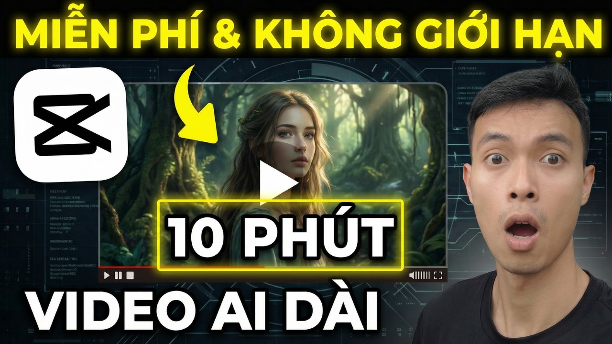
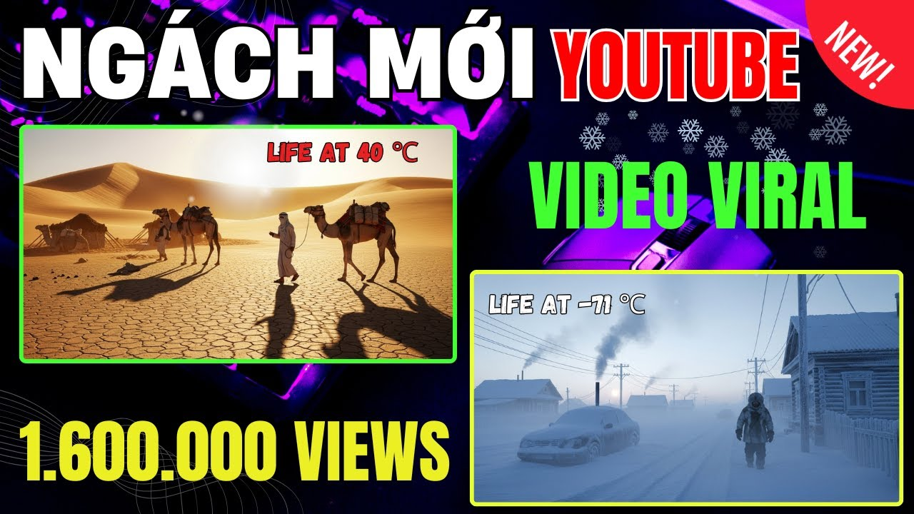
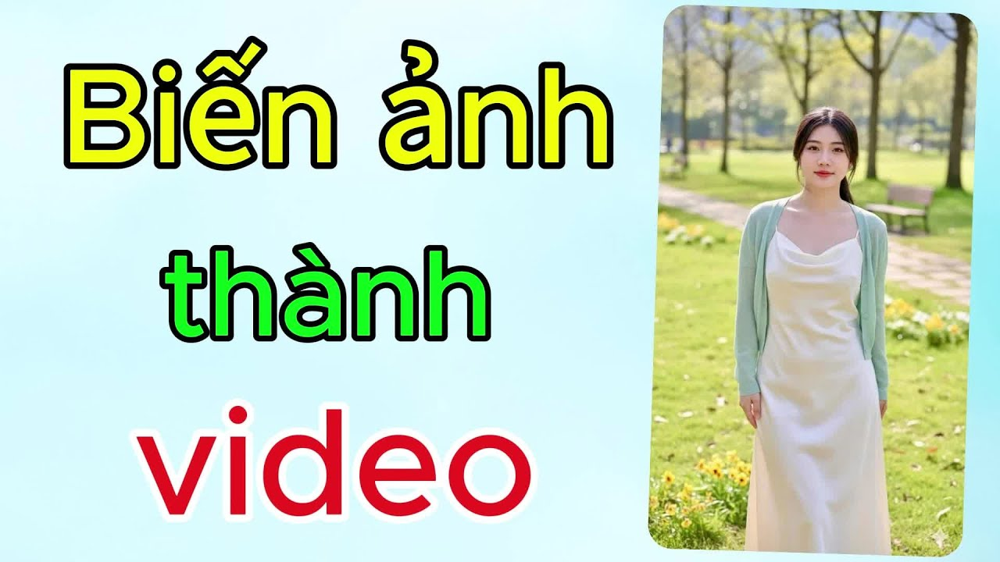

# Làm Video AI Không Cần Lộ Mặt: Hướng Dẫn Thực Chiến Từng Bước

---

## Intro

<iframe width="100%" class="aspect-video mt-4 mb-8 rounded-lg shadow-lg" src="https://www.youtube.com/embed/bIgtrveSh1M" frameborder="0" allowfullscreen></iframe>


Bạn đang ngồi nghĩ: *"Mình muốn làm video nhưng không muốn lên hình."*

Lý do có thể là ngại camera, muốn giữ ẩn danh, hay đơn giản là muốn scale nội dung mà không bị giới hạn bởi mặt mình. Đều hợp lý cả.

Tin tốt: năm 2025, làm video không lộ mặt không còn là workaround nữa — đó là một workflow hoàn chỉnh. Và với các model video AI hiện tại, chất lượng output đã đủ để dùng thật, chạy ads thật, kiếm tiền thật.

**Bài này dạy gì:**
- Quy trình tạo video AI không lộ mặt từ ý tưởng đến sản phẩm cuối
- Cách dùng Kling, Seedance, Veo3 trên tramsangtao.com cho từng loại nội dung
- Cách kết hợp ảnh AI từ FLUX/Nano Banana Pro làm visual base

**Mất bao lâu:** Lần đầu khoảng 2–3 giờ để làm quen workflow. Từ lần thứ hai: 30–45 phút/video hoàn chỉnh.

**Cần gì:**
- Tài khoản tramsangtao.com
- Script hoặc ý tưởng nội dung (kể cả chưa có, bài này có chỗ hướng dẫn)
- Không cần camera, không cần studio, không cần mặt bạn

---

## Prerequisites




Trước khi vào bước 1, hãy chắc chắn bạn có những thứ sau:

**1. Xác định mục đích video**
Không cần lộ mặt thì cần rõ *thay bằng gì*. Ba hướng phổ biến:
- **Visual storytelling** — cảnh quay cinematic, sản phẩm, thiên nhiên, nhân vật AI
- **Text-driven** — chữ + hình động, kiểu explainer
- **Character-based** — nhân vật AI nhất quán xuyên suốt series

Xác định hướng này trước để chọn đúng tool.

**2. Có script hoặc prompt thô**
Dù là 3 câu hay 30 câu — cần có trước. AI không đọc được ý bạn, nó chỉ làm theo mô tả.

**3. Biết platform output là đâu**
TikTok/Reels (9:16, ngắn 15–60s) hay YouTube (16:9, dài hơn)? Điều này ảnh hưởng đến ratio và độ dài clip bạn generate.

**4. Đã đăng nhập tramsangtao.com và nạp credit**
Một số model như Veo3 tốn credit cao hơn. Biết trước để không bị ngắt giữa chừng.

---

## Steps




### Bước 1: Tạo visual concept — Biết mình muốn trông như thế nào

**Làm gì:**
Trước khi generate video, hãy quyết định *visual language* của bạn. Đây là bước bị bỏ qua nhiều nhất — và là lý do nhiều video AI trông rời rạc, không có "hồn".

Viết ra 3 thứ:
- **Không gian:** đô thị hiện đại / thiên nhiên / studio tối / không gian trừu tượng
- **Nhân vật (nếu có):** mô tả nhân vật không phải mặt bạn — có thể là silhouette, nhân vật anime, người ẩn danh đeo kính, bàn tay thao tác sản phẩm
- **Mood:** warm & cozy / lạnh & dramatic / năng lượng cao / tối giản

**Tại sao:** AI tạo ra thứ bạn mô tả, không phải thứ bạn *ngầm hiểu*. Nếu bạn mơ hồ, output sẽ mơ hồ.

**Tip tránh lỗi:** Đừng dùng prompt kiểu "video đẹp về sản phẩm của tôi." Thay bằng: *"Close-up shot of hands unboxing a matte black skincare bottle on marble surface, warm golden hour lighting, slow motion, cinematic."*

---

### Bước 2: Tạo ảnh base bằng FLUX hoặc Nano Banana Pro

**Làm gì:**
Nhiều video AI hoạt động tốt nhất khi có ảnh đầu vào (image-to-video). Vì vậy, bước 2 là tạo ảnh nền.

Vào **tramsangtao.com**, chọn model ảnh:

| Nếu cần | Dùng model |
|---|---|
| Cảnh vật, sản phẩm, không gian | **FLUX** |
| Nhân vật / khuôn mặt AI nhất quán | **Nano Banana Pro** |

**Prompt mẫu cho FLUX (không lộ mặt):**
```
A woman's silhouette standing in front of a neon-lit city window at night, 
back to camera, cinematic composition, shallow depth of field, 8K
```

**Prompt mẫu cho Nano Banana Pro (nhân vật nhất quán):**
```
Portrait of a young Vietnamese woman, side profile, minimal makeup, 
natural light from window, neutral background, editorial style
```

> **Quan trọng:** Với Nano Banana Pro, bạn có thể tạo một nhân vật cố định và dùng xuyên suốt các video — đây là cách build "virtual persona" mà không cần lộ mặt thật.

**Tip tránh lỗi:** Generate ít nhất 3–4 ảnh, chọn 1–2 cái nhất quán nhau về ánh sáng và style. Đừng mix ảnh sáng tối loạn.

---

### Bước 3: Animate ảnh thành video bằng Kling hoặc Seedance

**Làm gì:**
Upload ảnh vừa tạo lên **tramsangtao.com**, chọn model video phù hợp:

| Model | Dùng khi nào |
|---|---|
| **Kling 2.5** | Cần độ ổn định, nhân vật ít biến dạng |
| **Kling 2.6** | Muốn chuyển động tự nhiên hơn, giá trung bình |
| **Kling 3.0** | Cần chất lượng cao nhất, chi tiết sắc nét |
| **Seedance 2.0** | Phong cách sáng tạo, dynamic motion, hiệu ứng đặc biệt |

**Motion prompt mẫu:**
```
Camera slowly pushes forward, subject remains still, 
soft bokeh in background, cinematic dolly movement
```

Hoặc nếu muốn nhân vật có chuyển động:
```
Subject turns head slightly to the left, hair moves gently with wind, 
blinks naturally, subtle shoulder movement, hyper-realistic
```

**Tip tránh lỗi:**
- **Đừng yêu cầu chuyển động quá lớn** ở lần đầu — tay chân AI vẫn có thể biến dạng nếu range of motion quá rộng
- Giữ clip trong **4–6 giây/đoạn**, ghép nhiều đoạn lại thay vì generate một clip dài
- Nếu có chữ trong ảnh gốc, xóa trước khi animate — AI hay làm chữ bị méo

---

### Bước 4: Tạo video text-to-video bằng Veo3

**Làm gì:**
Veo3 (Google) là lựa chọn mạnh khi bạn **không có ảnh base** và muốn generate thẳng từ mô tả.

Vào tramsangtao.com, chọn **Veo3**, nhập prompt:

```
Aerial drone shot of a Vietnamese coastal town at sunset, 
fishermen preparing boats on the dock, golden light reflecting on water, 
documentary style, no people's faces visible, cinematic
```

Veo3 đặc biệt mạnh với:
- Cảnh thiên nhiên, đô thị, môi trường
- Lifestyle footage không cần nhân vật cụ thể
- B-roll chất lượng cao cho video dài

**Tip tránh lỗi:**
- Thêm `"no faces visible"` hoặc `"back to camera"` trong prompt nếu muốn không lộ mặt
- Veo3 tốn credit nhiều hơn — test prompt ngắn trước, ưng rồi mới generate full
- Output của Veo3 đôi khi có watermark — kiểm tra kỹ trước khi dùng

---

### Bước 5: Chọn voiceover — Giọng nói thay mặt bạn

**Làm gì:**
Video không lộ mặt vẫn cần âm thanh. Hai hướng:

**Option A — Text-to-Speech AI:**
Dùng các tool như ElevenLabs, FPT.AI (cho giọng Việt), hoặc tính năng TTS tích hợp trong CapCut. Paste script vào, chọn giọng phù hợp với tone nội dung.

**Option B — Voiceover ẩn danh:**
Tự thu âm giọng bạn nhưng không xuất hiện trên hình. Đây vẫn là "không lộ mặt" — và giọng thật thường nghe tự nhiên hơn AI.

**Tip tránh lỗi:**
- Giọng AI tiếng Việt vẫn có điểm yếu ở câu dài và dấu nặng — nghe lại từng đoạn trước khi ghép
- Tốc độ đọc mặc định thường hơi chậm, tăng lên 1.05–1.1x nghe tự nhiên hơn

---

### Bước 6: Ghép và xuất — Đưa mọi thứ lại với nhau

**Làm gì:**
Ghép các clip AI đã generate + voiceover + subtitle trong CapCut hoặc DaVinci Resolve.

Cấu trúc cơ bản cho 1 video 30–60s:
```
[Hook visual - 3s] → [Clip 1 - 5s] → [Clip 2 - 5s] → [Clip 3 - 5s] 
→ [Text overlay / CTA - 4s] → [Outro - 3s]
```

**Checklist trước khi xuất:**
- [ ] Không frame nào lộ mặt người thật
- [ ] Subtitle đồng bộ với voiceover
- [ ] Ratio đúng với platform (9:16 cho TikTok/Reels)
- [ ] Không watermark từ tool AI
- [ ] Có CTA rõ ràng (comment, link bio, mua ngay...)

---

## Kết Quả Mong Đợi


Khi làm đúng quy trình này, video của bạn trông như thế nào?

- **Visual nhất quán** — màu sắc, ánh sáng, style không bị lộn xộn giữa các clip
- **Nhân vật (nếu có) không bị biến dạng** — tay chân đúng chỗ, chuyển động tự nhiên
- **Không ai hỏi "video này do AI làm hả?"** — đó là benchmark thật sự
- **Xem được trên mobile không bị vỡ hình** — test trên điện thoại trước khi post

Một video 30 giây đạt chuẩn: 4–6 clip AI ghép lại, voiceover khớp, subtitle sạch, không watermark. Không hoàn hảo như quay thật — nhưng đủ để người xem dừng lại và xem hết.

---

## Troubleshooting




### Lỗi 1: Nhân vật bị biến dạng tay/chân giữa clip

**Triệu chứng:** Tay có 6 ngón, chân méo, khuôn mặt biến dạng khi chuyển cảnh.

**Fix:**
- Giảm range of motion trong motion prompt — dùng *subtle* hoặc *minimal movement* thay vì *dancing* hay *running*
- Dùng Kling 2.5 thay vì model khác nếu cần độ ổn định nhân vật cao
- Crop frame nếu lỗi chỉ xuất hiện ở góc màn hình

---

### Lỗi 2: Các clip trông rời rạc, không liền mạch

**Triệu chứng:** Ghép lại nhìn như slideshow ghép lung tung, không phải video.

**Fix:**
- Tạo ảnh base từ cùng 1 prompt style trước khi animate — đây là nguyên nhân số 1 gây ra sự rời rạc
- Dùng transition trong CapCut (fade, dissolve) thay vì hard cut giữa các clip AI
- Giữ nhất quán về **color temperature** — đừng mix clip ấm và clip lạnh trong cùng video

---

### Lỗi 3: Voiceover AI nghe cứng, không tự nhiên

**Triệu chứng:** Nghe rõ là robot đọc, người xem thoát ngay.

**Fix:**
- Thêm dấu phẩy và dấu chấm đúng chỗ trong script — TTS đọc theo ngắt nghỉ của văn bản
- Tránh câu quá dài (trên 20 từ) — cắt thành câu ngắn
- Nếu budget có, ElevenLabs có giọng Việt nghe tự nhiên hơn nhiều tool miễn phí
- Thực tế nhất: thu âm giọng mình, không cần lên hình

## 📈 Case Study: Kênh TikTok 200k Followers Mà Admin Chưa Bao Giờ Lộ Mặt

Một admin quản lý kênh TikTok niche "Tâm Lý Học Đời Thường" muốn build audience nhưng không muốn trở thành public figure:
- **Pain Point:** Mọi kênh TikTok top đầu đều có "face" — người dẫn. Không lộ mặt đồng nghĩa với slideshow nhàm chán, bị TikTok bóp reach.
- **Giải Pháp:** Tạo 1 nhân vật AI cố định bằng Nano Banana Pro (cô gái trẻ tóc ngắn, phong cách minimalist). Dùng ảnh nhân vật này làm input cho Kling 2.6 Image-to-Video với các prompt khác nhau cho mỗi tập: *"Subject sitting at a café, gazing out the window thoughtfully, gentle camera push in, warm rainy day lighting."* Thu âm giọng thật (không lộ mặt) và ghép voiceover.
- **Kết Quả & ROI:** Kênh đạt 200k followers trong 4 tháng. Người xem nghĩ nhân vật AI chính là admin. Engagement rate trung bình 8-12% — cao hơn nhiều kênh có người thật. Chi phí sản xuất mỗi video chưa tới 20k tiền credit.

---

## 💎 Pro-Tips: Giữ "Hồn" Cho Video Không Lộ Mặt

1. **Tạo "Visual Signature" cố định:** Chọn 1 bảng màu (ví dụ: warm tone cam + be + nâu) và giữ nguyên xuyên suốt mọi video. Khi generate ảnh/video AI, luôn thêm cụm *"warm earth tones, consistent color palette"* vào prompt. Người xem sẽ nhận ra kênh của bạn chỉ sau 2-3 video nhờ visual identity này.
2. **Thu âm giọng thật, đừng dùng TTS nếu có thể:** Giọng thật vẫn tạo kết nối cảm xúc mạnh hơn AI voice gấp nhiều lần. Bạn không cần lộ mặt, nhưng giọng nói chính là "khuôn mặt âm thanh" của bạn.

---

## CTA

Quy trình này không phức tạp — nó chỉ cần bạn chạy thử một lần để thấy nó hoạt động.

**Bắt đầu ngay:** Vào [tramsangtao.com](https://tramsangtao.com), tạo 1 ảnh nhân vật bằng Nano Banana Pro, animate bằng Kling 2.6, thêm voiceover và subtitle bằng CapCut — video đầu tiên không lộ mặt của bạn sẽ xong trong vòng 1 giờ.

Không cần camera. Không cần studio. Chỉ cần ý tưởng và một buổi chiều rảnh.