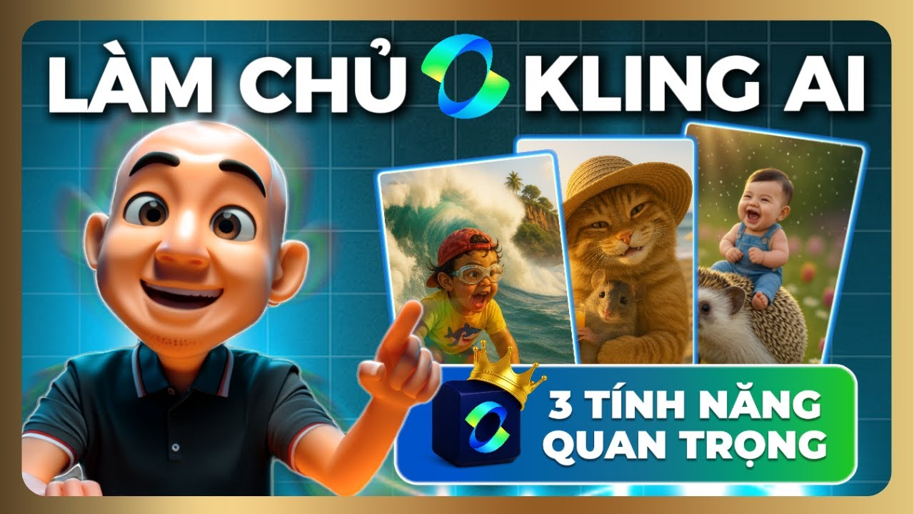

# Review Kling AI Tiếng Việt: Thật Sự Đáng Tiền Hay Chỉ Là Hype?

Bạn đã bao giờ ngồi làm content rồi nghĩ: *"Giá mà cái cảnh này có thêm chuyển động thì bán được gấp đôi"*? Ảnh tĩnh ngày càng khó kéo attention trên feed. Video thì tốn tiền thuê quay. Và AI video — nghe thì hay, nhưng hầu hết công cụ nước ngoài đều không có tài liệu tiếng Việt, phải tự mày mò mất cả tuần mới ra được cái gì đó dùng được.

Kling AI đang được giới content creator Việt truyền tay nhau khá nhiều trong năm qua. Nhưng thực tế dùng như thế nào? Phiên bản nào phù hợp với loại dự án gì? Và quan trọng hơn — có đáng để bỏ tiền không, hay chỉ là một cái tool xịn trên giấy nhưng output thực tế thì nhạt?

Bài này mình viết từ góc nhìn người dùng thực tế, không phải từ bản press release của Kuaishou. Sẽ có cả phần chê thẳng thắn.

---

## Kling AI Là Gì — Và Tại Sao Nó Khác Với Runway Hay Pika?

<iframe width="100%" class="aspect-video mt-4 mb-8 rounded-lg shadow-lg" src="https://www.youtube.com/embed/rP2VsvuKe5k" frameborder="0" allowfullscreen></iframe>


Kling AI là model sinh video AI của Kuaishou (Trung Quốc), ra mắt từ 2024 và liên tục update. Điểm khác biệt so với Runway hay Pika là Kling tập trung mạnh vào **chuyển động vật lý tự nhiên** — tóc bay, nước chảy, vải phất — những thứ mà các model cũ thường bị "plastic" hoặc giật lag.

Nhưng điểm mà ít ai nói đến: Kling xử lý **nhân vật người châu Á** tốt hơn hẳn các model Mỹ. Lý do thực tế — training data của họ thiên về nội dung châu Á. Với marketer Việt Nam làm content cho thị trường nội địa, đây không phải chi tiết nhỏ.

Trên [tramsangtao.com](https://tramsangtao.com), hiện có đủ Kling 2.5, 2.6 và 3.0 — ba phiên bản có sự khác biệt rõ về chất lượng và tốc độ xử lý. Không phải cứ bản mới nhất là phù hợp với mọi use case.

---

## So Sánh Kling 2.5 vs 2.6 vs 3.0: Dùng Bản Nào?


Đây là câu hỏi mình nhận nhiều nhất từ người mới.

**Kling 2.5** — nhanh nhất, chi phí thấp nhất. Phù hợp khi bạn cần volume lớn: làm batch content cho nhiều sản phẩm affiliate, test concept nhanh trước khi đầu tư vào bản chất lượng cao. Output vẫn ổn, nhưng nếu nhìn kỹ ở chi tiết như ngón tay hay chuyển cảnh phức tạp, sẽ thấy bị artifact.

**Kling 2.6** — cân bằng tốt nhất. Chuyển động mượt hơn 2.5 rõ rệt, đặc biệt ở cảnh có nhiều người hoặc background động. Mình hay dùng bản này cho content review sản phẩm beauty, thực phẩm — những ngành mà visual quality ảnh hưởng trực tiếp đến conversion.

**Kling 3.0** — chậm hơn, tốn credit hơn, nhưng độ chi tiết ở một tier khác. Skin texture, ánh sáng, depth of field — nhìn gần như footage quay thật. Dùng cho campaign hero video, landing page, hoặc khi bạn cần một clip mà người xem không nghi ngờ là AI.

Một sai lầm phổ biến: dùng 3.0 cho tất cả mọi thứ. Vừa tốn, vừa chậm, lại không cần thiết cho Instagram Story hay TikTok 15 giây.

---

## Prompt Kling AI Tiếng Việt: Nên Viết Thế Nào?


Thẳng thắn mà nói — Kling hiểu tiếng Anh tốt hơn tiếng Việt. Nhưng bạn không cần phải giỏi tiếng Anh để có prompt tốt. Cần có **cấu trúc tư duy đúng**.

Công thức mình hay dùng:

```
[Nhân vật/Chủ thể] + [Hành động cụ thể] + [Môi trường] + [Camera movement] + [Ánh sáng/Mood]
```

Ví dụ cụ thể cho một affiliate làm content sữa dưỡng thể:

❌ Kém: *"A woman using lotion"*

✅ Tốt hơn: *"Close-up of a Vietnamese woman's hand gently applying white lotion on her forearm, soft morning light from the left, slow camera pull-back, warm pastel background, cinematic"*

Sự khác biệt không nằm ở từ ngữ hoa mỹ — mà ở mức độ cụ thể bạn mô tả chuyển động camera và ánh sáng. Kling phản hồi tốt với instruction về camera hơn hầu hết model khác.

Một mẹo ít người biết: thêm **negative prompt** để loại bỏ lỗi thường gặp. Với cảnh người: *"no distorted hands, no flickering, no morphing face"* — sẽ giảm đáng kể tỉ lệ ra output xấu.

---

## Use Case Thực Tế Cho Marketer Và Content Creator Việt


### Affiliate Marketing

Đây là use case mà Kling AI tỏa sáng nhất, theo đánh giá cá nhân mình. Bạn có ảnh sản phẩm từ nhà cung cấp (thường là ảnh trắng nền, nhạt nhẽo). Dùng Kling để tạo video demo — sản phẩm xuất hiện trong một cảnh lifestyle tự nhiên, có chuyển động nhẹ của ánh sáng hoặc tay người cầm.

Kết quả: thumbnail và creative có chuyển động, performance trên Meta Ads thường tốt hơn ảnh tĩnh từ 20-40% về CTR (số liệu từ vài anh em trong nhóm affiliate mình quen, không phải con số chính thức).

### Content Creator / KOC

Làm unboxing concept mà không cần quay thật. Hay hơn nữa: tạo variation — cùng một sản phẩm nhưng thử 5 cảnh khác nhau để xem cái nào resonate với audience. Chi phí và thời gian bằng một buổi sáng.

### Agency Làm Pitch

Khi pitch concept cho khách hàng, thay vì show moodboard ảnh tĩnh, bạn có thể present một đoạn video 5-10 giây để khách hàng "feel" được hướng đi visual. Kling 3.0 ở đây là lựa chọn phù hợp — cái nhìn first impression của khách hàng quan trọng hơn tiết kiệm vài credit.

---

## Kling AI Có Điểm Yếu Không? Có, Và Đây Là Những Điều Cần Biết




Đánh giá Kling AI tiếng Việt mà không nói đến điểm yếu thì là review thiếu trung thực.

**Vấn đề với tay và ngón tay.** Vẫn là Achilles' heel của hầu hết AI video, Kling không ngoại lệ. Khi prompt yêu cầu cảnh cận tay làm việc gì đó phức tạp (gõ bàn phím, cầm bút viết), output hay bị distorted. Cách xử lý: tránh cảnh cận tay trừ khi thật sự cần, hoặc dùng negative prompt mạnh.

**Thời gian render.** Kling 3.0 với video 10 giây có thể mất 5-10 phút. Nếu bạn cần làm 20 clip trong một ngày, tính toán lại workflow. Không phải công cụ real-time.

**Consistency giữa các clip.** Nếu bạn cần một nhân vật xuất hiện nhất quán trong nhiều đoạn video (như series content), Kling không giữ được character consistency tốt. Đây là hạn chế chung của cả industry, không riêng Kling.

**Chi phí leo thang.** Nếu không có kế hoạch rõ ràng, bạn rất dễ "test cho vui" rồi hết credit trước khi ra được cái gì dùng được. Nên xác định mục tiêu cụ thể trước khi generate.

---

## Kling So Với Veo3 Và Seedance 2.0 Trên Tramsangtao

Tramsangtao.com có cả Veo3 (của Google) và Seedance 2.0 bên cạnh Kling. Tự nhiên câu hỏi đặt ra: dùng cái nào?

**Veo3** mạnh ở độ realistic và xử lý scene phức tạp với nhiều yếu tố chuyển động đồng thời. Nhưng prompt Veo3 cần kỹ hơn, và output đôi khi quá "Hollywood" — không phải lúc nào cũng fit với nội dung lifestyle thường ngày của creator Việt.

**Seedance 2.0** có thế mạnh riêng ở một số loại animation và motion style.

**Kling** nằm ở vị trí middle ground thực dụng — dễ prompt hơn Veo3, output natural hơn các model cũ, và đặc biệt tốt với nội dung người châu Á.

Thay vì chọn một công cụ "cho tất cả", cách tiếp cận hiệu quả hơn là dùng đúng tool cho đúng loại project. Tramsangtao.com đang có đủ cả ba nên bạn không phải chọn một rồi bỏ cái kia.

---

## 📈 Case Study: Freelancer Thiết Kế Dùng Kling AI Giảm 80% Thời Gian Làm Creative

Một Freelancer nhận job thiết kế Creative cho các shop nhỏ trên Shopee:
- **Pain Point:** Mỗi đợt campaign cần 10-15 creative khác nhau. Khách trả 500k/bộ, nhưng mỗi bộ tốn 3-4 tiếng nếu quay + edit truyền thống. Tính ra công không bõ.
- **Giải Pháp:** Chuyển hướng sang workflow: Chụp ảnh sản phẩm → FLUX tạo ảnh nền đẹp → Kling 2.6 animate thành video 5 giây. Giao cho khách cả ảnh lẫn video. Dùng tramsangtao.com vì có tất cả model trong 1 nền tảng, không cần nhảy qua nhảy lại.
- **Kết Quả & ROI:** Thời gian làm 1 bộ creative giảm từ 3-4 tiếng xuống còn 30-45 phút. Thu nhập từ freelance tăng gấp 3 vì nhận được nhiều job hơn. Khách hàng cũng happy hơn vì có cả video để chạy ads thay vì chỉ ảnh tĩnh.

---

## 💎 Pro-Tips: Cách "Chê" Kling Đúng Chỗ Để Chọn Đúng Tool

Kling AI không phải "best at everything". Biết điểm yếu của nó sẽ giúp bạn tiết kiệm rất nhiều credit và thời gian:
- **Cần video có text/chữ trong hình?** → Đừng dùng Kling. Render text bằng CapCut/Premiere sau, chất lượng gấp 10 lần.
- **Cần cảnh nước chảy, lửa cháy, vật lý phức tạp?** → Veo3 xử lý tốt hơn Kling ở mảng này.
- **Cần nhân vật giống nhau qua 5-6 video liên tiếp?** → Tạo 1 ảnh reference chuẩn bằng Nano Banana Pro, rồi dùng ảnh đó làm input cho Image-to-Video trên Kling mỗi lần. Đây là cách duy nhất hiện tại để giữ character consistency.

---

## FAQ — Câu Hỏi Thường Gặp Khi Dùng Kling AI

**Kling AI có interface tiếng Việt không?**
Hiện tại Kling AI gốc (kling.ai) chưa có tiếng Việt. Nhưng trên tramsangtao.com, giao diện và hỗ trợ đều tiếng Việt — đây là điểm khác biệt thực tế cho người dùng Việt Nam.

**Một video Kling tốn bao nhiêu credit?**
Tùy phiên bản và độ dài. Kling 2.5 rẻ nhất, 3.0 đắt hơn khoảng 3-4 lần so với 2.5 cho cùng độ dài. Tham khảo bảng giá cụ thể trên [tramsangtao.com/pricing](https://tramsangtao.com/pricing) để tính ngân sách.

**Có thể dùng ảnh có sẵn để làm thành video không?**
Có — đây là tính năng Image-to-Video. Bạn upload ảnh sản phẩm hoặc portrait, Kling tạo chuyển động từ ảnh đó. Đây là workflow phổ biến nhất với marketer sản phẩm.

**Output của Kling có dùng được cho commercial không?**
Theo điều khoản hiện tại, video tạo từ Kling được phép dùng cho mục đích thương mại. Tuy nhiên nên kiểm tra lại điều khoản mới nhất vì policy có thể update.

**Prompt tiếng Việt hay tiếng Anh ra kết quả tốt hơn?**
Tiếng Anh cho output ổn định hơn. Nhưng nếu bạn không quen, có thể viết ý tưởng bằng tiếng Việt rồi dùng ChatGPT dịch và expand — nhanh và hiệu quả hơn tự viết tiếng Anh bập bẹ.

---

## Thử Xem Sao — Không Cần Cam Kết Ngay

Đọc review thì dễ, nhưng cái cảm giác thực sự khi nhìn video AI đầu tiên của mình render xong — cái đó phải tự trải nghiệm mới biết.

Nếu bạn đang làm affiliate, content sản phẩm, hoặc cần visual đẹp hơn mà không muốn thuê cả ê-kíp quay dựng, Kling AI trên [tramsangtao.com](https://tramsangtao.com) là chỗ hợp lý để bắt đầu. Có đủ Kling 2.5, 2.6, 3.0 cùng Veo3 và Seedance 2.0 trong một nơi, giao diện tiếng Việt, không cần tự setup tài khoản nước ngoài.

Xem bảng giá và thử ngay tại **[tramsangtao.com/pricing](https://tramsangtao.com/pricing)** — mất khoảng 10 phút để có video đầu tiên.