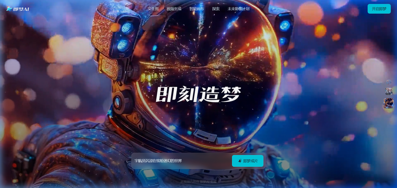

# Seedance AI Là Gì? Review Chi Tiết & Hướng Dẫn Dùng Seedance 2.0 Tiếng Việt

**Seedance** đang là cái tên được nhắc tới nhiều nhất trong cộng đồng AI video đầu năm 2026. Được phát triển bởi ByteDance (công ty mẹ của TikTok), Seedance 2.0 hứa hẹn mang tới khả năng tạo video AI multi-shot với tính nhất quán nhân vật vượt trội — thứ mà trước đây chỉ có Kling 3.0 làm tốt.

Nhưng liệu Seedance có thực sự xứng đáng với lời đồn? Người Việt có dùng được dễ dàng không? Bài viết này sẽ review toàn bộ **Seedance 2.0** từ A-Z: tính năng, giá cả, điểm mạnh/yếu và cách sử dụng tại Việt Nam.

*Xem video demo Seedance 2.0 — hướng dẫn từng bước tạo video AI.*

---

## Seedance AI Là Gì?

**Seedance** (tên đầy đủ: Seedance 2.0) là model tạo video AI thế hệ mới do ByteDance phát triển, ra mắt đầu năm 2026. Seedance được tích hợp chủ yếu trên nền tảng **Jimeng AI** (即梦AI, hay còn gọi là Dreamina) — ứng dụng sáng tạo nội dung của ByteDance tại thị trường Trung Quốc.

Về bản chất, Seedance 2.0 là đối thủ trực tiếp của Kling 3.0 (Kuaishou) và Veo 3.1 (Google) trong cuộc đua tạo video AI chất lượng cao.

*Chất lượng video AI từ Seedance 2.0 — cinematic, chân thực, nhân vật nhất quán.*

---

## Seedance 2.0 Có Gì Hot?

### Tính nhất quán nhân vật (Character Consistency)

Đây là "vũ khí bí mật" của Seedance. Khi bạn tạo video nhiều cảnh (multi-shot), nhân vật sẽ giữ nguyên ngoại hình — cùng khuôn mặt, cùng trang phục, cùng phong cách — xuyên suốt toàn bộ clip. Tính năng này cực kỳ quan trọng cho những ai muốn:

- Làm video series kể chuyện
- Tạo quảng cáo sản phẩm có nhân vật đại diện
- Build kênh TikTok với "KOL ảo" xuất hiện nhất quán

*Cùng một nhân vật xuất hiện qua 3 cảnh khác nhau — đây là sức mạnh của Seedance 2.0 và Kling 3.0.*

### Multi-Shot Storytelling

Thay vì tạo từng clip đơn lẻ rồi ghép lại, Seedance 2.0 cho phép bạn mô tả một chuỗi sự kiện trong prompt và AI sẽ tự chia thành nhiều cảnh quay liên tục. Ví dụ:

> *"Một cô gái bước vào quán cafe → ngồi xuống gọi cà phê → mở laptop làm việc → nhìn ra cửa sổ mỉm cười"*

Seedance sẽ tạo ra 1 video 10-15 giây với 3-4 cảnh quay mượt mà, nhân vật đồng nhất.

### Chất Lượng Hình Ảnh

- **Độ phân giải tối đa:** 2K (2048 x 1152)
- **Chuyển động tự nhiên:** Vật lý chân thực — tóc bay, vải lật, ánh sáng phản chiếu đúng quy luật
- **Thời lượng:** 5-15 giây/clip

---

## Bảng Giá Seedance 2.0

| Cách truy cập | Giá | Ghi chú |
|---|---|---|
| **Jimeng AI (trực tiếp)** | ~69 RMB/tháng (~240k VNĐ) | Cần tài khoản Trung Quốc, thanh toán Alipay/WeChat |
| **Dreamina Free** | Miễn phí | 2-3 video ngắn/ngày, không cần thẻ tín dụng |
| **API (BytePlus)** | Từ $0.01/giây (Lite) | Dành cho developer, 2 triệu free tokens khi đăng ký |
| **Qua Trạm Sáng Tạo** | Từ 99k VNĐ/tháng | Thanh toán MoMo, giao diện tiếng Việt |

---

## Seedance vs Kling 3.0 — Ai Hơn Ai?

Đây là câu hỏi được search nhiều nhất: *"Seedance vs Kling so sánh, cái nào tốt hơn?"*

| Tiêu chí | Seedance 2.0 | Kling 3.0 |
|---|---|---|
| **Độ phân giải tối đa** | 2K | 4K/60fps |
| **Nhất quán nhân vật** | Xuất sắc | Xuất sắc |
| **Multi-shot** | Có, tự động chia cảnh | Có, kiểm soát camera từng cảnh |
| **Audio tích hợp** | Không (cần ghép thêm) | Có (5 ngôn ngữ, lip sync) |
| **Thời lượng tối đa** | 15 giây | 15 giây |
| **Giá khởi điểm** | ~$9.60/tháng (Jimeng) | ~$6.99/tháng (Standard) |
| **Giao diện** | Tiếng Trung | Tiếng Anh/Trung |
| **Thanh toán** | Alipay/WeChat | Visa/Mastercard |
| **Truy cập từ VN** | Khó (cần TK Trung Quốc) | Dễ hơn (web quốc tế) |

**Kết luận nhanh:**
- **Chọn Kling 3.0** nếu bạn cần 4K, audio tích hợp, và sẵn sàng trả bằng thẻ quốc tế
- **Chọn Seedance** nếu bạn có tài khoản Trung Quốc và muốn tận dụng free tier rộng rãi
- **Chọn Trạm Sáng Tạo** nếu bạn muốn dùng **cả hai** mà không cần thẻ ngoại hay tài khoản Trung Quốc

---

## Cách Dùng Seedance Tại Việt Nam

Rào cản lớn nhất của Seedance với người Việt là **truy cập và thanh toán**. Jimeng AI yêu cầu số điện thoại Trung Quốc để đăng ký, và thanh toán chỉ qua Alipay/WeChat.

Có 2 cách giải quyết:

### Cách 1: Dùng Dreamina Free Tier (Hạn Chế)

Dreamina (phiên bản quốc tế của Jimeng) cho phép tạo 2-3 video ngắn miễn phí mỗi ngày. Bạn có thể đăng ký bằng email quốc tế, nhưng chất lượng và tính năng bị giới hạn đáng kể so với bản Jimeng đầy đủ.

### Cách 2: Dùng Qua Trạm Sáng Tạo (Khuyến Nghị)

[Trạm Sáng Tạo](https://tramsangtao.com/video) tích hợp sẵn nhiều model video AI — bao gồm cả engine từ ByteDance — với giao diện 100% tiếng Việt và thanh toán MoMo. Bạn không cần:
- Tài khoản Trung Quốc
- Thẻ Visa/Mastercard quốc tế
- Biết tiếng Trung hay tiếng Anh

Chỉ cần đăng ký bằng email hoặc SĐT Việt Nam, nạp tiền qua MoMo, và bắt đầu tạo video ngay.

---

## Ai Nên Dùng Seedance?

- **Filmmaker / Làm phim ngắn:** Character consistency + multi-shot = kể chuyện bằng AI mà không cần quay dựng
- **Agency quảng cáo:** Tạo storyboard video nhanh chóng, test ý tưởng quảng cáo trước khi quay thật
- **Content Creator TikTok:** Video series với nhân vật nhất quán, build thương hiệu cá nhân bằng AI

## Ai KHÔNG Nên Dùng Seedance Trực Tiếp?

- Người không có tài khoản Trung Quốc (dùng qua TST thay thế)
- Người cần lip sync / TTS tiếng Việt (Seedance không hỗ trợ — dùng KOL AI trên TST)
- Affiliate marketer cần khối lượng lớn, giá siêu rẻ (Kling Turbo trên TST rẻ hơn)

---

## FAQ — Câu Hỏi Thường Gặp Về Seedance

### Seedance có miễn phí không?

Có, nhưng rất hạn chế. Dreamina cho 2-3 video ngắn miễn phí mỗi ngày. Để sử dụng đầy đủ tính năng Seedance 2.0, bạn cần đăng ký Jimeng Premium (~69 RMB/tháng).

### Seedance 2.0 khác gì Seedance 1.0?

Seedance 2.0 nâng cấp lớn về character consistency, multi-shot storytelling và chất lượng hình ảnh (lên 2K). Seedance 1.0 Lite vẫn hoạt động nhưng chỉ phù hợp cho video đơn giản, ngắn.

### Seedance có tạo được video dài không?

Tối đa 15 giây/clip. Nếu cần video dài hơn, bạn phải tạo nhiều clip rồi ghép lại bằng CapCut hoặc tool edit khác. Đây là hạn chế chung của tất cả AI video hiện tại (kể cả Kling 3.0 và Veo 3).

### Hướng dẫn dùng Seedance tiếng Việt ở đâu?

Hiện tại không có hướng dẫn chính thức bằng tiếng Việt từ ByteDance. Bạn có thể sử dụng Seedance engine qua [Trạm Sáng Tạo](https://tramsangtao.com) — toàn bộ giao diện và hướng dẫn đều bằng tiếng Việt.

---

## Kết Luận

Seedance 2.0 xứng đáng với vị trí "dark horse" trong cuộc đua video AI 2026. Character consistency và multi-shot storytelling là hai tính năng cực kỳ ấn tượng, đặc biệt cho người làm phim ngắn và quảng cáo.

Tuy nhiên, rào cản **truy cập (cần TK Trung Quốc)** và **thanh toán (Alipay/WeChat)** khiến Seedance gần như ngoài tầm với của đa số người Việt — trừ khi bạn dùng qua nền tảng trung gian.

> **[Trải Nghiệm Tạo Video AI Ngay Tại Trạm Sáng Tạo](https://tramsangtao.com/video)** — Dùng engine Kling, Veo, và nhiều model AI khác với giao diện tiếng Việt, thanh toán MoMo. Đăng ký mới được **dùng thử miễn phí 0 đồng**!
