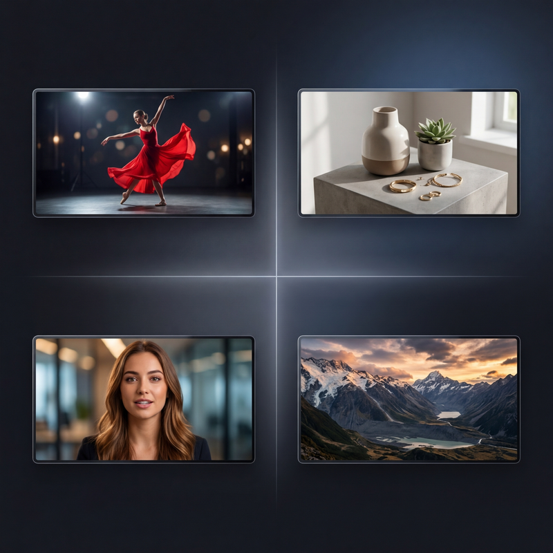
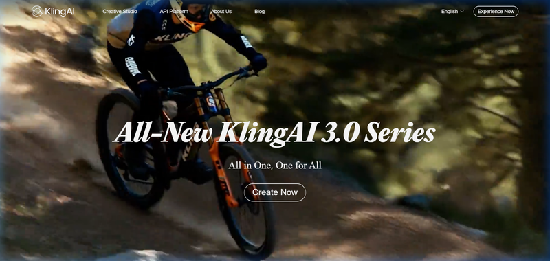
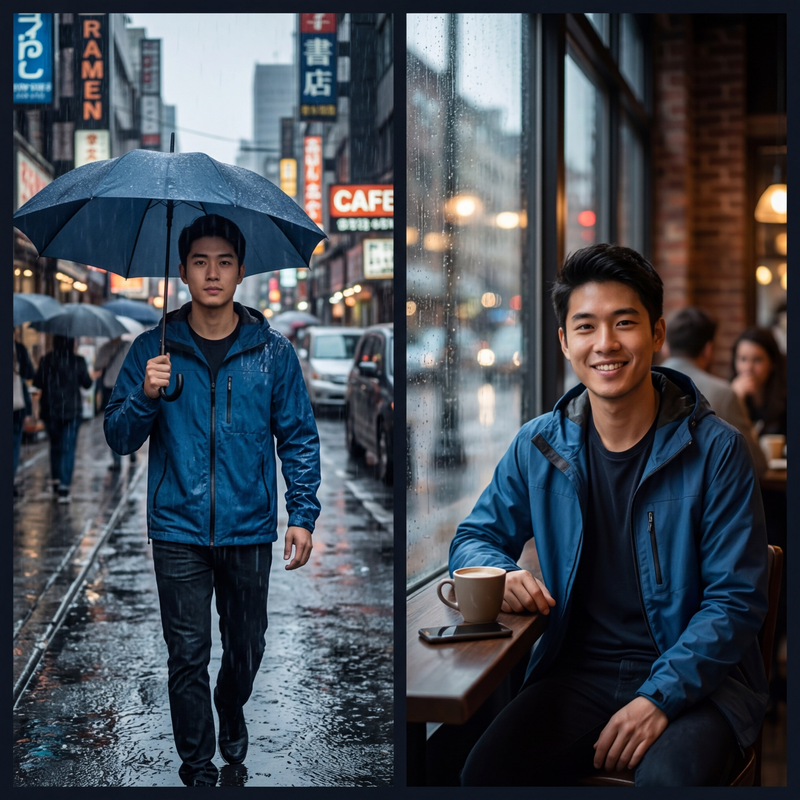
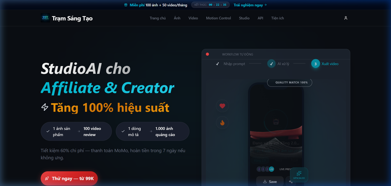

# So Sánh 7 Công Cụ Tạo Video AI Tốt Nhất 2026: Kling, Sora 2, Veo 3, Seedance

Năm 2026 là năm bùng nổ của **công cụ tạo video AI**. Từ Kling 3.0 của Kuaishou cho đến Veo 3 của Google, Seedance 2.0 của ByteDance hay Sora 2 của OpenAI — người dùng Việt Nam đang đứng trước một "rừng" lựa chọn mà không biết nên bắt đầu từ đâu.

Nếu bạn đang tự hỏi: *"App tạo video AI nào tốt nhất?"*, *"Kling vs Sora cái nào hơn?"*, hay *"Có tool nào thanh toán bằng MoMo không?"* — thì bài viết này dành cho bạn.

Chúng tôi đã thử nghiệm thực tế tất cả 7 công cụ phổ biến nhất, so sánh từ **chất lượng video, giá cả, giao diện tiếng Việt** cho đến khả năng **thanh toán nội địa** — để giúp bạn chọn đúng tool phù hợp với nhu cầu và ngân sách của mình.

---

## Bảng So Sánh Tổng Quan Nhanh

Trước khi đi sâu vào từng tool, hãy nhìn qua bức tranh toàn cảnh:

| Tiêu chí | Kling 3.0 | Sora 2 | Veo 3.1 | Seedance 2.0 | CapCut AI | Trạm Sáng Tạo |
|---|---|---|---|---|---|---|
| **Nhà phát triển** | Kuaishou (TQ) | OpenAI (Mỹ) | Google (Mỹ) | ByteDance (TQ) | ByteDance | Việt Nam |
| **Chất lượng** | 4K/60fps | 1080p | 4K | 2K | 1080p | Tùy model (tới 4K) |
| **Giá khởi điểm** | $6.99/tháng | $20/tháng (ChatGPT Plus) | $19.99/tháng (AI Pro) | ~$9.60/tháng (Jimeng) | Miễn phí (giới hạn) | 99k VNĐ/tháng (~$4) |
| **Giao diện tiếng Việt** | Không | Không | Không | Không | Có (một phần) | Có (100%) |
| **Thanh toán VN** | Visa/MC quốc tế | Visa/MC quốc tế | Visa/MC quốc tế | Alipay/WeChat | Miễn phí | MoMo, Ngân hàng VN |
| **Lip sync tiếng Việt** | Không hỗ trợ | Không | Không | Không | Cơ bản | Có (Kling engine) |
| **Phù hợp cho** | Pro editor | Nhà phát triển | Hệ sinh thái Google | Filmmaker | Newbie | Affiliate, Creator VN |

---

## 1. Kling AI 3.0 — "Vua Chất Lượng" Nhưng Không Dành Cho Người Mới

### Kling AI là gì?

**Kling AI** là nền tảng tạo video AI của Kuaishou (Trung Quốc), ra mắt phiên bản 3.0 vào tháng 2/2026. Đây được coi là chuẩn mực (benchmark) về chất lượng video AI hiện tại với khả năng render **4K/60fps** và tạo video multi-shot (nhiều cảnh liên tiếp) từ một prompt duy nhất.

*Giao diện trang chủ klingai.com — hoàn toàn bằng tiếng Anh, không có tùy chọn tiếng Việt.*

### Điểm mạnh

- **Chất lượng hình ảnh hàng đầu:** Native 4K/60fps, chi tiết texture da, tóc, vải cực kỳ chân thực
- **Multi-shot generation:** Tạo video nhiều cảnh (2-6 shots) từ một prompt, kiểm soát camera từng cảnh
- **Tính nhất quán nhân vật:** Giữ nguyên ngoại hình nhân vật xuyên suốt các cảnh — điều mà nhiều tool khác chưa làm được
- **Native Audio:** Tạo nhạc nền, hiệu ứng âm thanh, đồng bộ thoại với cử động môi
- **Motion Control:** Trích xuất chuyển động từ video tham chiếu rồi áp lên ảnh tĩnh

### Điểm yếu — và lý do người Việt ngại dùng

- **Hoàn toàn bằng tiếng Anh/Trung:** Giao diện, prompt, hướng dẫn — không có một chữ tiếng Việt
- **Thanh toán quốc tế:** Chỉ chấp nhận Visa/Mastercard quốc tế, không hỗ trợ MoMo hay chuyển khoản ngân hàng VN
- **Gói Free gần như vô dụng:** Có 66 credits/ngày nhưng không rollover, chỉ đủ test 1-2 video thấp — và kèm watermark
- **Lip sync không hỗ trợ tiếng Việt:** Audio AI chỉ hỗ trợ 5 ngôn ngữ: Trung, Anh, Nhật, Hàn, Tây Ban Nha
- **Đường cong học tập cao:** Cần viết prompt chi tiết kiểu screenplay, không phù hợp người mới bắt đầu

### Bảng giá Kling AI 3.0

| Gói | Giá/tháng | Credits | Ước tính video 5s (1080p) |
|---|---|---|---|
| Free | $0 | 66/ngày | 1-2 video (watermark) |
| Standard | ~$6.99 | 660 | ~30 video |
| Pro | ~$25.99 | 3.000 | ~150 video |
| Ultra | ~$59.99 | 8.000 | ~400 video |

> Nếu bạn cần chất lượng studio để làm quảng cáo TV hoặc phim ngắn chuyên nghiệp, Kling 3.0 là lựa chọn số 1. Nhưng với affiliate marketer hay content creator Việt Nam, rào cản thanh toán và ngôn ngữ khiến nó trở nên kém thực tế.

---

## 2. Sora 2 — "Ngôi Sao Đã Tắt" Của OpenAI

### Sora 2 là gì?

**Sora 2** là model tạo video AI đình đám của OpenAI, ra mắt tháng 9/2025. Tuy nhiên, OpenAI đã **ngừng hoạt động Sora vào ngày 24/3/2026** để tập trung vào nghiên cứu mô phỏng thế giới (world simulation).

### Tại sao vẫn cần nhắc tới?

Nhiều người Việt vẫn search "*Sora 2 là gì*" hoặc "*cách dùng Sora tạo video*", nên cần lưu ý:

- **Sora 2 không còn hoạt động** — bạn không thể đăng ký tài khoản mới hoặc tạo video.
- Trước khi đóng cửa, Sora 2 được truy cập thông qua gói ChatGPT Plus ($20/tháng) hoặc ChatGPT Pro ($200/tháng).
- Chất lượng tốt nhưng **cực kỳ đắt**: Một video 5 giây 1080p tiêu tốn khoảng 200 credits — tức gói Plus chỉ làm được khoảng 5 video chất lượng cao mỗi tháng.
- Không có giao diện tiếng Việt, không hỗ trợ thanh toán nội địa.

> **Kết luận:** Sora 2 đã vào lịch sử. Nếu bạn đang tìm "*app tạo video AI tốt nhất*" thì hãy bỏ qua Sora và chuyển sang các lựa chọn đang hoạt động bên dưới.

---

## 3. Google Veo 3.1 — Chất Lượng Cao Nhưng "Đắt Xắt Ra Miếng"

### Veo 3 là gì?

**Google Veo 3** (phiên bản mới nhất: Veo 3.1) là model video AI của Google, tích hợp trong hệ sinh thái Gemini. Veo 3 nổi bật với khả năng tạo video cinematography chất lượng cao kèm âm thanh đồng bộ (dialogue, SFX, nhạc nền) tự động.

*Một frame video AI chất lượng cinematic — đây là level mà Veo 3 và Kling 3.0 đang hướng tới.*

### Điểm mạnh

- **Chất lượng cinematic ấn tượng:** Hỗ trợ tới 4K, ánh sáng tự nhiên, chuyển cảnh mượt mà
- **Audio tích hợp:** Tạo lời thoại, hiệu ứng âm thanh, nhạc nền tự động — Sora không làm được điều này trước khi đóng cửa
- **Hệ sinh thái Google:** Nếu bạn đã dùng Google Workspace, Gemini, hay YouTube — Veo 3 tích hợp rất mượt

### Điểm yếu

- **Giá cực kỳ cao:**
  - Google AI Pro: $19.99/tháng — chỉ được khoảng 50 video ngắn (Fast mode)
  - Google AI Ultra: **$249.99/tháng** (gần 6.5 triệu VNĐ!) — dành cho studio chuyên nghiệp
- **Video ngắn:** Tối đa 8 giây mỗi clip
- **Không có giao diện tiếng Việt**, không thanh toán MoMo — bắt buộc thẻ quốc tế
- **Truy cập hạn chế:** Cần subscription Google AI, không có gói Free đáng kể

### Bảng giá Veo 3.1

| Gói | Giá/tháng | Số video ước tính |
|---|---|---|
| Google AI Plus | $7.99 | Veo 3 Fast, giới hạn fair-use |
| Google AI Pro | $19.99 | ~50 video Fast hoặc ~10 video Quality |
| Google AI Ultra | $249.99 | ~625 video Fast hoặc ~125 video Quality |
| API (Fast) | $0.15/giây | Theo dùng |
| API (Standard) | $0.40/giây | Theo dùng |

> Veo 3 phù hợp với agency lớn, studio quảng cáo hoặc YouTuber chuyên nghiệp có ngân sách. Không phù hợp cho freelancer, affiliate marketer hay người Việt muốn test thử.

---

## 4. Seedance 2.0 — "Dark Horse" Từ ByteDance

### Seedance là gì?

**Seedance 2.0** là model tạo video AI mới nhất từ ByteDance (công ty mẹ TikTok), ra mắt đầu năm 2026. Seedance được đánh giá cao về **tính nhất quán nhân vật** và khả năng tạo video multi-shot kể chuyện — tương tự Kling 3.0 nhưng giá rẻ hơn.

### Điểm mạnh

- **Giá hấp dẫn:** Gói premium trên Dreamina (Jimeng) chỉ ~69 RMB (~$9.60/tháng)
- **Character consistency xuất sắc:** Giữ nguyên nhân vật qua nhiều cảnh, rất phù hợp làm video series

*Tính năng độc đáo của Seedance và Kling 3.0: cùng một nhân vật xuất hiện nhất quán qua nhiều cảnh khác nhau.*
- **Free tier tương đối rộng rãi:** 2-3 video ngắn miễn phí mỗi ngày trên Dreamina — không cần thẻ tín dụng
- **Chất lượng tốt:** Hỗ trợ tới 2K, chuyển động tự nhiên

### Điểm yếu

- **Truy cập chủ yếu từ Trung Quốc:** Seedance 2.0 hiện tại chỉ truy cập đầy đủ qua Jimeng (Dreamina) — cần tài khoản Trung Quốc hoặc dùng qua platform bên thứ ba
- **Thanh toán bằng Alipay/WeChat** — cực kỳ bất tiện cho người Việt
- **Không hỗ trợ tiếng Việt**
- **Max 15 giây/clip** và chưa hỗ trợ 4K (Kling 3.0 đã có 4K)
- **Giao diện toàn tiếng Trung:** Nếu không biết tiếng Trung, bạn sẽ rất khó sử dụng trực tiếp

> Seedance 2.0 là "con ngựa ô" đáng chú ý, nhưng rào cản truy cập và thanh toán khiến nó gần như ngoài tầm với của đa số người Việt — trừ khi bạn dùng qua bên thứ ba.

---

## 5. CapCut AI — Miễn Phí Nhưng Giới Hạn

### CapCut AI làm được gì?

**CapCut** (cũng thuộc ByteDance) là ứng dụng edit video phổ biến nhất Việt Nam. Phiên bản mới đã tích hợp một số tính năng AI cơ bản: tự động cắt ghép, thêm caption, hiệu ứng AR, và tạo ảnh/video AI đơn giản.

### Nên dùng khi nào?

- Bạn là **người mới bắt đầu**, chưa từng dùng AI tạo video
- Bạn cần **chỉnh sửa nhanh** một video có sẵn (cắt, ghép, thêm nhạc, subtitle)
- Bạn muốn thử nghiệm hiệu ứng AI trending trên TikTok

### Không nên dùng khi nào?

- Tạo video AI chất lượng cao từ ảnh tĩnh (Image-to-Video)
- Cần video lip sync / KOL ảo
- Muốn scale ra nhiều video hàng loạt cho affiliate
- Cần chất lượng 4K, cinematography chuyên nghiệp

> CapCut tuyệt vời cho việc **edit video**, nhưng không phải tool **tạo video AI** chuyên nghiệp. Đừng nhầm lẫn giữa hai khái niệm này.

---

## 6. Higgsfield — Đắt Và Không Đáng Để Cân Nhắc

Nhiều bài viết trước đây nhắc tới Higgsfield như một lựa chọn cho video AI nhảy/dance. Tuy nhiên, thực tế:

- Giá **từ $15/tháng** (~375k VNĐ), thanh toán Visa/Mastercard quốc tế
- Chất lượng output **không ổn định**, hên xui tùy prompt
- Giao diện tiếng Anh, không hỗ trợ tiếng Việt
- Không có tính năng nổi trội so với Kling 3.0 hay Seedance

> Trong bối cảnh Kling 3.0 và Seedance đã vượt mặt về mọi mặt, Higgsfield không còn là lựa chọn đáng cân nhắc trong năm 2026.

---

## 7. Trạm Sáng Tạo — Giải Pháp "All-in-One" Cho Người Việt

### Tại sao Trạm Sáng Tạo khác biệt?

Tất cả các tool kể trên đều có một điểm chung: **không phải cho người Việt**. Giao diện tiếng Anh/Trung, thanh toán thẻ ngoại, hỗ trợ bằng tiếng nước ngoài, và giá tính bằng đô la.

[Trạm Sáng Tạo](https://tramsangtao.com) giải quyết triệt để vấn đề này bằng cách **tập hợp tất cả các model AI hàng đầu vào một nền tảng duy nhất**, hoàn toàn bằng tiếng Việt và thanh toán nội địa.

*Landing page tramsangtao.com — giao diện 100% tiếng Việt, 1 ảnh sản phẩm → 100 video review, thanh toán MoMo từ 99k.*

### Bạn được gì khi dùng Trạm Sáng Tạo?

**Tạo Video AI (Image-to-Video):**
- Dùng engine **Kling 2.5 Turbo, Kling 2.6, Kling 3.0** — cùng chất lượng gốc, giá rẻ hơn 3-5 lần so với mua trực tiếp
- Dùng **Sora 2 Pro** (vẫn hoạt động trên TST), **Veo 3** — không cần đăng ký ChatGPT hay Google AI riêng
- Chi phí chỉ khoảng **1.000 VNĐ/video** với Kling 2.5 Turbo

**Tạo Ảnh AI:**
- **FLUX 1.1 Pro** cho ảnh nghệ thuật, banner quảng cáo
- **Nano Banana Pro** (~200 VNĐ/ảnh) cho ảnh mẫu thời trang, sản phẩm — da thật, texture sắc nét
- **Tính năng thử đồ ảo (Virtual Try-on):** Upload ảnh quần áo → AI mặc lên người mẫu tự động

**Video nhảy & Motion Control:**
- Tải lên video tham chiếu (dance, hát nhép) → AI áp chuyển động lên ảnh tĩnh
- Phù hợp cho trend TikTok: em bé nhảy, mẫu ảo nhảy, video reaction

**KOL Ảo (Avatar Video):**
- Upload ảnh mặt + file giọng nói (MP3) → AI tạo video lip sync tiếng Việt
- Chi phí ~1-2k VNĐ/clip, scale lên hàng chục video mỗi ngày

### Tính năng độc quyền cho người Việt

| Tính năng | Trạm Sáng Tạo | Tool ngoại |
|---|---|---|
| Giao diện 100% tiếng Việt | Có | Không |
| Thanh toán MoMo, ngân hàng VN | Có | Không (Visa/MC/Alipay) |
| Hỗ trợ tiếng Việt (chat, email) | Có | Tiếng Anh/Trung |
| Video hướng dẫn YouTube tiếng Việt | Có | Không |
| Tập hợp nhiều model AI một chỗ | Kling + Sora + Veo + FLUX + Nano | Mỗi tool riêng lẻ |
| Dùng thử miễn phí 0 đồng | Có (tài khoản mới) | Hạn chế hoặc không |

### Bảng giá Trạm Sáng Tạo

| Gói | Giá | Credits | Ảnh/tháng | Video/tháng |
|---|---|---|---|---|
| Trải Nghiệm | 99.000 VNĐ | 2.000 | ~400 | ~100 |
| Tiết Kiệm (Phổ biến) | 199.000 VNĐ | 4.500 | ~900 | ~250 |
| Sáng Tạo | 499.000 VNĐ | 13.000 | ~2.600 | ~700 |

So sánh nhanh: Gói Tiết Kiệm 199k VNĐ (~$8) cho ra ~250 video/tháng. Trong khi Kling trực tiếp $6.99/tháng (175k VNĐ) chỉ được ~30 video. **Rẻ hơn gần 8 lần tính trên mỗi video.**

---

## Nên Chọn Tool Nào? Hướng Dẫn Theo Nhu Cầu

Không có tool nào "tốt nhất tuyệt đối" — chỉ có tool **phù hợp nhất** với bạn. Dưới đây là gợi ý theo từng nhóm nhu cầu:

### Bạn là Affiliate Marketer / Bán hàng TikTok Shop

**Chọn: [Trạm Sáng Tạo](https://tramsangtao.com/video)**

Lý do: Bạn cần làm **nhiều video** (10-50 video/ngày), chi phí phải **cực thấp** (dưới 2k/video), và cần thanh toán bằng MoMo chứ không phải lôi thẻ Visa ra. Trạm Sáng Tạo sinh ra để phục vụ chính xác nhu cầu này.

*Với AI, bạn chỉ cần 1 ảnh sản phẩm là có thể tạo ra hàng chục video review khác nhau mà không cần quay dựng.*

### Bạn là Content Creator / YouTuber

**Chọn: [Trạm Sáng Tạo](https://tramsangtao.com) hoặc Kling 3.0 trực tiếp**

Nếu bạn cần chất lượng 4K/60fps cho video YouTube → Kling 3.0 trực tiếp (nhưng cần thẻ quốc tế). Nếu bạn cần đa dạng model + thanh toán VN → Trạm Sáng Tạo.

### Bạn là Studio / Agency Quảng Cáo

**Chọn: Kling 3.0 (Ultra) hoặc Veo 3.1 (Google AI Ultra)**

Ngân sách không phải vấn đề, bạn cần chất lượng studio-grade cho TVC, product showcase, brand film.

### Bạn là Newbie / Muốn Thử Cho Biết

**Chọn: CapCut AI (miễn phí) → sau đó nâng lên [Trạm Sáng Tạo](https://tramsangtao.com)**

Bắt đầu với CapCut để làm quen khái niệm AI video. Khi muốn nghiêm túc hơn, chuyển sang Trạm Sáng Tạo để dùng Kling/Veo/FLUX với giá Việt Nam.

---

## FAQ — Câu Hỏi Thường Gặp

### Tool tạo video AI nào tốt nhất hiện tại?

Về chất lượng thuần túy: **Kling 3.0** dẫn đầu với 4K/60fps và multi-shot. Về giá trị tổng thể cho người Việt: **Trạm Sáng Tạo** vì tập hợp nhiều model (Kling + Veo + FLUX), giá rẻ, thanh toán MoMo.

### Sora 2 còn dùng được không?

Không. OpenAI đã **ngừng hoạt động Sora** từ ngày 24/3/2026. Tuy nhiên, bạn vẫn có thể dùng engine Sora 2 Pro thông qua các nền tảng bên thứ ba như Trạm Sáng Tạo.

### Có tool tạo video AI nào thanh toán bằng MoMo không?

Có. **Trạm Sáng Tạo** hỗ trợ thanh toán bằng MoMo và chuyển khoản ngân hàng Việt Nam. Đây là nền tảng AI duy nhất tại Việt Nam cho phép nạp tiền bằng phương thức thanh toán nội địa.

### Dùng AI tạo video có cần tài khoản nước ngoài không?

Nếu dùng Kling, Veo, hay Seedance trực tiếp — **có**, bạn cần tài khoản quốc tế và thẻ Visa/Mastercard. Nếu dùng qua **Trạm Sáng Tạo** — **không**, chỉ cần email hoặc số điện thoại Việt Nam để đăng ký.

### Seedance 2.0 có tốt hơn Kling 3.0 không?

Seedance 2.0 có character consistency tốt và giá rẻ hơn, nhưng chưa hỗ trợ 4K và khó truy cập từ Việt Nam (cần tài khoản Trung Quốc). Kling 3.0 vẫn dẫn đầu về chất lượng tổng thể.

### Veo 3 vs Kling 3.0 — cái nào tốt hơn?

Cả hai đều hỗ trợ 4K và audio tích hợp. Kling 3.0 có multi-shot generation tốt hơn và giá rẻ hơn (~$7/tháng vs $20/tháng). Veo 3 mạnh hơn về tích hợp hệ sinh thái Google (Gemini, YouTube). Nếu bạn ở Việt Nam và muốn dùng cả hai → [Trạm Sáng Tạo](https://tramsangtao.com) có sẵn cả Kling lẫn Veo.

---

## Kết Luận: Đừng Mua Credit Ngoại Khi Có Giải Pháp Việt

Thị trường tool tạo video AI năm 2026 cạnh tranh khốc liệt, nhưng đa phần đều hướng tới người dùng Mỹ/Trung Quốc. Người Việt Nam phải chịu bất lợi kép: **giá đô la + thanh toán quốc tế + giao diện ngoại ngữ**.

**Trạm Sáng Tạo** xóa bỏ hoàn toàn 3 rào cản đó. Bạn được dùng cùng engine AI hàng đầu thế giới (Kling, Veo, FLUX, Nano Banana) với:
- Giá Việt Nam (từ 99k/tháng)
- Thanh toán MoMo / ngân hàng nội địa
- Giao diện + hỗ trợ 100% tiếng Việt
- Dùng thử miễn phí 0 đồng cho tài khoản mới

> **[Đăng Ký Trạm Sáng Tạo Ngay Hôm Nay](https://tramsangtao.com)** — Tạo video AI đầu tiên của bạn trong 2 phút, không cần thẻ quốc tế, không cần biết tiếng Anh. Nạp MoMo và bắt đầu sáng tạo thôi!
