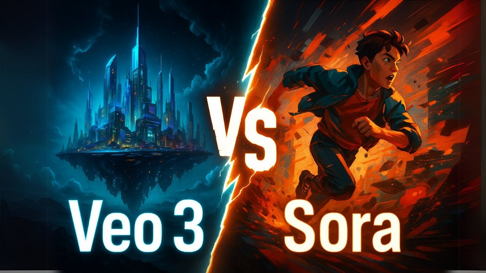
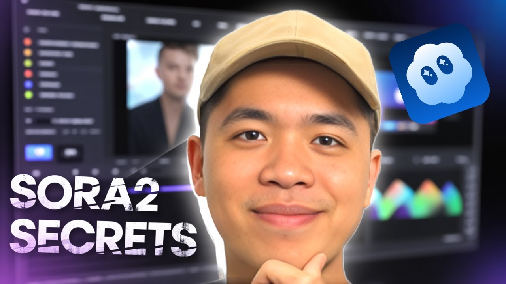
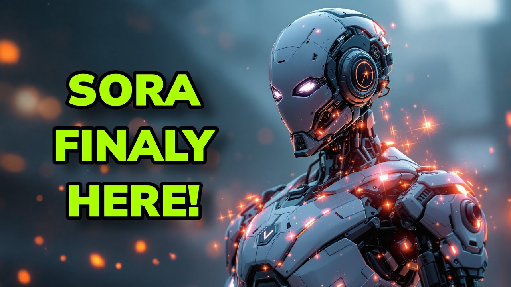
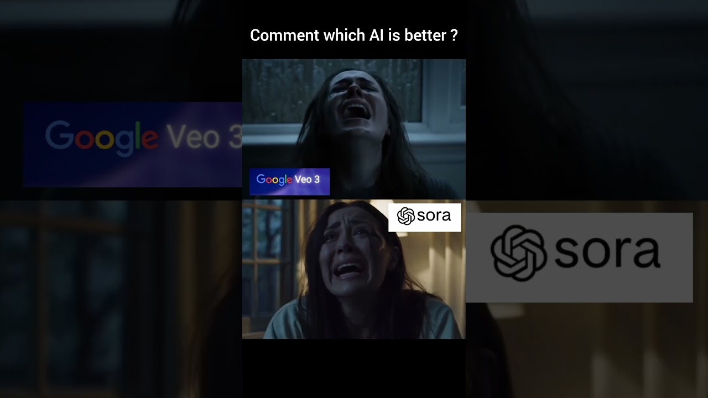

---
title: "Sora 2 Là Gì? Đánh Giá Thực Tế Và So Sánh Với Các Model Video AI"
slug: "sora-2-la-gi-danh-gia-thuc-te"
meta_title: "Sora 2 Là Gì? Đánh Giá & So Sánh Kling, Veo3, Seedance"
meta_description: "Sora 2 có thực sự xịn như lời đồn? Đánh giá thẳng thắn điểm mạnh, điểm yếu và so sánh với Kling, Veo3 — giúp bạn chọn đúng tool video AI cho thị trường Việt Nam."
tags:
  - Sora 2
  - Video AI
  - AI tạo video
  - Kling AI
  - công cụ AI
status: draft
---

# Sora 2 Là Gì? Đánh Giá Thực Tế Và So Sánh Với Các Model Video AI Đang Hot Nhất

Bạn đã nghe đến Sora 2 và tự hỏi nó có thực sự xịn như người ta đồn không? Hay lại là một đợt hype khác của OpenAI — ra mắt rình rang, dùng thực tế thì vỡ mộng?

Câu trả lời trung thực là: **Sora 2 có những điểm mạnh thật sự, nhưng cũng có những giới hạn mà hầu hết review quốc tế đều né tránh nói thẳng** — đặc biệt với người dùng Việt Nam làm content, affiliate, hay cần tạo video nhanh cho chiến dịch marketing. Bài này sẽ phân tích thẳng thắn để bạn tự quyết định có đáng đầu tư không, và nếu không thì còn lựa chọn nào tốt hơn đang có mặt ngay tại Việt Nam.

---

## Sora 2 Là Gì — Và OpenAI Đang Muốn Gì Với Nó?

<iframe width="100%" class="aspect-video mt-4 mb-8 rounded-lg shadow-lg" src="https://www.youtube.com/embed/OY2x0TyKzIQ" frameborder="0" allowfullscreen></iframe>

Sora 2 là thế hệ thứ hai của model tạo video AI từ OpenAI, ra mắt vào cuối 2024. Về kỹ thuật, đây là một **text-to-video và image-to-video diffusion transformer** — tức là bạn nhập prompt chữ hoặc ảnh vào, model sẽ sinh ra video với độ dài lên đến 20 giây, độ phân giải tối đa 1080p.

Điều OpenAI làm tốt hơn so với Sora phiên bản đầu là **consistency** — nhân vật không bị biến dạng giữa các frame, vật thể giữ nguyên hình dạng, ánh sáng liên tục hơn. Đây đúng là bước tiến đáng kể so với phiên bản 2023.

Nhưng đây là phần ít ai nói: **Sora 2 hiện vẫn còn trong giai đoạn rollout hạn chế, không phải ai cũng access được ngay**, và giá không rẻ nếu bạn dùng nhiều. Với người làm content ở Việt Nam, đây là rào cản thực tế chứ không phải vấn đề kỹ thuật.

---

## Sora 2 Làm Được Gì Thực Sự? Đừng Tin Vào Demo Clip

Những video demo của OpenAI trông đẹp không bàn — cảnh quay điện ảnh, chuyển động mượt, ánh sáng ấn tượng. Nhưng nếu bạn định dùng Sora 2 để làm việc thực tế, hãy biết rõ nó làm được gì và không làm được gì.

**Sora 2 làm tốt:**
- Cảnh tự nhiên: biển, rừng, đường phố, thành phố ban đêm
- Slow-motion và cinematic shots với ánh sáng phức tạp
- Video ngắn 6–20 giây có tính thẩm mỹ cao
- Chuyển cảnh camera: zoom, pan, dolly — tốt hơn hầu hết đối thủ

**Sora 2 còn yếu:**
- **Nhân vật người Á Đông** — vẫn thiên về khuôn mặt phương Tây, đây là vấn đề lớn với content creator VN
- **Chữ trong video** — lỗi cơ bản vẫn còn, text bị méo hoặc sai ký tự
- **Control nhân vật** — bạn không thể giữ nguyên một nhân vật cụ thể xuyên suốt nhiều clip như các tool khác

Ví dụ thực tế: Nếu bạn cần tạo video review sản phẩm mỹ phẩm cho thị trường Việt Nam với người mẫu gương mặt châu Á, Sora 2 sẽ khiến bạn frustrate. Đây không phải phán xét chủ quan — đây là limitation đã được cộng đồng test và xác nhận.

---

## Sora 2 So Với Kling, Veo3, Seedance — Bức Tranh Thật Sự

Đây là phần nhiều người cần nhất. Không phải "Sora 2 có gì hay" mà là "so với những gì đang available, tôi nên dùng cái nào?"

**Kling 2.5 / 2.6 / 3.0** (đang có trên tramsangtao.com):
Kling đến từ Kuaishou — và cái họ làm tốt nhất là **chuyển động tự nhiên của con người, đặc biệt khuôn mặt và biểu cảm**. Kling 2.6 đã xử lý nhân vật châu Á tốt hơn Sora 2 nhiều, và consistency giữa các frame rất ổn. Với Kling 3.0, khả năng control camera đã bắt kịp và một số benchmark còn vượt Sora 2 trong các tác vụ thực tế. Nếu bạn làm video người thật — lifestyle, beauty, food — Kling là lựa chọn thực dụng hơn.

**Veo3** (Google, đang có trên tramsangtao.com):
Đây là model mạnh nhất hiện tại về **chất lượng cinematic và audio sync** — Veo3 là model đầu tiên có thể generate âm thanh native đi kèm video, không cần add âm thanh riêng. Nếu bạn làm short film, ad concept, hay content cần âm nhạc/ambience tự nhiên, Veo3 là đối thủ trực tiếp của Sora 2 — và trên nhiều benchmark, Veo3 đang thắng.

**Seedance 2.0** (ByteDance, đang có trên tramsangtao.com):
Seedance ít được nhắc đến nhưng **tốc độ sinh video cực nhanh** và rất phù hợp với workflow cần output nhiều, iterate nhanh. Với affiliate marketer cần test nhiều creatives trong thời gian ngắn, Seedance 2.0 có thể phù hợp hơn Sora 2 về mặt cost-per-output.

Nói thẳng: Nếu bạn ở Việt Nam và cần tool tạo video AI cho công việc thực tế ngay hôm nay, **Kling + Veo3 là combo mạnh hơn Sora 2 trong hầu hết use case** — chưa kể access dễ hơn và giá kiểm soát được hơn.

---

## Tại Sao Sora 2 Được Hype Nhiều Đến Vậy? Và Bạn Có Nên Tin Không?

Hype của Sora 2 đến từ hai nguồn: **brand power của OpenAI** và **demo clips chọn lọc**. Không phải âm mưu — đây là marketing bình thường, nhưng người dùng thực tế cần hiểu rõ.

OpenAI đã làm một việc rất khéo: họ không release Sora đại trà ngay mà kiểm soát access, tạo ra cảm giác exclusive. Điều này khiến mỗi lần ai đó share clip Sora là news, trong khi Kling hay Seedance đã quietly ship feature tương đương hoặc tốt hơn mà không có PR máy móc đằng sau.

Bạn có nên quan tâm đến Sora 2 không? **Có — nếu bạn làm việc với brand global, cần cinematic quality cực cao cho một số ít clip đặc biệt.** Không — nếu bạn cần volume, cần nhân vật châu Á, cần iterate nhanh, hay cần giá tốt.

Nhìn thẳng vào workflow của bạn trước khi theo trend.

---

## Sora 2 Cho Affiliate Marketing và Content Creator Việt — Ứng Dụng Thực Tế

Dù có hạn chế, Sora 2 vẫn có một số use case cụ thể đáng dùng cho người làm affiliate và content:

**1. Background video cho quảng cáo:**
Cảnh biển, cảnh thiên nhiên, cảnh thành phố làm background — Sora 2 làm rất tốt. Nếu bạn cần footage đẹp không cần nhân vật, đây là điểm mạnh thật.

**2. B-roll cho YouTube và TikTok:**
Thay vì mua stock footage, bạn có thể dùng Sora 2 để tạo B-roll tùy chỉnh — đúng màu sắc, đúng vibe của brand.

**3. Concept video cho pitch:**
Khi cần pitch idea cho client mà chưa có budget quay thật, Sora 2 tạo concept clip trông rất legit cho buổi present.

**Nhưng với những task như:**
- Video review sản phẩm có người
- UGC-style content
- Video có chữ overlay
- Series nhân vật nhất quán

...thì Kling hay Seedance thực dụng hơn nhiều, và ngay bây giờ bạn có thể dùng trên tramsangtao.com mà không cần chờ waitlist hay lo về payment quốc tế.

---

---

## 🧐 Case Study: Agency Sống Gấp Cần Gì Ở Một Tham Số AI?

Một Creative Agency tại TP.HCM vừa pitching (chào hàng) một chiến dịch quảng cáo bằng Video AI cho một nhãn hàng Bất Động Sản. Dưới đây là bài toán thực tế họ đối mặt:
- **Yêu cầu:** 3 Video Trailer 15s tả cảnh Flycam khu đô thị buổi chiều tà, và cảnh gia đình vui chơi. Khách cần bản Demo gấp trong 4 tiếng.
- **Sora 2:** Muốn render 15s cảnh Flycam, thời gian xếp hàng (queue) và trả kết quả trung bình lên tới 25-40 phút cho 1 lần generate. Nếu prompt sai, làm lại = mất tiếp 30 phút. Nửa ngày không ra nổi 1 video ưng ý vì bị thắt cổ chai ở khâu Tốc Độ.
- **Kling 3.0 + Veo 3:** Song song dùng Kling 3.0 để render gia đình (motion mượt) và Veo 3 để làm Flycam kèm tiếng gió, chim hót (audio native). Tốc độ trả file trên API của TramSangTao chỉ mất dưới 4-5 phút cho mỗi Generation.
- **Kết Quả:** Khách hàng chốt ý tưởng dựa trên Clip làm từ Kling + Veo3 vì nó ra kịp trước giờ họp, dù Sora 2 (nếu đợi được) có thể nhỉnh hơn 5% về độ thật của ánh nắng. **Trong thực chiến, Tốc Độ và Tính Khả Dụng ăn đứt Hype.**

---

## 📈 Case Study: Lột Xác Kênh YouTube Triết Học Nhờ B-roll AI

Một YouTube Creator chuyên làm nội dung "Talking Head" về chủ đề Triết học và Xã hội học gặp bế tắc khi muốn giữ chân khán giả:
- **Pain Point:** Kênh toàn cảnh ngồi nói trước ống kính mất đi sự thú vị sau phút thứ 3. Muốn chèn B-roll minh họa (VD: Cảnh dòng người vội vã ở New York, cảnh đồng hồ cát trôi chậm) nhưng mua trên Shutterstock/Storyblocks tốn hàng trăm đô la mỗi tháng. Cảnh miễn phí trên Pexels thì mờ, ai cũng dùng, làm giảm định vị "Cao cấp" của kênh.
- **Giải Pháp:** Tích hợp Workflow B-roll tự động. Audio xuất xong, đưa cho Claude/ChatGPT tách ra list Keyword B-roll. Sau đó đưa vào Sora 2 (và Kling) để gen 3-5s cảnh cinematic. Prompt đơn giản: *"Cinematic wide shot of busy New York street, golden hour, people out of focus, slow motion 4k"*.
- **Kết Quả & ROI:** Chi phí duy trì giảm từ 2 triệu VNĐ tiền mua Stock hàng tháng xuống còn khoảng 400.000 VNĐ tiền Token chạy AI trên nền tảng. Thời lượng xem trung bình (Average View Duration) của kênh tăng từ 28% lên 45% do hình ảnh nịnh mắt, đúng 100% ngữ cảnh lời đọc. Đây là quyền lực thực sự của AI Video đối với Creator!

---

## 💎 Pro-Tips: Thay Trò Chơi Phụ Thuộc Bằng Multi-Model

1. **Đừng Bắt 1 Model Gánh Tạ:** Sự thật là KHÔNG model nào hoàn hảo. Nếu bạn dùng Kling làm người tốt, hãy giữ Kling làm người. Nếu bạn cần chuyển cảnh cháy nổ, bão táp, hãy dùng Veo 3. Ghi chép lại "Khẩu vị" (Điểm mạnh) của từng thằng và dùng nó như việc chọn Lens cho Máy Ảnh vậy.
2. **Upscale Mới Là Bước Cuối, Đừng Bật High-Res Từ Đầu:** Khi Render bằng Kling hay Veo3, luôn set độ phân giải 720p hoặc Standard để ép chúng ra kết quả nhanh nhất và rẻ nhất. Bao giờ có cảnh ưng ý 10/10, bạn mới đẩy vào các model Upscale (như Topaz Video AI hoặc tool có sẵn trên TramSangTao) để nâng lên 4K.
3. **Kỹ Thuật Panning Để Giấu Lỗi:** Hiện tại AI render khuôn mặt khi quay ngang (Profile) hoặc chuyển động xoay cổ từ trước ra sau (Yaw) hay bị lỗi móp méo. Hãy ưu tiên các prompt dùng góc máy *Dolly In, Dolly Out, Tracking shot từ đằng sau* thay vì bắt nhân vật quay đầu 180 độ.

---

## FAQ — Những Câu Hỏi Thường Gặp Về Sora 2

**Sora 2 có miễn phí không?**
Không. Sora 2 yêu cầu subscription ChatGPT Plus hoặc Pro ($20–$200/tháng), và ngay cả với gói Plus bạn cũng bị giới hạn số lượng video mỗi tháng. Đây là barrier lớn với người dùng VN khi so sánh với các option local khác.

**Sora 2 và Sora khác nhau như thế nào?**
Sora 2 cải thiện đáng kể về consistency (nhân vật không bị warp), độ phân giải (lên 1080p), và thời lượng video (lên 20 giây). Physics simulation cũng tự nhiên hơn. Tuy nhiên những limitation cơ bản như text rendering và nhân vật châu Á vẫn chưa được giải quyết triệt để.

**Sora 2 có dùng được tiếng Việt không?**
Prompt tiếng Anh cho kết quả tốt nhất. Tiếng Việt hoạt động nhưng kết quả không ổn định bằng. Với các model như Kling hay Seedance được train nhiều hơn trên data châu Á, kết quả với prompt Việt tốt hơn đáng kể.

**Khi nào thì Sora 2 được dùng rộng rãi tại Việt Nam?**
Chưa có timeline cụ thể. OpenAI vẫn đang rollout theo khu vực và kiểm soát access. Trong khi đó, Kling 3.0, Veo3, và Seedance 2.0 đã available qua tramsangtao.com ngay hôm nay — không cần VPN, không cần thẻ quốc tế.

**Sora 2 có thể làm video dài hơn 20 giây không?**
Hiện tại không. Giới hạn 20 giây là hard limit của Sora 2. Nếu bạn cần video dài hơn, cần ghép nhiều clip lại — thêm bước xử lý post production.

---

## Kết Luận — Và Bước Tiếp Theo Của Bạn

Sora 2 là gì? Là một bước tiến thật sự của OpenAI trong AI video — nhưng không phải magic bullet, và không phải lựa chọn tốt nhất cho mọi use case của người làm content tại Việt Nam.

Nếu bạn đang chờ access Sora 2 và bỏ lỡ việc tạo content hàng ngày, đó là một quyết định đắt giá. Kling 3.0, Veo3, và Seedance 2.0 đang hoạt động tốt ngay lúc này — và đã được cộng đồng content creator Việt Nam test thực tế.

**Thử ngay trên [tramsangtao.com](https://tramsangtao.com/pricing)** — không cần setup phức tạp, không cần thẻ quốc tế, xem thử pricing và chọn plan phù hợp với workflow của bạn. Thực tế hơn là đợi hype.