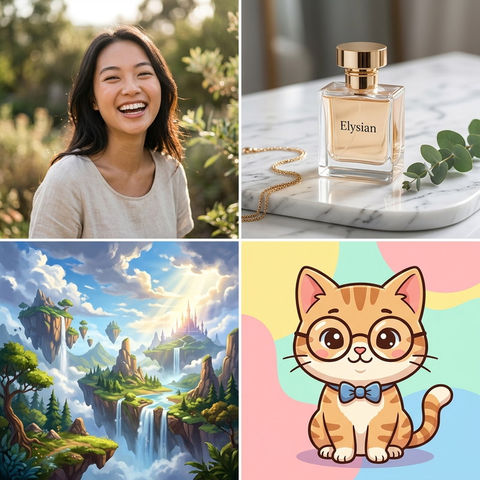
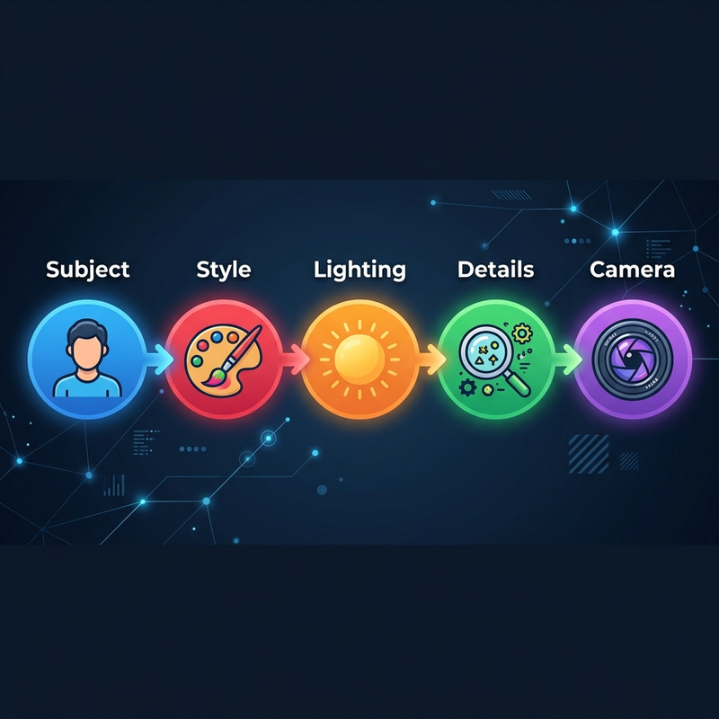
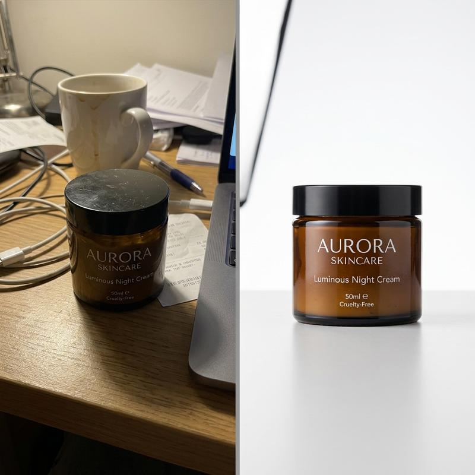
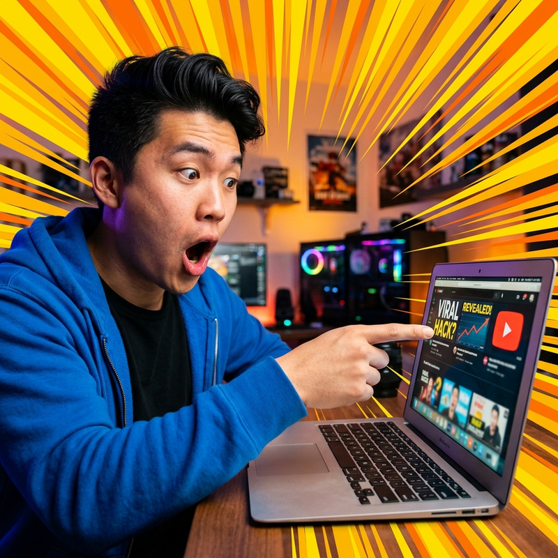

# Tạo Ảnh AI Miễn Phí: Top 7 Công Cụ & Cách Viết Prompt Đẹp Nhất 2026



Tạo ảnh bằng AI không còn cần Photoshop, không cần kỹ năng thiết kế. Chỉ cần 1 dòng mô tả (prompt), AI sẽ vẽ cho bạn bất cứ thứ gì: ảnh sản phẩm chuyên nghiệp, chân dung chân thực, avatar cute, hay thumbnail YouTube bắt mắt.

Nhưng "miễn phí" trong thế giới AI ảnh 2026 thường có nghĩa là **dính watermark, giới hạn số lượng, hoặc chất lượng bị cắt**. Bài viết này review thật 7 công cụ tạo ảnh AI tốt nhất — nói rõ cái nào free thật, cái nào dính logo, và cái nào đáng bỏ tiền.

---

## 7 App Tạo Ảnh AI Đẹp Nhất 2026

### 1. FLUX 2 Pro (Stability AI)

**Loại:** Text-to-Image chất lượng cao
**Free tier:** ⚠️ Một số nền tảng cho dùng thử nhưng **ảnh free thường bị dính watermark** hoặc giới hạn độ phân giải. Cần trả phí để có ảnh sạch
**Điểm mạnh:** Chất lượng ảnh cực kỳ sắc nét, xử lý tay và ngón tay tốt nhất hiện tại, phong cách đa dạng từ photorealistic đến anime
**Phù hợp:** Ảnh chân dung, banner quảng cáo, art concept

### 2. Google Gemini (tích hợp Imagen)

**Loại:** Text-to-Image tích hợp chatbot
**Free tier:** Có, miễn phí hoàn toàn trên gemini.google.com
**Điểm mạnh:** Miễn phí không giới hạn, prompt bằng tiếng Việt được, tích hợp sẵn trong Gemini chat
**Hạn chế:** Chất lượng trung bình, hay từ chối prompt liên quan đến người thật
**Phù hợp:** Người mới bắt đầu, cần ảnh minh họa nhanh

### 3. Nano Banana Pro (Trạm Sáng Tạo)

**Loại:** Text-to-Image photorealistic
**Free tier:** ❌ Không có free tier. Dùng qua Trạm Sáng Tạo từ 99k/tháng (hoàn tiền 7 ngày)
**Điểm mạnh:** Ảnh người Việt/Châu Á cực chân thực, phong cách photorealistic vượt trội, hoàn hảo cho ảnh thời trang và beauty
**Phù hợp:** Ảnh mẫu thời trang, ảnh KOL, ảnh chân dung chuyên nghiệp

→ *Đọc chi tiết: [Ảnh Mẫu AI Cho Thời Trang](/drafts/anh-mau-ai-thoi-trang)*

### 4. Kling O1 Image

**Loại:** Text-to-Image từ Kuaishou (nhà phát triển Kling AI)
**Free tier:** ⚠️ 66 credits miễn phí/ngày trên klingai.com nhưng **ảnh dính watermark Kling**. Bỏ watermark cần gói trả phí
**Điểm mạnh:** Phong cách đa dạng, xử lý layout phức tạp tốt, hỗ trợ in-painting
**Phù hợp:** Ảnh poster, ảnh ghép nhiều nhân vật, ảnh concept

### 5. ChatGPT Image (DALL-E 3)

**Loại:** Text-to-Image tích hợp ChatGPT
**Free tier:** ⚠️ Giới hạn ~3 ảnh/ngày trên ChatGPT Free, **không dính watermark** nhưng số lượng rất ít. Cần ChatGPT Plus ($20/tháng) để dùng thoải mái
**Điểm mạnh:** Hiểu prompt phức tạp rất tốt nhờ GPT-4, tạo text trong ảnh chính xác hơn các model khác
**Hạn chế:** Phong cách hơi "AI-look", không photorealistic bằng Flux hoặc Nano Banana
**Phù hợp:** Ảnh có text (poster, meme, infographic), minh họa concept

### 6. Seedream (ByteDance)

**Loại:** Text-to-Image aesthetic
**Free tier:** ⚠️ Dreamina cho dùng thử vài ảnh/ngày, **có thể dính watermark** tùy model. Cần tài khoản Trung Quốc để dùng đầy đủ
**Điểm mạnh:** Phong cách nghệ thuật đẹp, màu sắc hài hòa, xử lý landscape/nature xuất sắc
**Phù hợp:** Ảnh nghệ thuật, wallpaper, ảnh mood/vibe

### 7. Freepik AI Image Generator

**Loại:** Text-to-Image tích hợp nền tảng stock
**Free tier:** ⚠️ 3-5 ảnh/ngày nhưng **ảnh free dính watermark Freepik**, cần gói Premium (~$10/tháng) để tải ảnh sạch
**Điểm mạnh:** Tích hợp sẵn trên Freepik, dùng ngay không cần đăng ký riêng, dễ dùng cho người không rành tech
**Phù hợp:** Ảnh stock nhanh, ảnh blog, ảnh minh họa

---

## So Sánh Nhanh 7 Công Cụ

| Công cụ | Free tier | Watermark? | Chất lượng | Dùng trên TST |
| --- | --- | --- | --- | --- |
| **FLUX 2 Pro** | Giới hạn | ⚠️ Có (trên một số nền tảng) | ⭐⭐⭐⭐⭐ | ✅ Không watermark |
| **Gemini** | ✅ Miễn phí không giới hạn | ✅ Không | ⭐⭐⭐ | ❌ |
| **Nano Banana Pro** | ❌ Trả phí | ✅ Không | ⭐⭐⭐⭐⭐ | ✅ |
| **Kling O1** | 66 credits/ngày | ⚠️ Có | ⭐⭐⭐⭐ | ✅ Không watermark |
| **ChatGPT Image** | ~3 ảnh/ngày | ✅ Không | ⭐⭐⭐⭐ | ❌ |
| **Seedream** | Vài ảnh/ngày | ⚠️ Tùy model | ⭐⭐⭐⭐ | ✅ Không watermark |
| **Freepik** | 3-5 ảnh/ngày | ⚠️ Có | ⭐⭐⭐ | ✅ Không watermark |

> **Mẹo:** Nếu bạn muốn dùng nhiều model (FLUX, Nano Banana, Kling O1, Seedream, Freepik) tại 1 nơi duy nhất, [Trạm Sáng Tạo](https://tramsangtao.com) tập hợp sẵn tất cả — giá từ 99k/tháng, thanh toán MoMo.

---

## Cách Viết Prompt Tạo Ảnh AI — Hướng Dẫn Chi Tiết

Prompt quyết định 90% chất lượng ảnh AI. Cùng model, người viết prompt giỏi sẽ ra ảnh khác hoàn toàn so với người viết sơ sài.


*Prompt tốt = Chủ thể rõ → Phong cách cụ thể → Ánh sáng chi tiết → Bố cục camera chính xác.*

### Công Thức Prompt Cơ Bản

```
[Chủ thể] + [Phong cách] + [Ánh sáng] + [Chi tiết bổ sung] + [Góc camera]
```

### 10 Ví Dụ Prompt Theo Mục Đích Sử Dụng

**Ảnh chân dung chân thực:**
> "Portrait of a 25-year-old Vietnamese woman, natural makeup, wearing a white linen blouse, soft window light, shallow depth of field, shot on Canon 85mm f/1.4"

**Ảnh sản phẩm chuyên nghiệp:**
> "Product photography of a luxury perfume bottle on white marble surface, soft studio lighting from left, clean white background, commercial quality, 4K"

**Thumbnail YouTube bắt mắt:**
> "Close-up portrait of a young Asian man with excited surprised expression, mouth open, pointing at camera, bold yellow radial background, vibrant saturated colors, dramatic lighting"

**Ảnh avatar cute:**
> "Cute chibi anime avatar of a girl with cat ears, pastel pink hair, wearing oversized hoodie, kawaii style, soft gradient background, digital art"

**Ảnh bìa Facebook:**
> "Wide panoramic landscape photo, cherry blossom trees along a peaceful river in spring, golden hour lighting, dreamy atmosphere, 16:9 aspect ratio"

**Ảnh sản phẩm thời trang:**
> "Fashion model wearing a modern ao dai, standing in old Hanoi street, morning golden light, editorial photography style, shot on Hasselblad"

**Ảnh nghệ thuật/Art:**
> "Surreal digital painting of a giant whale flying through clouds above a small Vietnamese fishing village, warm sunset colors, Studio Ghibli inspired"

**Ảnh minh họa blog:**
> "Flat design illustration of a person sitting at desk working on laptop, coffee cup nearby, indoor plants, pastel color palette, clean minimalist style"

**Ảnh food/F&B:**
> "Overhead flat lay of Vietnamese pho bowl, fresh herbs, lime wedges, chopsticks on dark wooden table, steam rising, food photography, natural window light"

**Ảnh bất động sản:**
> "Interior photography of modern minimalist living room, large windows with natural light, white sofa, wooden floors, Scandinavian style, wide angle lens"

### 5 Sai Lầm Phổ Biến Khi Viết Prompt

1. **Prompt quá ngắn** — "ảnh đẹp" không nói gì cho AI. Cần ít nhất 15-30 từ mô tả cụ thể
2. **Dùng phủ định** — "no watermark, no text" thường không hiệu quả. Mô tả những gì bạn MUỐN thay vì không muốn
3. **Prompt tiếng Việt** cho model không hỗ trợ — hầu hết model (trừ Gemini) hiểu tiếng Anh tốt hơn nhiều
4. **Quá nhiều yêu cầu** — nhét 10 ý vào 1 prompt sẽ khiến AI bị "confused". Tập trung 3-5 yếu tố chính
5. **Không chỉ định phong cách** — nếu không nói "photorealistic" hay "anime", AI sẽ tự chọn ngẫu nhiên

---

## 5 Ứng Dụng Thực Tế Của Ảnh AI

### 1. Ảnh Sản Phẩm Cho Shop Online


*Ảnh chụp điện thoại (trái) → Ảnh sản phẩm chuyên nghiệp bằng AI (phải). Không cần studio, không cần photographer.*

Chủ shop online có thể tiết kiệm hàng triệu đồng chi phí chụp ảnh sản phẩm:
- Upload ảnh chụp smartphone → AI tạo ảnh nền trắng chuyên nghiệp
- Tạo ảnh sản phẩm trong nhiều bối cảnh khác nhau (trên bàn, trong tay model, ngoài trời)
- Batch xử lý 100 sản phẩm trong 1 giờ thay vì 1 tuần chụp studio

### 2. Thumbnail YouTube


*Thumbnail AI chất lượng cao — khuôn mặt biểu cảm, màu sắc bắt mắt, đúng format YouTube viral.*

Thumbnail quyết định 70% lượng click trên YouTube. Với AI, bạn có thể:
- Tạo 5-10 phiên bản thumbnail cho mỗi video, A/B test để chọn bản CTR cao nhất
- Không cần Photoshop — chỉ cần prompt mô tả biểu cảm, background, bố cục

### 3. Ảnh Avatar & Ảnh Đại Diện

Tạo avatar chuyên nghiệp cho social media, Zalo, hoặc LinkedIn:
- Prompt: "Professional headshot, business attire, neutral background, studio lighting"
- Ra ảnh avatar look chuyên nghiệp mà không cần đi studio chụp

### 4. Ảnh Bìa Facebook & Banner

Tạo ảnh bìa Facebook, banner Zalo, hoặc cover cho group/fanpage:
- Prompt chỉ rõ kích thước: thêm "16:9 aspect ratio" hoặc "wide panoramic"
- Phong cách: landscape, cityscape, abstract gradient — tùy brand

### 5. Ảnh Minh Họa Blog & Content Marketing

Thay vì dùng ảnh stock lặp lại nhàm chán, tạo ảnh minh họa unique cho mỗi bài blog:
- Ảnh illustration phong cách flat design cho bài tech
- Ảnh photorealistic cho bài review sản phẩm
- Ảnh concept cho bài brainstorm/ý tưởng

---

## FAQ — Câu Hỏi Thường Gặp

### Tạo ảnh AI miễn phí ở đâu tốt nhất?

Nếu chỉ cần ảnh nhanh, miễn phí hoàn toàn: **Google Gemini** (không giới hạn, prompt tiếng Việt). Nếu cần chất lượng cao hơn: **Freepik** (3-5 ảnh/ngày) hoặc **Trạm Sáng Tạo** gói 99k (2000 credits ≈ 250 ảnh).

### Ảnh AI có được dùng thương mại không?

Có, hầu hết các model (FLUX, Nano Banana, Kling O1) đều cho phép dùng ảnh AI cho mục đích thương mại (quảng cáo, bán hàng, in ấn). Tuy nhiên, KHÔNG được dùng ảnh AI để giả danh ảnh thật với mục đích lừa đảo.

### Tạo ảnh AI chân thực nhất bằng model nào?

**Nano Banana Pro** cho người Châu Á/Việt Nam. **FLUX 2 Pro** cho người phương Tây. Cả hai đều có trên Trạm Sáng Tạo.

### Prompt tiếng Việt có tạo ảnh được không?

Được với **Google Gemini** (tốt nhất cho tiếng Việt). Các model khác (FLUX, Nano Banana, Kling O1) nên dùng **tiếng Anh** để có kết quả tốt hơn.

### 1.000 credits trên Trạm Sáng Tạo tạo được bao nhiêu ảnh?

Khoảng **250 ảnh** (mỗi ảnh tiêu tốn ~4 credits). Gói Starter 99k = 2.000 credits ≈ 500 ảnh. Nếu cần ảnh không giới hạn, gói **Image Basic 149k/tháng** (unlimited Freepik, Gemini, Imagen, Seedream, FLUX 2 Pro, Kling O1).

---

## Kết Luận

Năm 2026, tạo ảnh AI miễn phí đã không còn là "chơi cho vui" — nó là **công cụ sản xuất thực thụ**. Từ ảnh sản phẩm cho Shopee, thumbnail YouTube viral, đến ảnh mẫu thời trang chuyên nghiệp, AI đều làm được nhanh hơn và rẻ hơn cách truyền thống.

**Tóm tắt nhanh:**
- **Miễn phí thật sự (không watermark):** Google Gemini (chất lượng trung bình), ChatGPT Free (~3 ảnh/ngày)
- **Free nhưng dính watermark:** Kling O1, Freepik, FLUX trên một số platform
- **Chất lượng cao, không watermark:** Nano Banana Pro, FLUX 2 Pro, Kling O1 — qua [Trạm Sáng Tạo](https://tramsangtao.com) từ 99k, thanh toán MoMo

> **[Bắt Đầu Tạo Ảnh AI Ngay Tại Trạm Sáng Tạo](https://tramsangtao.com)** — 6 model ảnh AI, giao diện tiếng Việt, giá từ 99k/tháng. Gói **Image Basic 149k/tháng = UNLIMITED ảnh AI!**

---

## Bài Viết Liên Quan

- [Cách Tạo Video AI Từ Ảnh — Hướng Dẫn Toàn Diện](/drafts/cach-tao-video-ai-tu-anh)
- [Ảnh Mẫu AI Cho Thời Trang](/drafts/anh-mau-ai-thoi-trang)
- [So Sánh 7 Công Cụ Tạo Video AI Tốt Nhất 2026](/drafts/so-sanh-tool-tao-video-ai)
- [Cách Tạo KOL Ảo TikTok Từ A-Z](/drafts/kol-ai-tiktok)
