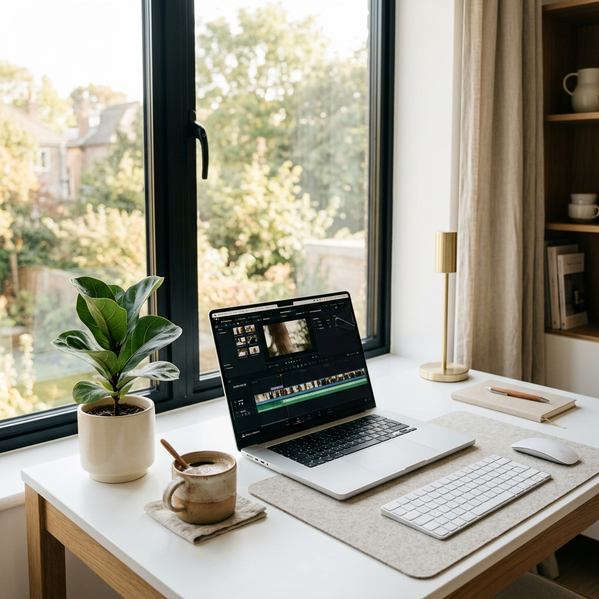
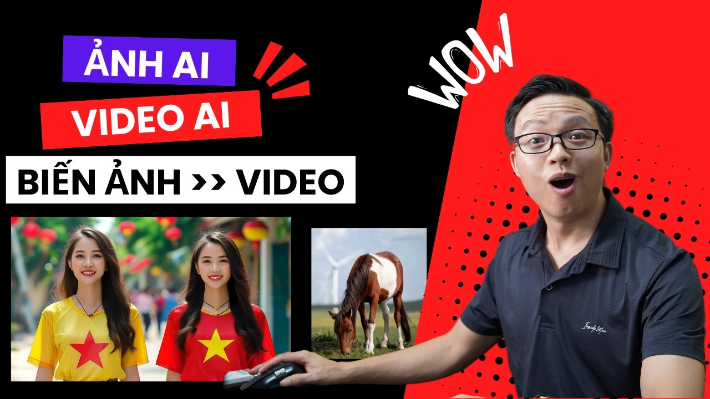

---
title: "Tạo Video AI — Hướng Dẫn Toàn Diện Từ A-Z Cho Người Việt (2026)"
slug: "tao-video-ai-huong-dan-toan-dien-cho-nguoi-viet"
meta_title: "Tạo Video AI Từ A-Z: Hướng Dẫn Toàn Diện Cho Người Việt 2026 | Trạm Sáng Tạo"
meta_description: "Hướng dẫn toàn diện tạo video AI cho người Việt: từ chọn tool, viết prompt, đến workflow thực chiến. Kling, Veo 3, FLUX — tất cả trong 1 bài."
tags:
  - tạo video AI
  - hướng dẫn video AI
  - AI cho người Việt
  - workflow video AI
  - Kling AI
  - Veo 3
  - content creator
status: draft
cta_page: /video
image: cover_master_guide.jpg
---

# Tạo Video AI — Hướng Dẫn Toàn Diện Từ A-Z Cho Người Việt (2026)

Năm 2026, kỷ nguyên mà một người với chiếc laptop mỏng nhẹ có thể sản xuất lượng video gấp đôi cả một studio 10 người hồi năm 2023. Nghe có vẻ điên rồ, nhưng nếu bạn biết cách ứng dụng Trí tuệ Nhân tạo (AI), điều đó là hoàn toàn có thật.

Vấn đề lớn nhất lúc này không phải là "AI có làm được không", mà là có quá nhiều công cụ ngoài kia, quá nhiều hướng dẫn rời rạc khiến bạn bị "ngợp" và không biết nên bắt đầu từ đâu.

Vì vậy, bài viết này ra đời với mục đích trở thành **cẩm nang duy nhất bạn cần đọc**. Nó tổng hợp mọi thứ từ A đến Z: cách chọn đúng công cụ, bí quyết viết prompt, cho đến những workflow (quy trình) bài bản nhất đã được kiểm chứng thực tế.

Dù bạn là một marketer chạy ads, một freelancer nhận job video, chủ tiệm online muốn làm nội dung TikTok dễ dàng, hay một content creator — bài hướng dẫn này dành cho bạn. Hãy đánh dấu (bookmark) ngay trang này lại, vì chắc chắn bạn sẽ cần quay lại đây nhiều lần!

---

## Bước 0: Hiểu Bức Tranh Toàn Cảnh — Video AI Đang Ở Đâu?

<iframe width="100%" class="aspect-video mt-4 mb-8 rounded-lg shadow-lg" src="https://www.youtube.com/embed/bIgtrveSh1M" frameborder="0" allowfullscreen></iframe>


Nhìn lại một chút về timeline từ năm ngoái: Sora ra mắt tạo nên một cơn địa chấn, tiếp theo là sự bùng nổ của các đối thủ sừng sỏ. Đến hiện tại, những cái tên như Kling, Veo, và Seedance đã vươn lên mạnh mẽ, trong khi Sora lại có phần tụt lại do rào cản chi phí và khả năng tiếp cận quá khó khăn.

Bức tranh video AI lúc này được chia làm 3 thể loại chính:

1. **Text-to-Video (Văn bản thành Video):** Viết câu lệnh (prompt) mô tả và AI sẽ tạo ra một đoạn video hoàn chỉnh.
2. **Image-to-Video (Ảnh tĩnh thành Video):** Đưa cho AI một bức ảnh tĩnh, nó sẽ làm cho bức ảnh đó chuyển động một cách sinh động.
3. **Video-to-Video (Video thành Video):** Đem một video có sẵn để AI thay đổi phong cách, làm nét, hoặc thêm hiệu ứng (enhance/edit).

Với người dùng thực chiến tại Việt Nam, tôi khuyên bạn nên tập trung mạnh vào **Text-to-Video** và **Image-to-Video**, bởi đây là hai dạng trơn tru mang lại hiệu quả về lợi nhuận (ROI) nhanh nhất và cao nhất.

Để dễ hình dung, đây là bảng tóm tắt nhanh:

| Loại công cụ | Ví dụ Use Case (Trường hợp áp dụng) | Tool phù hợp nhất |
|------|---------------|-------------------|
| **Text-to-Video** | Tạo clip quảng cáo từ ý tưởng ban đầu | Kling 3.0, Veo 3 |
| **Image-to-Video** | Làm ảnh sản phẩm chuyển động, nhân vật AI | Kling 2.5 / Kling 2.6 |
| **Video-to-Video** | Thêm hiệu ứng VFX, thay đổi background | Runway ML |

> **Đọc thêm:**
>
> - [Sora đã thay đổi thế nào và lựa chọn thay thế nào là ngon nhất?](/blog/cach-dung-sora-tao-video-ai-va-lua-chon-thay-the)
> - [Veo 3 là gì? Khám phá siêu AI về video của Google](/blog/veo-3-la-gi-mo-hinh-video-ai-cua-google)

---

## Bước 1: Chọn Đúng Tool — Đừng Mất Tiền Vào Tool Sai


Thị trường hiện nay là một "rừng rậm" rắc rối các công cụ tạo video AI. Việc chọn sai công cụ không chỉ khiến bạn bực mình vì kết quả tệ, lỗi ngôn ngữ mà còn lãng phí tiền bạc. Chìa khóa ở đây là: Hãy vứt bỏ tư duy xem công cụ nào "xịn nhất thế giới", mà hãy tìm công cụ **phù hợp nhất** với nhu cầu thực tế của chính bạn.

Dưới đây là bảng "Ra quyết định nhanh" giúp bạn nhắm thẳng vào công cụ cần thiết nhất:

| Bạn muốn... | Tool nên ưu tiên dùng | Tại sao lại tối ưu? |
|-------------|--------------|---------|
| Tạo clip quảng cáo sản phẩm chân thực | **Kling 2.5** (để test ý tưởng) → **Kling 3.0** (render final) | Giá thành cực siêu rẻ, đặc biệt có độ hiểu biết sâu sắc về văn hóa thẩm mỹ (visual) châu Á và Việt Nam. |
| Video cinematic, điện ảnh với độ khó cao | **Veo 3** | Tích hợp sẵn hiệu ứng âm thanh môi trường nguyên bản cực kỳ xuất sắc, hiểu các lệnh đạo diễn camera tinh vi. |
| Làm ảnh tĩnh (sản phẩm/nhân vật) chuyển động | **Kling 2.6** (tính năng Image-to-Video) | Sự ổn định kinh ngạc ở khả năng giữ lại y chang bản chụp gốc từ đường nét đến tông màu ánh sáng. |
| Sản xuất video sỉ cho nền tảng video ngắn | **Kling 2.5 Turbo** | Cực kỳ rẻ, chỉ rơi vào khoảng thấp kỷ lục ~1.000 VNĐ cho mỗi clip với tốc độ trả file tính bằng vài ba phút. |
| Review đánh giá, làm kênh nhưng che danh tính | **Nano Banana Pro** (tạo ảnh mẫu) → **Kling** (làm hiệu ứng) | Nhào nặn ra một diện mạo mới mẻ độc nhất làm gương mặt AI cố định dùng xuyên suốt vạn tập video khác nhau! |
| Sáng tác ra hình ảnh đồ vật/mẫu chụp lookbook | **FLUX** hoặc **Nano Banana Pro** | Cho hiệu ứng đồ họa chân thực (photorealistic) cao độ y hệt thuê nhiếp ảnh gia studio về làm ròng rã 3 ngày 3 đêm! |

**Hiểu Rõ Phân Khúc (Tier) Model Để Tiện Ích Hóa Chi Phí:**
Đừng bao giờ cứ lao đầu chọn model đắt tiền nhất. Dưới đây là phân mảng đẳng cấp các công cụ hiện nay để dùng chiến thuật tiền bạc:

- **Kling 2.5:** "Công nhân bốc vác" sinh ra để làm **bản nháp (draft) / test ý tưởng nhanh**. Rẻ bèo, kết quả đủ tốt để rà soát prompt.
- **Kling 2.6:** Ngôi sao sinh ra cho **Production (sản xuất đại trà)**. Độ sâu chi tiết từ biểu cảm khuôn mặt và kết cấu không gian được trau chuốt, cân bằng hoàn hảo giá/chất.
- **Kling 3.0:** Con ngựa trắng **Premium (siêu cao cấp)**. Khi bạn cần camera bay nhảy như máy cơ (xoay vòng, pan, góc ngửa), chất lượng Full HD sắc bén, đây là câu trả lời xứng tầm.
- **Veo 3:** Cỗ máy **High-end (công xưởng xịn)** đình đám từ Google. Phù hợp cho agency hạng sang cần render ra clip quảng cáo TVC kèm âm thanh sẵn có trơn mượt không cần chắp ghép.

**Dù bạn là ai, vẫn luôn có lựa chọn riêng:**

- **Nếu bạn chỉ có ngân quỹ khoảng 100k/tháng:** Dành toàn bộ tình yêu cho **Kling 2.5 Turbo**. Con số đó dư sức cày hàng trăm lượt sinh video demo (thử nghiệm) phục vụ mảng ngách video Facebook.
- **Nếu bạn có số ngân quỹ rủng rỉnh hơn là 500k/tháng:** Kết hợp nhịp nhàng giữa **Kling 2.6** (chuẩn hóa kịch bản chính) và xen kẽ vài thước phim điểm xuyết từ **Veo 3**. Đủ bài bản làm trọn tuyến kênh có độ chuyên sâu cao.
- **Nếu mức ngân sách mạnh ở mức trên 2 triệu/tháng (Cấp độ Pro):** Vận hành mượt mà quy trình trọn vẹn: dựng mẫu ở **FLUX/Nano Banana** → Giao lại cho **Kling 3.0 / Veo 3** hoạt họa thành đoạn phim kinh điển. Bạn sẽ cạnh tranh ngang ngửa mọi media house vừa và nhỏ!

> **Nắm bắt chi tiết và mổ sẻ các model trong chuỗi bài viết sau:**
>
> - [Kling AI là gì? Hướng dẫn làm chủ nền tảng này](/blog/kling-ai-la-gi)
> - [Sự thật về bảng giá Kling AI 2025. Chi phí rẻ hều?](/blog/kling-ai-gia-bao-nhieu-bang-gia-2025)
> - [Kling 2.5 làm được gì? Đọc để không tụt hậu](/blog/kling-2-5-la-gi-moi-thu-ban-can-biet)
> - [Kling 2.6 vs Kling 3.0: 7 Điểm thay máu đọ sức nhau](/blog/kling-2-6-vs-kling-3-0-7-diem-khac-biet-can-biet)
> - [Review trần trụi sức mạnh Kling 3.0 Pro](/blog/kling-3-0-la-gi-danh-gia-chi-tiet)
> - [Giải mã mô hình Google Veo 3 đối với ngành visual](/blog/veo-3-la-gi-mo-hinh-video-ai-cua-google)
> - [Top 7 App tạo Video AI có tối ưu riêng rẻ và chất lượng cho tiếng Việt](/blog/top-7-tool-tao-video-ai-ho-tro-tieng-viet)

---

## Bước 2: Viết Prompt — Kỹ Năng Quyết Định 80% Chất Lượng Video


*Góc làm việc gọn gàng sẽ giúp tư duy viết prompt AI logic và mạch lạc hơn.*

Sự khác biệt giữa một video khiến người xem thốt lên "Wow!" và một video bị lướt qua nằm ở câu lệnh (Prompt). Nó chiếm đến 80% chất lượng đầu ra.

Công thức viết Prompt bất bại gồm 5 phần:
**Subject (Chủ thể) + Action (Hành động) + Environment (Môi trường) + Camera (Góc máy) + Style (Phong cách).**

Hãy phân tích thử một ví dụ cụ thể này (Lưu ý: Luôn dùng tiếng Anh để AI hiểu tốt nhất):
> *"A young Vietnamese woman (Subject) sipping coffee at a sidewalk café (Action + Environment), slow push-in camera movement (Camera), warm golden hour lighting, shallow depth of field, film grain (Style)"*
>
> **Phân tích:**
>
> - **Subject:** `A young Vietnamese woman` (Một phụ nữ trẻ VN)
> - **Action + Env:** `sipping coffee at a sidewalk café` (đang nhâm nhi cà phê ở quán vỉa hè)
> - **Camera:** `slow push-in camera movement` (Cú máy tiến chậm về phía trước, tạo sự tập trung)
> - **Style:** `warm golden hour lighting` (ánh sáng giờ vàng ấm áp), `shallow depth of field` (độ sâu trường ảnh mỏng hay gọi là xóa phông nhẹ), `film grain` (thêm chút hạt nhiễu của phim cũ để tạo độ chân thực).

**Bảng "Keyword Ma Thuật" Đã Test Thực Tế:**
Để video của bạn trông không "giả trân", đây là danh sách từ khóa bí mật nên cho vào đoạn cuối prompt:

| Mục đích bạn muốn | Keyword thêm vào prompt | Tác dụng cực mạnh |
|-------------------|--------------------------|------------------|
| **Trông chân thực hơn** | *"film grain, natural skin texture, imperfection"* | Giảm hẳn vẻ "nhựa", siêu thực mịn màng đáng sợ của AI. |
| **Ánh sáng đẳng cấp** | *"golden hour, warm afternoon light, soft studio lighting"* | Tạo ngay luồng ánh sáng tone ấm, trông rất pro và điện ảnh. |
| **Tập trung chủ thể** | *"shallow depth of field, bokeh, cinematic focus"* | Làm mờ hậu cảnh (xóa phông), bắt mắt người xem vào ngay giữa khung hình. |
| **Cảm giác Studio** | *"commercial product photography style, clean background"* | Cần khi làm clip review sản phẩm, không bị rối mắt bởi ngoại cảnh. |
| **Thu hút ngay giây đầu** | *"dramatic zoom in", "aerial descending", "FPV drone flying"* | Cú máy chuyển động cực lôi cuốn, đóng vai trò làm Hook giữ chân người xem. |

**3 Lỗi "Tử Huyệt" Khi Viết Prompt Bạn Phải Tránh:**

1. **Viết dài ngoằn ngoèo như làm văn (>50 từ):** AI rất dễ bị "rối" (confused). Dài không có nghĩa là tốt. Càng súc tích, chia phẩy rõ ràng, AI càng làm chuẩn.
2. **"Ép" AI hiểu tiếng Việt:** Output khi bạn dùng prompt Tiếng Việt thua kém rõ rệt, thiếu hụt nhiều góc máy phức tạp vì dữ liệu huấn luyện của AI đa phần là tiếng Anh.
3. **Thêm các từ thừa thãi như *"4K, ultra HD, masterpiece, 8k best quality"*:** Đây là thói quen từ thời làm ảnh AI cũ. Với các mô hình video như Kling hay Veo, những từ này hoàn toàn vô dụng, không hề làm video nét hơn mà chỉ gây lãng phí token (chiều dài) prompt.

> 💎 **Pro-Tips: Quy trình Prompt cho người không giỏi Tiếng Anh:**
> Hãy sử dụng ChatGPT hoặc Claude, viết kịch bản bằng Tiếng Việt thân thuộc: *"Viết cho tôi cảnh cô gái đi dạo phố Hà Nội buổi sáng..."*, sau đó yêu cầu chúng: *"Hãy dịch cảnh này sang Prompt mô tả video bằng Tiếng Anh, bổ sung thêm các keyword góc máy điện ảnh và hệ thống ánh sáng"*. Kết quả chắc chắn sẽ đánh gục bạn.

> **Đọc thêm:**
>
> - Chi tiết làm quen: [Hướng dẫn dùng Kling AI Tiếng Việt từ Zero đến Video hoàn chỉnh](/blog/huong-dan-dung-kling-ai-tieng-viet-tu-zero-den-video)

---

## Bước 3: Workflow Thực Chiến — Từ Ý Tưởng Đến Video Hoàn Chỉnh



Lý thuyết đã xong, giờ là lúc xắn tay áo. Tùy vào việc bạn là ai, hãy chọn 1 trong 3 workflow dưới đây và làm theo nhé. Từng bước đều được tối ưu về mặt hiệu suất và ngân sách.

### 📈 Workflow A: Tạo Video Quảng Cáo Sản Phẩm (Dành cho Shop Online / Marketer)

Thay vì thuê studio chụp choẹt đắt đỏ, hãy tự làm ngay tại nhà:

1. **Chụp gốc:** Chụp ảnh sản phẩm (quần áo, mỹ phẩm, đồ ăn...) bằng điện thoại. Cố gắng chụp nơi sáng sủa, rồi dùng Snapseed kéo sáng lên một chút cho rõ ràng.
2. **Biến hóa ảnh:** Truy cập Trạm Sáng Tạo, dùng AI **FLUX** tải ảnh sản phẩm lên để nó tạo ra các tấm "Lifestyle mockup" cực xịn (đặt sản phẩm lên bàn gỗ, có ánh nắng chiếu qua...).
3. **Tạo chuyển động nháp:** Lấy tấm ảnh FLUX ưng ý nhất, thả vào tính năng Image-to-Video của **Kling 2.5**. Chạy thử 2-3 biến thể prompt khác nhau để xem hiệu ứng xoay, chuyển động nào đẹp nhất.
4. **Render chốt hạ:** Chọn đúng biến thể prompt và thông số tốt nhất, chuyển sang **Kling 2.6 hoặc Kling 3.0** để render video final (độ phân giải cao, đẹp rực rỡ).
5. **Hậu kỳ:** Bỏ video vào CapCut. Chèn nhạc đang trending, đẩy thêm 1 dòng text thật kêu gọi mua hàng (Call to Action), xuất file. Xong!

- **⏱ Tổng thời gian:** 20 - 30 phút/video.
- **💰 Chi phí:** Chỉ từ ~2.000 đến 5.000 VNĐ.

### 📈 Workflow B: Kênh Video Không Lộ Mặt (Dành cho Creator / KOL Ẩn Danh)

Hướng đi kiếm tiền mảng Affiliate cực tốt mà không ai biết mặt bạn ngoài đời:

1. **Định hình nhân vật AI:** Sử dụng công cụ **Nano Banana Pro**, tạo ra 1 gương mặt/nhân vật AI (nam/nữ tùy ngách). Hãy lưu tất cả hình ảnh của nhân vật này lại như một bộ ảnh tham chiếu (reference).
2. **Chuyển động hóa:** Ở mỗi kịch bản/tập video mới, đưa ảnh reference vào tính năng Image-to-Video của **Kling 2.6**.
3. **Thay thế bối cảnh:** Viết prompt yêu cầu Model chỉ thay đổi bối cảnh, giữ nguyên nhân vật (vd: *"cô gái đang đi dạo trong rừng, cô gái đang ngồi uống nước..."*).
4. **Lồng tiếng:** Thu âm voiceover bằng chính giọng thật của bạn (sẽ tạo cảm giác kết nối mạnh mẽ với người xem hơn), hoặc có thể dùng ElevenLabs nếu muốn ẩn danh tuyệt đối.
5. **Hoàn thành:** Ném video và file ghi âm vào CapCut để ghép, rồi dùng tính năng Auto-subtitle thần thánh để chạy vietsub.

- **⏱ Tổng thời gian:** 30 - 45 phút/video.
- **💰 Chi phí:** Chỉ từ ~5.000 đến 10.000 VNĐ.

### 📈 Workflow C: Sản Xuất Batch Video Hàng Loạt (Dành cho Agency / Freelancer)

Cần lên kế hoạch content 1 tháng cho tệp khách? Áp dụng ngay:

1. **Chuẩn bị đầu vào:** Nhận brief, concept và kho ảnh sản phẩm từ khách hàng.
2. **Lên kho Prompt:** Thiết lập sẵn 5-10 Prompt vào một file Google Sheet (tạo thành một Prompt Library) gồm các bối cảnh khác nhau.
3. **Chạy máy:** Mở Trạm Sáng Tạo, copy toàn bộ loạt prompt đó và submit lệnh chạy **hàng loạt (batch generate)** trên **Kling 2.5**.
4. **Nghiệm thu nhanh:** Đi pha một tách cà phê. 10 phút sau quay lại, lướt qua kết quả. Video nào chất lượng tốt rồi thì lưu luôn, video nào cần độ chi tiết sắc nét hơn cho Facebook Ads thì upgrade riêng lệnh đó lên **Kling 3.0**.
5. **Biên tập sỉ:** Bỏ 10 video vào CapCut PC chỉnh sửa một lượt. Đặc biệt: Luôn cắt đi 2 giây cuối của mỗi clip (mẹo này sẽ nói ở phần sau). Thêm hiệu ứng chuyển cảnh, xuất 1 file video dài và cắt nhỏ thành 10 video ngắn.

- **⏱ Tổng thời gian:** 2 - 3 giờ cho 1 batch tầm 10 video chất lượng!
- **💰 Chi phí:** Chưa tới 50.000 VNĐ / lô 10 video. Rẻ không tưởng.

> **Đọc bài viết hướng dẫn chi tiết từng Use-case:**
>
> - Kịch bản Workflow A: [Cách làm video AI thủ công chỉ trong 20 phút](/blog/cach-tao-video-ngan-bang-ai-trong-20-phut)
> - Auto Workflow: [Làm video AI tự động từ ý tưởng tới clip hoàn chỉnh](/blog/lam-video-ai-tu-dong-tu-y-tuong-den-clip-hoan-chinh)
> - Kịch bản Workflow B: [Tuyệt chiêu làm video AI hoàn toàn không lộ giọng thật và mặt thật](/blog/lam-video-ai-khong-can-lo-mat-huong-dan-thuc-chien)
> - Tối ưu Workflow C: [Làm nội dung không cần quay, hướng dẫn từ A-Z cho dân làm sỉ](/blog/tao-video-ai-khong-can-quay-huong-dan-thuc-te-tu-a-z)
> - Kênh TikTok: [Dùng AI xây kênh TikTok từ Zero đến khi đăng clip](/blog/cach-dung-ai-tao-video-tiktok-tu-dau-den-khi-dang)
> - Kỹ nghệ tĩnh sang động: [Hướng dẫn tạo video AI từ ảnh tĩnh](/blog/cach-tao-video-ai-tu-anh-tinh-den-video-chuyen-dong)

---

## Bước 4: Tối Ưu Chất Lượng — Mẹo "Dân Trong Nghề"

Biết dùng thì dễ, nhưng để tối ưu hoá ngân sách và làm ra những đoạn video mượt mà, đậm chất chuyên gia, bạn bắt buộc phải nằm lòng những "mẹo người trong nghề" dưới đây — những thứ hiếm khi được ghi trong các bài hướng dẫn chính thức từ nhà mạng.

💎 **Pro-Tips: 7 Bí Quyết Tối Ưu Tột Đỉnh**

1. **Quy tắc "Test Rẻ, Render Đắt":** Đừng tốn credits xịn ngay từ lần đầu! Luôn chạy thử ý tưởng (prompt) bằng Kling 2.5 (phiên bản cực rẻ). Khi nào ra đúng composition (bố cục) ưng ý, hãy chốt đoạn prompt đó và copy qua cho render bằng Kling 3.0 hay Veo 3. Mẹo này giúp bạn tiết kiệm 60-70% ngân sách credit.
2. **"Last 2 Seconds Rule" - Luật 2 Giây Cuối:** Hầu như mọi đoạn video sinh ra bởi Gen-AI hiện nay đều gặp tình trạng hình ảnh bắt đầu biến dạng (morphing) hoặc tụt chất lượng ở cuối chu kỳ sinh (giây thứ 4 hoặc 5). Do đó, hãy ném clip vào CapCut và cắt bỏ 1 đến 2 giây cuối. Video sẽ lập tức trở nên vô cùng hoàn hảo.
3. **Phép thần Negative Prompt (Lệnh phủ định):** Một số luồng công cụ cho phép nhập Negative Prompt. Hãy ném vào chuỗi này: *"--no blur, distorted, deformed hands, extra fingers, text, watermark"*. Nó giống như tấm rào chắn loại bỏ mọi khiếm khuyết khó chịu nhất của AI.
4. **Thời điểm vàng để tạo video:** Máy chủ của Kling, Veo thường quá tải vào khung giờ vàng buổi tối (do nhu cầu toàn thế giới). Hãy thử generate vào sáng sớm (5h-7h) hoặc lúc đêm muộn. Server rảnh rỗi hơn đồng nghĩa với thời gian xử lý nhanh và đôi khi chất lượng kết xuất cũng sắc nét hơn do không bị bóp nghẽn băng thông xử lý.
5. **Kéo sự chú ý: "3 giây đầu quyết định tất cả":** Một video đăng Reels/TikTok bị lướt đi trong vòng chưa tới 3 giây thói quen cuộn. Thế nên, hãy dùng **chuyển động camera mạnh mẽ** ngay câu prompt của clip đầu tiên. Các câu lệnh như *"dramatic zoom in"*, *"fast dolly forward, cinematic action"* sẽ tạo ra lực hút cực mạnh, buộc người xem phải phanh ngón tay lại!
6. **Màu sắc xóa bỏ phong cách "Nhìn phát biết ngay AI":** Trí tuệ nhân tạo (AI default) thường tạo ra video có màu rất rực rỡ, độ bão hòa siêu cao, rất chói và giả tạo. Mẹo là: kéo clip vào CapCut. Giảm thanh Saturation (độ bão hòa màu) xuống khoảng 10-15%, tăng Contrast (độ tương phản) lên 5%, phủ thêm bộ lọc tone ấm nhẹ (warm tone/retro). Video sẽ đằm lại và trông đậm chất điện ảnh hơn hẳn.
7. **Kỹ nghệ Batch Generate (chạy số lượng lớn):** Đừng bao giờ làm tuần tự từng video một. Hãy chuẩn bị tệp 5 đến 10 prompt khác nhau. Vứt tất cả lên khung submit liên tục, ấn gửi và... đi pha một ly cà phê. Hoàn toàn thư giãn. Khi bạn quay lại, bạn sẽ có nguyên một kho data để review và chọn lựa. Mẹo nhỏ này đẩy tốc độ hoàn thành công việc lên gấp 3 lần!

> **Đọc thêm về các đánh giá chuyên sâu:**
>
> - [Sự khác biệt: Kling 2.6 so với bản Kling 3.0](/blog/kling-2-6-vs-kling-3-0-7-diem-khac-biet-can-biet)
> - [Review trần trụi: Kling AI bản tiếng Việt đáng tiền hay chiêu trò PR?](/blog/review-kling-ai-tieng-viet-dang-tien-hay-chi-la-hype)

---

## Bước 5: Tính Toán Chi Phí — Bao Nhiêu Là Đủ?


*Tối ưu hóa ngân sách là cuộc chơi sống còn khi sản xuất nội dung AI.*

Sau tất cả những điều hay ho với AI, chúng ta vẫn phải quay lại một câu hỏi trần trụi nhất trong kinh doanh: **Vậy tóm lại tốn bao nhiêu tiền?**

Hiểu rõ chi phí là cách duy nhất để duy trì sản xuất dài hạn. Dưới đây là bức tranh tài chính cực kỳ cụ thể khi vận hành trên nền tảng tramsangtao.com:

| Model AI bạn chọn | Chi phí dự kiến / video | Thời lượng mặc định | Nhận xét chất lượng |
|-------------------|------------------------|---------------------|----------------------|
| **Kling 2.5 Turbo** | ~1.000 - 2.000 VNĐ | Khoảng 5 giây | Dùng để Draft / Test nháp / Short TikTok |
| **Kling 2.6** | ~3.000 - 5.000 VNĐ | Khoảng 5 giây | Hoàn hảo ở cấp độ Production đại trà |
| **Kling 3.0** | ~8.000 - 15.000 VNĐ | Lên tới 5 - 10 giây | Đỉnh cao, Premium detail (mặt người y đúc) |
| **Google Veo 3** | ~15.000 - 25.000 VNĐ | Khoảng 5 - 8 giây | Dấu ấn điện ảnh cinematic, kèm âm thanh |

**Hãy thử làm một bài toán so sánh ROI (Tỷ suất hoàn vốn):**
Với phương pháp truyền thống, nếu bạn thuê một đội thiết bị quay phim để sản xuất 1 buổi: tiền studio, diễn viên (KOL), ekip... ít nhất bạn mất từ **2 đến 5 triệu VNĐ**. Kết quả mang về giỏi lắm là 3 tới 5 clip.
Với kho AI trên Trạm Sáng Tạo, bạn bỏ ra **50.000 VNĐ tới 100.000 VNĐ** (chưa bằng bát phở bát đá lõi rùa). Kết quả? Bạn tạo tự tay ra 20 đến 50 clip rải đều dùng cho cả tháng.
Mức ROI tiết kiệm được là gấp từ **20 đến 50 lần**. Nó là một cuộc cách mạng kinh hoàng chứ không phải sự tiến bộ nữa.

**Dựa theo đó, lời khuyên đầu tư hàng tháng dành cho bạn:**

- **Nhóm Sinh viên, Cá nhân, Sở thích (Hobby):** Khoảng 99.000 đến 199.000 VNĐ. Gói này đủ để bạn tạo nội dung thả ga cho Instagram cá nhân hay làm content short vui vẻ.
- **Freelancer, Affiliates, Người làm dịch vụ Tầm trung:** Mức 300.000 đến 500.000 VNĐ. Ngân sách đủ để xuất xưởng hàng tá video chất lượng cho 2 đến 3 luồng dự án khác nhau.
- **Agency Marketing quy mô nhỏ đến vừa:** Đầu tư 1 đến 2 triệu VNĐ. Thiết lập hệ thống chạy số lượng lớn tạo sức mạnh Content Video vô hạn định phục vụ danh sách khách hàng doanh nghiệp dày đặc.

> **Đọc thêm:**
>
> - [Kling AI giá bao nhiêu? Phân tích bảng giá 2025](/blog/kling-ai-gia-bao-nhieu-bang-gia-2025)
> - [Sự thật về các gói Kling AI hoàn toàn miễn phí](/blog/kling-ai-co-mien-phi-khong-su-that-2025)
> - [Quy trình thao tác đăng ký Kling chuẩn nhất](/blog/cach-dang-ky-kling-ai-huong-dan-tung-buoc)

---

## So Sánh Nhanh: Kling vs Veo 3 vs Sora vs Seedance

Để giúp bạn quyết định nhanh mà không phải đọc dài dòng, đây là bảng tổng hợp sức mạnh của tứ đại "anh tài" làng video AI tính đến thời điểm hiện tại. Chỉ cần scan 10 giây là hiểu tool nào sinh ra dành cho bạn.

| Tiêu chí | Kling 3.0 | Veo 3 | Sora 2 | Seedance 2.0 |
| :--- | :--- | :--- | :--- | :--- |
| **Chất lượng video** | ⭐⭐⭐⭐ | ⭐⭐⭐⭐⭐ | ⭐⭐⭐⭐ | ⭐⭐⭐½ |
| **Audio tích hợp** | ❌ | ✅ | ❌ | ❌ |
| **Giá/video** | ~10k VND | ~20k VND | $20/tháng | ~5k VND |
| **Image-to-Video** | ✅ Rất tốt | ✅ Trung bình | ❌ Hạn chế | ✅ Tốt |
| **Hoạt động trên TST** | ✅ | ✅ | ❌ | ✅ |
| **Tốt nhất cho** | Kênh TikTok, Ads | TVC, Đoạn phim ngắn | Trải nghiệm công nghệ mới | MV giải trí, nhảy múa |

> 💡 **Tóm tắt gọn gàng cho anh em:**
> Thực tế cho thấy, **80% nhu cầu của người Việt** (làm review, kể truyện, affiliate TikTok) chỉ cần xài tới hàng **Kling 2.5 hoặc Kling 2.6 là dư sức qua cầu**.  Kling 3.0 nên được để dành cho những cú "chốt hạ" final video cần độ chi tiết cực nét. Còn Veo 3 sẽ toả sáng rực rỡ nếu bạn làm video brand cao cấp với kinh phí dồi dào.

Để ngâm cứu kỹ hơn, anh em có thể nhặt đọc thêm các bài mổ xẻ chi tiết của mình:  

- Trận chiến đỉnh cao: [Kling vs Veo 3 - Kèo nào ngon hơn?](/blog/kling-ai-vs-veo-3-so-sanh-chi-tiet)
- So sánh anh tài Á - Âu: [Kling vs Sora 2025 - Có gì khác biệt?](/blog/kling-vs-sora-2025-7-diem-so-sanh-thuc-te)
- Cái nhìn toàn cảnh: [6 App Tạo Video AI Ngon Và Rẻ Nhất 2025](/blog/6-app-tao-video-ai-tot-nhat-2025)
- [Đánh giá thực tế Sora 2 từ người dùng Việt Nam](/blog/sora-2-la-gi-danh-gia-thuc-te)

---

## Ảnh AI: Bước Đệm Quan Trọng Mà Nhiều Người Bỏ Qua

<iframe width="100%" class="aspect-video mt-4 mb-8 rounded-lg shadow-lg" src="https://www.youtube.com/embed/M4qpxZ7Mqtg" frameborder="0" allowfullscreen></iframe>

Đây là "kinh nghiệm xương máu" mà phải đốt rất nhiều credit mình mới ngộ ra: **Đừng bao giờ làm màn Text-to-Video (T2V) trực tiếp nếu bạn muốn video có độ control chính xác cao**.

Hãy nghĩ quy trình làm video AI giống như vẽ phác thảo trước khi lên màu. Làm Ảnh AI (Keyframe) trước khi đưa vào animate (Image-to-Video / I2V) sẽ mang lại chất lượng và sự ổn định cao hơn gấp vạn lần.

### Vì Sao Phải Bắt Đầu Bằng Ảnh AI?

- **Kiểm Soát Góc Máy & Khuôn Mặt:** Khi gõ prompt thẳng T2V, AI sẽ tự do "bay bổng", sinh ra góc quay hoặc khuôn mặt nhân vật có thể lệch hẳn với ý tưởng gốc. Bắt đầu bằng 1 bức ảnh chuẩn nghĩa là bạn đã khóa được composition ngay từ đoạn cất bước.
- **Tiết Kiệm Tối Đa Ngân Sách:** Generate 10 tấm ảnh để chọn ra 1 tấm ưng ý tốn cực kỳ ít tiền so với việc bắt AI generate lại 10 đoạn clip 5 giây hỏng.

### "Vũ Khí Tạo Ảnh" Nào Đang Hot?

1. **FLUX:** Anh cả của làng tạo ảnh hiện nay. Cực hiểu prompt dài, render chi tiết da thịt, vải vóc cực kỳ sinh động. Phù hợp tạo keyframe điện ảnh, tĩnh vật.
2. **Stable Diffusion (SD):** "Lão làng lão tướng". Hơi khó nhằn lúc đầu nhưng control cực nét qua ControlNet (tạo pose tay chân, pose mặt đúng ý). [So sánh chi tiết FLUX vs Stable Diffusion ở đây nhé](/blog/flux-vs-stable-diffusion-so-sanh-chi-tiet).
3. **Nano Banana Pro:** Tool "điểm mù" đỉnh cao cho dân làm shop thời trang. Cho virtual try-on, tạo người mẫu 3D mặc đúng bộ đồ của shop cực xịn.

> 💡 **Pro-Tip thần thánh:** Muốn ảnh render ra y chang như chụp thật để bỏ vào video không bị sượng trân 3D? Hãy chèn chuỗi sau vào cuối prompt hệt như một gã chơi máy ảnh thực thụ:  
> ```"shot on Canon 5D Mark IV, 85mm f/1.4, cinematic lighting, 4k resolution, ultra detailed, hyper realistic"```

Khi bạn có ảnh keyframe chuẩn rồi, [đưa tấm ảnh đó sang các công cụ làm video bằng AI](/blog/cach-tao-video-ai-tu-anh-tinh-den-video-chuyen-dong), thành quả thu được sẽ làm bạn há hốc mồm. Bạn có thể chắp cánh bằng việc sử dụng các [công cụ tạo ảnh AI hoàn toàn miễn phí](/blog/tao-anh-ai-mien-phi) trước khi rút ví.

---

## FAQ — 8 Câu Hỏi Hay Gặp Nhất

Làm video bằng AI mới tinh nhưng cũng có rất nhiều "truyền thuyết đô thị". Dưới đây là màn Q&A những băn khoăn hay gặp nhất mà anh em thường nhắn tớ.

**1. Video do AI làm có bị YouTube/TikTok đánh gậy bản quyền không?**  
→ Thường là **Không**. Content sinh ra bằng AI (AI-generated content) mặc định được xem là content nguyên bản thuộc về người prompt. Tuy nhiên, thuật toán chống spam ngày càng khắt khe, bạn đừng "chỉ quăng video clip trần" lên. Hãy thêm Voiceover (giọng đọc AI từ Vbee/ElevenLabs), chèn nhạc mồi, Text Overlay bằng CapCut là bảo tàng 100%.

**2. Gõ prompt bằng tiếng Việt hay tiếng Anh cho ra video nét hơn?**  
→ **Tiếng Anh luôn chiến thắng.** 99% các AI Model được train trên data tiếng Anh, sự hiểu biết văn tự tiếng Anh của nó cực kỳ sắc sảo. Workflow của mình luôn là: Viết ý tưởng mộc → Quăng cho ChatGPT dịch sang prompt chuẩn tiếng Anh chuyên ngành → Đưa cho AI làm video.

**3. Khởi nghiệp làm mâm video mất bao lâu nếu chưa biết gì?**  
→ Lần đầu làm quen tool: 1 tiếng. Khi đã quen tay, công thức sẽ là: 1-3 phút quăng prompt đợi Gen AI + 5-10 phút đổ CapCut ghép nhạc/caption = Tổng cộng khoảng **15-20 phút cho một chiếc clips xịn xò**. Gọn nhẹ hơn múa rườm rà rất nhiều.

**4. Dốt edit video bằng Premiere/After Effect có dùng được không?**  
→ **Không cần thiết!** Cứ CapCut PC hoặc CapCut Mobile phang tới. CapCut có Auto-subtitle, auto-cut frame và đống effect mỳ ăn liền bao la đủ làm cho video của bạn nhìn chuyên nghiệp.

**5. Video AI có đẹp đủ chuẩn chạy Meta Ads hay TikTok Ads kiếm cơm chưa?**  
→ Chất lượng cực mịn. **Kling 2.6 / 3.0** thực thi tốt tỷ lệ khung hình dọc của TikTok Ads, độ chi tiết ngon nghẻ. Nếu anh em chơi mảng YouTube Ads định dạng ngang (16:9) thì **Veo 3** sẽ mang đến độ phân giải siêu đỉnh, bao nét bấy bá.

**6. Nuôi "boss AI" này mất chi phí cho một tháng tầm bao nhiêu?**  
→ Khởi điểm rất bình dân, 1 gói dao động tầm **99.000 VNĐ - 150.000 VNĐ/tháng** dùng nhòe đối với cá nhân [như bảng giá chi phí làm video AI ở Bước 5](#buoc-5-bai-toan-kinh-te--toi-uu-chi-phi-khong-lo-xot-vi). Team Agency sản xuất scale lớn có thể lên tới 1-2 triệu. Rẻ hơn chán vạn chi phí book KOL hay studio.

**7. Mới gia nhập môn nghệ thứ 7 thì dùng model nào ngon bổ rẻ?**  
→ Hãy mở bát với **Kling 2.5**. Giá nó hạt dẻ nhất, độ phản hồi thời gian render siêu nhanh. Quá thích hợp để newbie test prompt, rèn nghề làm quen dàn ý dựng phim mà không lo cảnh xót ví. Gắn bó 1 thời gian master xong up lên Kling 3.0 chả muộn.

**8. Tiện hỏi luôn, dùng Kling thông qua Trạm Sáng Tạo khác quái gì xài trực tiếp trên kling.ai?**  
→ Nó cùng chung 1 lõi engine của Kling, chung mô hình xịn nhất. Cái khác nằm ở trải nghiệm "dân dã": Quất trên Trạm Sáng Tạo được cái **giao diện 100% tiếng Việt, nạp ví thanh toán banking VNĐ trực tiếp cái rẹt**, khỏi lằng nhằng thẻ Visa. Mắc cái gì có đội ngũ VN support chửi bằng tiếng Việt cũng được gỡ lỗi nhanh. Đọc chi tiết hơn tại [Review nền tảng Kling AI Việt Nam](/blog/review-kling-ai-tieng-viet-dang-tien-hay-chi-la-hype).

---

## Kết Luận + CTA

Làn sóng Video AI đang bùng nổ, và đến năm 2026, nó chắc chắn không còn là công nghệ "chơi cho vui" kiểu ú òa lướt xem giải trí nữa. Nó đã vươn mình trở thành **công cụ sản xuất thực thụ**, thứ vũ khí sắc bén giúp cho mọi content creator dẹp bỏ rào cản chi phí.

Một vòng quay khép kín từ con số 0 giờ đây cực kỳ trơn mượt: Bạn không cần phải ôm bộ đồ nghề trăm củ, cũng không cần còng lưng chạy After Effects cả đêm mòn mắt. Việc duy nhất bạn cần là **1 ý tưởng đủ cháy + 20 phút vọc vạch**. Nếu bạn còn đang e dè, hãy bắt đầu thật nhỏ bé — test thử gói **Kling 2.5 giá 99k/tháng**, cảm nhận độ phản ứng và tự động tăng tốc (scaleup) công suất sản xuất lên một khi đã ngửi thấy mùi ROI rủng rỉnh tiền túi.

**Bắt Trọn Sóng Ngay Hôm Nay!**

Đừng ngồi yên nhìn người ta hốt bạc! Thử [**Tạo Video AI đầu tiên của bạn ngay tại Trạm Sáng Tạo**](https://tramsangtao.com) — chỉ mất 10 phút setup nạp đạn và 20 phút trải nghiệm kết quả xịn lòi trên sản phẩm đầu tay.

> **Đọc Thêm Hành Trang Luyện Nghề Sâu Hơn:**
>
> - 🚀 [**Hướng dẫn tạo tài khoản Kling AI từng bước dễ hiểu**](/blog/cach-dang-ky-kling-ai-huong-dan-tung-buoc)
> - 🔥 [**So đọ TOP 7 Tool thiết kế Video AI tốt nhất hiện nay**](/blog/top-7-tool-tao-video-ai-ho-tro-tieng-viet)
> - 📱 [**Kĩ năng setup làm Video AI lên TikTok từ A tới lúc đăng**](/blog/cach-dung-ai-tao-video-tiktok-tu-dau-den-khi-dang)
> - ✨ [**Top Công cụ làm ảnh AI miễn phí tạo Keyframe cực đã**](/blog/tao-anh-ai-mien-phi)
> - 🤖 [**Làm Video AI ẩn danh: Bí kíp kiếm kênh triệu Sub mà không lộ mặt**](/blog/lam-video-ai-khong-can-lo-mat-huong-dan-thuc-chien)
