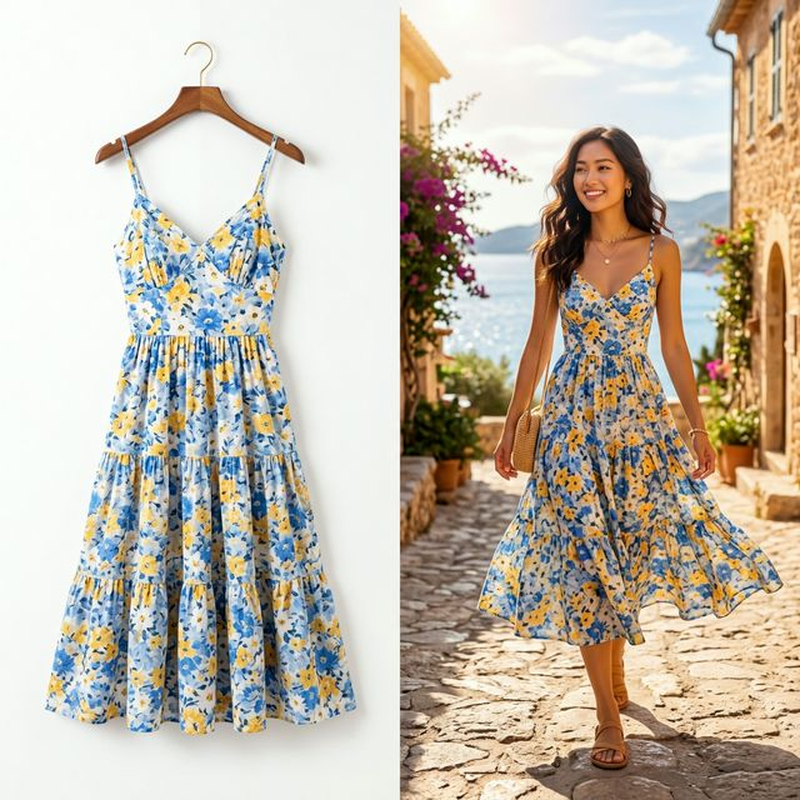
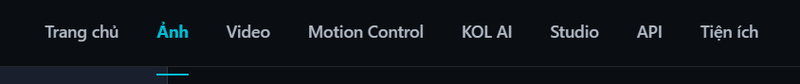
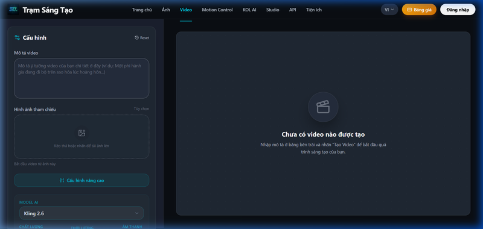
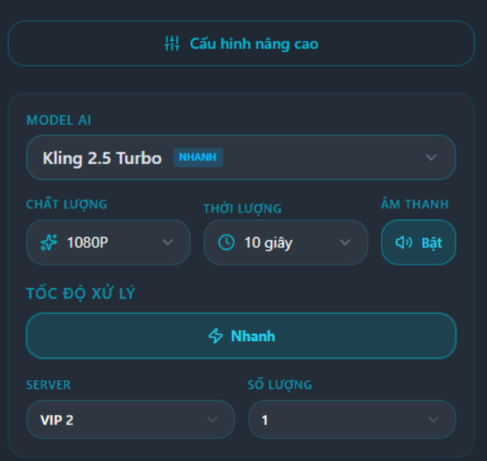

# Cách Tạo Video Chạy Affiliate TikTok Shop Bằng AI Từ 1 Ảnh (2026)

Chạy affiliate TikTok Shop hay Shopee bằng video ngắn đang là mỏ vàng, nhưng rào cản lớn nhất là **chi phí và thời gian làm video**. Mua mẫu về tự quay thì tốn kém, re-up video của người khác thì bị bóp tương tác hoặc dính gậy bản quyền đánh sập kênh.

Giải pháp tối ưu nhất hiện nay là **tạo video affiliate bằng AI**. Chỉ cần lấy 1 bức ảnh sản phẩm trên mạng, AI sẽ biến nó thành video review mượt mà, chân thực như quay thật. Bài viết này sẽ hướng dẫn bạn cách tạo hàng trăm video bán hàng AI mỗi ngày với chi phí siêu rẻ.

---

## Vì Sao Nên Dùng AI Tạo Video Affiliate?

Thay vì phải nhập hàng mẫu (sample) về chụp ảnh, quay phim, setup đèn đóm phức tạp, làm video AI giải quyết triệt để 3 vấn đề của dân làm affiliate:

1. **Không cần mua hàng mẫu:** Lấy ảnh sản phẩm trực tiếp từ Shop/Taobao/1688 làm nguyên liệu đầu vào.
2. **Không lo dính bản quyền (Re-up):** Video tạo ra từ AI là 100% video mới (unique). Thuật toán TikTok sẽ đánh giá đây là content tự sản xuất, giúp dễ cắn đề xuất (viral).
3. **Scale up nhanh (lên hàng loạt):** Với 1 ảnh sản phẩm, bạn có thể nhập 100 prompt khác nhau để AI tạo ra 100 video review ở các góc độ, bối cảnh khác nhau. 

---

## Các Cách Làm Video Chạy Affiliate Hiện Nay

### Cách 1: Dùng CapCut / Canva (Thủ công)

Nhiều người dùng CapCut hoặc Canva để ghép các ảnh sản phẩm lại thành video dạng slide ảnh (slideshow), lồng thêm nhạc giật giật. 

**Hạn chế:** TikTok ngày càng thông minh. Dạng video slide ảnh tĩnh ghép lại bị đánh giá là content chất lượng thấp (Low-quality content). Tương tác kém, khó chuyển đổi ra đơn hàng vì người xem không thấy được độ chân thực của sản phẩm.

### Cách 2: Tạo Video AI Chuyên Nghiệp trên Trạm Sáng Tạo

Thay vì video slideshow tĩnh báo hiệu sự "giả trân", công nghệ AI Image-to-Video (Ảnh thành Video) sẽ phân tích bức ảnh tĩnh và tái tạo ra chuyển động vật lý 3D. 

Ví dụ: Bạn có 1 bức ảnh chiếc váy đang treo trên móc. AI có thể tạo ra video **chiếc váy đang bay nhẹ trong gió**, hoặc **có người mẫu thật mặc chiếc váy đó bước đi** (như bức ảnh minh họa 1-đổi-1 phía trên). 

[Trạm Sáng Tạo](https://tramsangtao.com) là nền tảng AI hiếm hoi hỗ trợ giao diện tiếng Việt, tích hợp các model tạo video mạnh nhất hiện nay như Kling AI, Sora, Veo3 với chi phí rẻ hơn đối thủ rất nhiều.

---

## Hướng Dẫn Bước Bước Tạo Video Affiliate Bằng AI

### Bước 1: Chuẩn bị ảnh sản phẩm (Nguyên liệu)

Bạn lên TikTok Shop, Shopee, hoặc Taobao tìm sản phẩm muốn chạy affiliate. Tải một bức ảnh rõ nét nhất của sản phẩm.
*Lưu ý: Ảnh có độ phân giải cao, hậu cảnh đơn giản sẽ cho AI xử lý tốt hơn.*

### Bước 2: Truy cập Trạm Sáng Tạo

Đăng nhập vào [tramsangtao.com](https://tramsangtao.com), chọn phần **Video** trên menu chính.

### Bước 3: Upload ảnh và Viết Prompt lệnh (Tiếng Việt)

Chọn tab **Image-to-Video** (Ảnh sang Video), upload bức ảnh sản phẩm lên. Sau đó, nhập câu thần chú (prompt) mô tả chuyển động mà bạn muốn AI tạo ra. Điểm mạnh của Trạm Sáng Tạo là bạn có thể nhập prompt bằng **TIẾNG VIỆT**.

**Ví dụ một số prompt ăn tiền cho Affiliate:**

*   **Thời trang/Giày dép:** *(Tải ảnh đôi giày tĩnh)* → Prompt: *"Một đôi giày sneaker đang được ai đó bước đi trên đường phố ngập nước, phong cách cinematic, quay cận cảnh."*
*   **Mỹ phẩm:** *(Tải ảnh lọ serum tĩnh)* → Prompt: *"Lọ serum đặt trên bàn trang điểm, ánh nắng chiếu qua cửa sổ, có bàn tay người phụ nữ đang nhỏ vài giọt serum lấp lánh."*
*   **Đồ gia dụng:** *(Tải ảnh máy xay sinh tố)* → Prompt: *"Máy xay sinh tố đang hoạt động mạnh mẽ, xoay nhuyễn trái cây tươi, bọt nước văng nhẹ, quay siêu chân thực."*

*Giao diện Video AI Trạm Sáng Tạo: Điền prompt và tải ảnh tham chiếu cực dễ.*

### Bước 4: Tùy chỉnh chất lượng và Render

Ở phần cài đặt (Settings), hãy mở bảng **Cấu hình nâng cao** và chọn model AI phù hợp. Đối với làm video Affiliate số lượng lớn, **Kling 2.5 Turbo** là sự lựa chọn hoàn hảo ngon-bổ-rẻ. 

- Chọn độ phân giải **1080P** để video đăng lên TikTok / Reels được sắc nét nhất.
- Chọn thời lượng **10 giây** để có nhiều không gian show sản phẩm.
- Bật tùy chọn **Âm thanh** để AI tự sinh âm thanh background phù hợp (tiếng gió, tiếng rót nước, tiếng bước chân).
- Nhấn **Tạo Video** và chờ vài phút.

---

## Bài Toán Chi Phí: Lãi Ngay Từ Đơn Đầu Tiên

Dùng AI thì tốn phí, nhưng hãy làm bài toán kinh tế so với cách truyền thống:

1. Mua hàng mẫu về quay: Tốn **70k - 200k/sản phẩm**.
2. Dùng Trạm Sáng Tạo: Gói Tiết Kiệm 199.000đ cho 4.500 credits. 
   - 1 video tạo bằng Kling 2.5 Turbo tốn khoảng 30 credits.
   - → Chia ra, bạn chỉ mất tính toán khoảng **~1.000 VNĐ cho 1 video** quảng cáo sản phẩm sắc nét.

Với 1.000đ, bạn tạo được 1 video review độc quyền. Nếu bạn chi 100.000đ cho 100 video affiliate đăng lên kênh, chỉ cần nổ **1 ĐƠN HÀNG** (hoa hồng 10-20k) là bạn đã kiếm đủ tiền vốn tạo video, từ đơn thứ 2 trở đi là lãi ròng.

---

## Kinh Nghiệm Xương Máu Chạy Affiliate Bằng AI

Để chuyển đổi ra đơn hàng (CR - Conversion Rate) cao thay vì chỉ có view:

1. **Hiệu ứng chim mồi:** Không bao giờ đăng video thô. Sau khi Trạm Sáng Tạo render xong video, tải về CapCut, chèn thêm text giật tít ở khung trên dưới (Hook text như: *"Xả kho giảm giá sốc"*, *"Săn sale 1k"*).
2. **Kịch bản nói (Voiceover):** Video AI sinh ra có hình 1080p, nhưng bạn phải lồng ghép kịch bản review. Có thể [tạo audio AI giọng review dạo trên Trạm Sáng Tạo](/video) và map với video.
3. **Mồi Review:** Cuối video luôn luôn call to action chỉ mũi tên chỉ xuống giỏ hàng góc trái màn hình TikTok.

---

## Câu Hỏi Thường Gặp (FAQ)

### Tạo video bằng AI có bị TikTok quét dính re-up gậy đỏ không?

Mỗi lần AI render (sinh ra) một video, video đó là **duy nhất (unique) 100% trên toàn cầu về mã hash, từng pixel ảnh**. Do đó, TikTok sẽ đánh giá đây là source content video mới hoàn toàn, bạn không bao giờ bị dính gậy bản quyền (trừ khi file nhạc bạn lồng vào có bản quyền).

### Dùng 1 ảnh tạo được bao nhiêu video?

Không giới hạn. Bạn có thể dùng duy nhất 1 bức ảnh góc thẳng của cái bình giữ nhiệt, viết 10 prompt khác nhau để tạo ra 10 bối cảnh video khác nhau (bình để trên bàn, người cầm bình uống, bình đặt trong tuyết...).

### Nền tảng AI nào ngon nhất cho Affiliate?

Kling 2.5 Turbo (có mặt trên [Trạm Sáng Tạo](https://tramsangtao.com)) hiện tại là ngon nhất cho bài toán kinh tế số lượng lớn. Nếu sản phẩm luxury cần độ khó cực cao, bạn có thể chọn Kling 3.0 hoặc Veo3.

---

## Kết Luận

Kỷ nguyên của việc còng lưng nhập từng món hàng mẫu về quay review đang dần đóng lại. Các Affiliate Master hiện tại đang ứng dụng AI **Image-to-Video** để sản xuất công nghiệp 50-100 video/ngày, phủ kín top trending TikTok Shop với chi phí vỏn vẹn **chỉ ~1.000đ/video**.

Sự khác biệt giữa kênh bạn và kênh đối thủ chỉ nằm ở chỗ ai master công cụ AI nhanh hơn.

> 🚀 **[Biến 1 Ảnh Thành Video Bán Hàng Ngay Tại tramsangtao.com](https://tramsangtao.com/video)** — Khởi đầu chuỗi ngày rải link không giới hạn chỉ với Gói Trải Nghiệm 99k!
