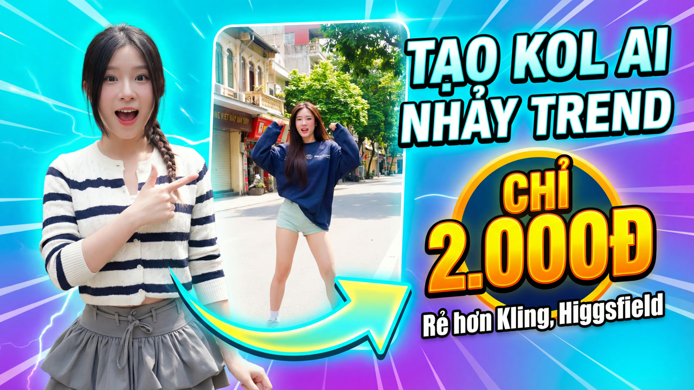
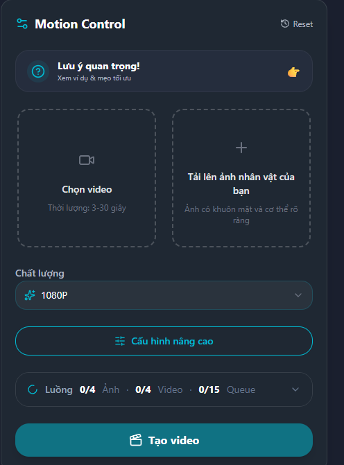
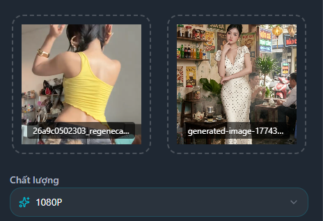

# Hướng Dẫn Tạo Video AI Nhảy TikTok Triệu View 2026



Bạn đã từng thấy những video AI nhảy trên TikTok đạt hàng triệu lượt xem chưa? Một bức ảnh tĩnh bỗng chốc biến thành nhân vật nhảy nhót, uốn éo theo nhạc trending — và tất cả chỉ mất vài phút để tạo.

Trong bài này, tôi sẽ chỉ bạn **3 cách tạo video AI nhảy TikTok** — từ miễn phí tới chuyên nghiệp — cùng mẹo giúp video dễ viral nhất. Cuối bài có video hướng dẫn chi tiết bạn có thể xem ngay.

---

## Video AI Nhảy Là Gì? Tại Sao Viral Đến Vậy?

Video AI nhảy sử dụng công nghệ **motion transfer** — AI quét chuyển động từ một video mẫu (clip người nhảy) rồi áp dụng lên một bức ảnh tĩnh. Kết quả: nhân vật trong ảnh "sống dậy" và nhảy theo đúng động tác.

**Tại sao format này viral?**

- **Hiệu ứng "wow":** Người xem bất ngờ khi thấy ảnh tĩnh biến thành video
- **Dễ bắt trend:** Bất kỳ ai cũng tạo được, không cần biết nhảy
- **Tận dụng nhạc trending:** Kết hợp nhạc hot trên TikTok → thuật toán đẩy mạnh
- **Content không giới hạn:** Dùng ảnh thật, ảnh AI, nhân vật hoạt hình... đều được

---

## Cách 1: Higgsfield — Nổi Tiếng Nhưng Đắt Và Chất Lượng Hên Xui

**Phù hợp cho:** Người muốn thử tool quốc tế, chấp nhận giá cao

[Higgsfield.ai](https://higgsfield.ai) là một trong những tool tạo video AI nhảy được biết đến nhiều nhất. Tuy nhiên, **giá không hề rẻ** (từ $15/tháng, tương đương ~375.000 VND) và chất lượng output khá **hên xui** — có video mượt, có video tay chân méo mó.

### Cách dùng:

1. Truy cập [higgsfield.ai](https://higgsfield.ai) — đăng ký tài khoản
2. Upload ảnh nhân vật (toàn thân, nền đơn giản)
3. Upload hoặc chọn video nhảy mẫu từ thư viện
4. Chờ AI xử lý (1-3 phút)
5. Tải video về

**Ưu điểm:** Tên tuổi, có sẵn thư viện video mẫu
**Hạn chế:** Giá cao (từ $15/tháng ~375k), thanh toán Visa/Mastercard, chất lượng hên xui, giao diện tiếng Anh, tay chân nhân vật hay bị méo, không có người hỗ trợ khi gặp lỗi

---

## Cách 2: CapCut AI — Có Sẵn Trên Điện Thoại

**Phù hợp cho:** Edit nhanh, content casual

CapCut (app chính chủ của TikTok) tích hợp hiệu ứng AI chuyển động cơ bản:

1. Mở CapCut → tạo dự án mới
2. Import ảnh nhân vật
3. Vào **AI Effects** → chọn hiệu ứng chuyển động
4. Thêm nhạc trending từ thư viện
5. Xuất video 9:16

**Ưu điểm:** Trực tiếp trên điện thoại, miễn phí
**Hạn chế:** Không phải motion transfer thực sự, hiệu ứng giới hạn, chất lượng thấp nhất trong 3 cách

---

## Cách 3: Trạm Sáng Tạo — Chất Lượng Cao Nhất, Giá Rẻ Hơn 2-3 Lần ⭐

**Phù hợp cho:** Content creator chuyên nghiệp, người muốn video chất lượng studio với giá phải chăng

Đây là phương pháp cho kết quả **mượt mà và chân thật nhất**, sử dụng công nghệ Motion Control từ Kling AI — nhưng chạy trên [Trạm Sáng Tạo](https://tramsangtao.com), nền tảng Việt Nam với giá rẻ hơn gốc 2-3 lần.

### Tại sao chọn Trạm Sáng Tạo thay vì dùng Kling/Higgsfield trực tiếp?

| | Kling trực tiếp | Higgsfield | Trạm Sáng Tạo |
|---|---|---|---|
| **Ngôn ngữ** | Tiếng Anh/Trung | Tiếng Anh | 🇻🇳 **Tiếng Việt 100%** |
| **Giao diện** | Phức tạp | Đơn giản nhưng ít tùy chọn | **UI/UX thân thiện**, ai cũng dùng được |
| **Hỗ trợ** | Email (chờ 1-3 ngày) | Không có | **Người Việt hỗ trợ trực tiếp** qua chat |
| **Video hướng dẫn** | Tiếng Anh | Không có | **Nhiều video hướng dẫn tiếng Việt** |
| **Giá** | Từ $6.99/tháng (~175k VND) | Từ $15/tháng (~375k VND) | **Từ 99k/tháng** (rẻ hơn 2-4 lần) |
| **Thanh toán** | Visa/Mastercard | Visa/Mastercard | **Momo, chuyển khoản ngân hàng VN** |
| **Chất lượng** | ⭐⭐⭐⭐⭐ | ⭐⭐⭐ (hên xui) | ⭐⭐⭐⭐⭐ (cùng engine Kling) |

### Motion Control trên Trạm Sáng Tạo khác gì?

Trong khi Higgsfield chỉ áp dụng chuyển động cơ bản (và giá lại đắt gấp 4 lần), Motion Control trên Trạm Sáng Tạo:

- **Phân tích xương khớp 3D** từ video mẫu → chuyển động chính xác, tự nhiên
- **Giữ nguyên chi tiết khuôn mặt** và trang phục — không bị méo như Higgsfield
- **Hỗ trợ 1080p** — video sắc nét, đăng TikTok không bể pixel
- **Kiểm soát camera** — zoom, xoay, pan theo ý muốn
- **Lip sync** — nhân vật có thể hát nhép, nói chuyện theo audio

### Hướng dẫn từng bước trên Trạm Sáng Tạo:

**Bước 1: Đăng ký tài khoản**

Truy cập [tramsangtao.com](https://tramsangtao.com) và đăng ký — chỉ cần email hoặc Google login. Thanh toán qua Momo hoặc chuyển khoản ngân hàng Việt Nam, không cần thẻ quốc tế.

**Bước 2: Vào Motion Control**

Chọn mục [Motion Control](https://tramsangtao.com/motion-control) trên menu chính. Giao diện tiếng Việt, có tooltip hướng dẫn ở từng bước.



*Giao diện Motion Control: chỉ cần upload video + ảnh, chọn chất lượng 1080P và bấm "Tạo video".*

**Bước 3: Upload ảnh nhân vật**

Upload ảnh đầu vào. Trạm Sáng Tạo xử lý được cả nền phức tạp, nhưng ảnh toàn thân nền trơn vẫn cho kết quả tốt nhất.

**Bước 4: Upload video chuyển động**

Upload clip nhảy mẫu (5-10 giây). AI sẽ tự động phân tích skeleton và mapping chuyển động.



*Sau khi upload: video tham khảo và ảnh nhân vật đã sẵn sàng, chỉ cần bấm "Tạo video".*

**Bước 5: Chọn cài đặt và render**

- **Độ phân giải:** 1080p (khuyến nghị) hoặc 720p (nhanh hơn)
- **Mode:** Motion Control (mới nhất)
- Bấm **Tạo video** → chờ 2-5 phút → tải về

> Gặp khó khăn ở bước nào? Chat trực tiếp với team support người Việt ngay trên website — phản hồi trong vài phút.

### Lưu Ý Quan Trọng Khi Chọn Video & Ảnh

Trạm Sáng Tạo có sẵn mục **"Lưu ý quan trọng!"** ngay trên giao diện. Đảm bảo:

- **Video mẫu:** 1 nhân vật duy nhất, nửa/toàn thân, chuyển động liên tục, 3-30 giây
- **Ảnh nhân vật:** Rõ nét, 1 người, khuôn mặt + cơ thể rõ ràng, tỷ lệ phù hợp video (9:16 cho TikTok)

> **Mẹo:** Bấm vào **"Xem ví dụ & mẹo tối ưu"** trên giao diện để xem mẫu video và ảnh đạt chuẩn.

### Chi phí:

| Gói | Giá | Credits | Số video Motion Control/tháng |
|---|---|---|---|
| Trải Nghiệm | 99.000 VND | 2.000 | ~15-30 video |
| Tiết Kiệm ⭐ Phổ biến | 199.000 VND | 4.500 | ~35-70 video |
| Sáng Tạo | 499.000 VND | 13.000 | ~100-200 video |

So sánh: Kling trực tiếp từ ~175k/tháng, Higgsfield từ ~375k/tháng — đều phải thanh toán thẻ quốc tế. Trạm Sáng Tạo **rẻ hơn 2-4 lần** với cùng (hoặc hơn) chất lượng output, và thanh toán bằng Momo/ngân hàng VN.

---

## 📺 Video Hướng Dẫn Chi Tiết

Xem video hướng dẫn tạo video AI nhảy từng bước trên kênh YouTube Trạm Sáng Tạo:

[](https://www.youtube.com/watch?v=2wXn4ndXHkY)

👆 *Nhấn vào ảnh để xem video hướng dẫn đầy đủ*

---

## So Sánh 3 Phương Pháp

| Tiêu chí | Higgsfield | CapCut AI | Trạm Sáng Tạo |
|---|---|---|---|
| **Giá** | Từ $15/tháng (~375k) | Miễn phí | **Từ 99k/tháng** |
| **Chất lượng** | ⭐⭐⭐ (hên xui) | ⭐⭐ | ⭐⭐⭐⭐⭐ |
| **Tốc độ** | 1-3 phút | 30 giây | 2-5 phút |
| **Độ phân giải** | 720p | 720p | 1080p |
| **Ngôn ngữ** | Tiếng Anh | Tiếng Anh | 🇻🇳 Tiếng Việt |
| **Hỗ trợ** | Không | Không | Chat trực tiếp |
| **Thanh toán** | Visa/Mastercard | — | Momo, ngân hàng VN |
| **Chuyển động** | Hên xui, hay méo | Cơ bản | Rất mượt |
| **Phù hợp** | Thử nghiệm | Edit nhanh | Content chuyên nghiệp |

**Khuyến nghị:** CapCut nếu muốn test nhanh miễn phí. Khi cần **chất lượng cao + giá hợp lý + hỗ trợ tiếng Việt** → [Trạm Sáng Tạo](https://tramsangtao.com/motion-control) là lựa chọn tốt nhất. Higgsfield đắt mà chất lượng lại hên xui — không đáng.

---

## Tips Tối Ưu Để Video Dễ Viral

### 1. Chọn ảnh và video input đúng chuẩn

Ảnh đầu vào quyết định 80% chất lượng video output:
- ✅ Chụp **toàn thân**, tay chân rõ ràng, không bị cắt
- ✅ **Nền đơn giản** — trơn hoặc ít chi tiết
- ✅ Độ phân giải cao (tối thiểu 512x512px)
- ✅ Tỷ lệ ảnh nên **phù hợp tỷ lệ video** (9:16 cho TikTok)
- ❌ Tránh ảnh cắt ngang người, selfie cận mặt
- ❌ Tránh nền quá phức tạp (đông người, nhiều đồ vật)

Video mẫu nhảy cũng quan trọng:
- ✅ **Một người duy nhất** nhảy, rõ nét, nền trơn
- ✅ Chuyển động liên tục, mượt mà, 3-30 giây
- ❌ Tránh video nhiều người, chuyển cảnh, hoặc cắt giữa chừng

> **Mẹo pro:** Ảnh người thật thường viral hơn ảnh AI — người xem tò mò "có phải người thật nhảy không?"

### 2. Chọn nhạc đúng trend

Nhạc quyết định 50% khả năng viral:
- Vào tab **Khám phá** trên TikTok → xem nhạc nào đang hot
- Chọn nhạc có beat rõ, dễ sync với chuyển động AI
- Ưu tiên nhạc ngắn 15-30 giây — vừa đủ để hook

### 3. Hook trong 1-2 giây đầu

TikTok chỉ cho bạn 1-2 giây để giữ chân người xem:
- Bắt đầu ngay bằng động tác mạnh, bất ngờ
- Hiệu ứng "trước/sau" — 1 giây ảnh tĩnh rồi nhảy → wow effect
- Không intro dài dòng

### 4. Hashtag thông minh

Công thức mix hashtag hiệu quả:
```
#VideoAI #TikTokTrend #AIDance #MotionControl #TramSangTao
```

- **Rộng:** `#AI`, `#TikTokTrend`, `#FYP` (triệu bài, reach lớn)
- **Ngách:** `#KlingAI`, `#MotionControl`, `#VideoAINhay` (ít cạnh tranh)

### 5. Đăng đúng giờ vàng

Khung giờ TikTok VN engagement cao nhất:
- **11h-13h** (giờ nghỉ trưa)
- **19h-22h** (sau giờ làm — peak time)
- **7h-9h** sáng cuối tuần

---

## Câu Hỏi Thường Gặp (FAQ)

### Video AI nhảy có bị TikTok hạn chế không?

Không. TikTok khuyến khích nội dung sáng tạo từ AI. Chỉ bị gỡ nếu video vi phạm (bạo lực, nhạy cảm) hoặc dùng hình ảnh người khác không xin phép.

### Tạo 1 video nhảy AI mất bao lâu?

Từ lúc chọn ảnh đến lúc có video hoàn chỉnh: khoảng **5-10 phút**. Render trên Trạm Sáng Tạo mất 2-5 phút, Higgsfield 1-3 phút.

### Dùng ảnh người thật hay ảnh AI nhảy tốt hơn?

**Ảnh người thật** viral hơn vì tạo hiệu ứng bất ngờ mạnh. Ảnh em bé, thú cưng nhảy cũng rất hot. Ảnh AI phù hợp khi muốn tạo nhân vật riêng hoặc tránh vấn đề bản quyền.

### Video nhảy AI có cần credit/phí không?

- Higgsfield: Từ $15/tháng (~375k VND), thanh toán Visa/Mastercard — đắt và chất lượng hên xui
- CapCut: Miễn phí (chất lượng thấp, không phải motion transfer thực sự)
- **Trạm Sáng Tạo:** Từ 99.000 VND/tháng cho 2.000 credits = 15-30 video chất lượng cao — rẻ nhất và tốt nhất

### Trạm Sáng Tạo có gì hơn Kling/Higgsfield trực tiếp?

**Giao diện hoàn toàn tiếng Việt**, UI/UX đơn giản ai cũng dùng được, có **team support người Việt** hỗ trợ chat trực tiếp, nhiều **video hướng dẫn tiếng Việt** trên YouTube, thanh toán Momo/ngân hàng VN, và **giá rẻ hơn 2-3 lần** so với mua Kling trực tiếp.

### Tôi không rành công nghệ, có dùng được không?

Hoàn toàn được. Trạm Sáng Tạo thiết kế cho người Việt, giao diện đơn giản chỉ cần 3-4 bước. Gặp khó ở đâu thì chat hỏi team support ngay trên web — phản hồi trong vài phút, không phải chờ email tiếng Anh.

---

## Kết Luận

Tạo video AI nhảy TikTok không khó — bạn chỉ cần 1 bức ảnh và đúng công cụ. CapCut nếu muốn thử nhanh miễn phí, nhưng khi cần chất lượng cao thật sự thì **Trạm Sáng Tạo là lựa chọn tốt nhất cho người Việt**:

- ✅ Giao diện tiếng Việt 100%
- ✅ Hỗ trợ trực tiếp bằng tiếng Việt
- ✅ Nhiều video hướng dẫn trên YouTube
- ✅ Giá từ 99k/tháng — rẻ hơn Kling 2-3 lần
- ✅ Thanh toán Momo, chuyển khoản ngân hàng

Với gói Trải Nghiệm chỉ 99.000 VND/tháng, bạn có thể tạo **15-30 video nhảy AI chất lượng cao** — đủ để đăng TikTok mỗi ngày.

> 🚀 **[Bắt đầu tạo video AI nhảy ngay tại tramsangtao.com](https://tramsangtao.com/motion-control)** — Đăng ký và thử ngay hôm nay!
