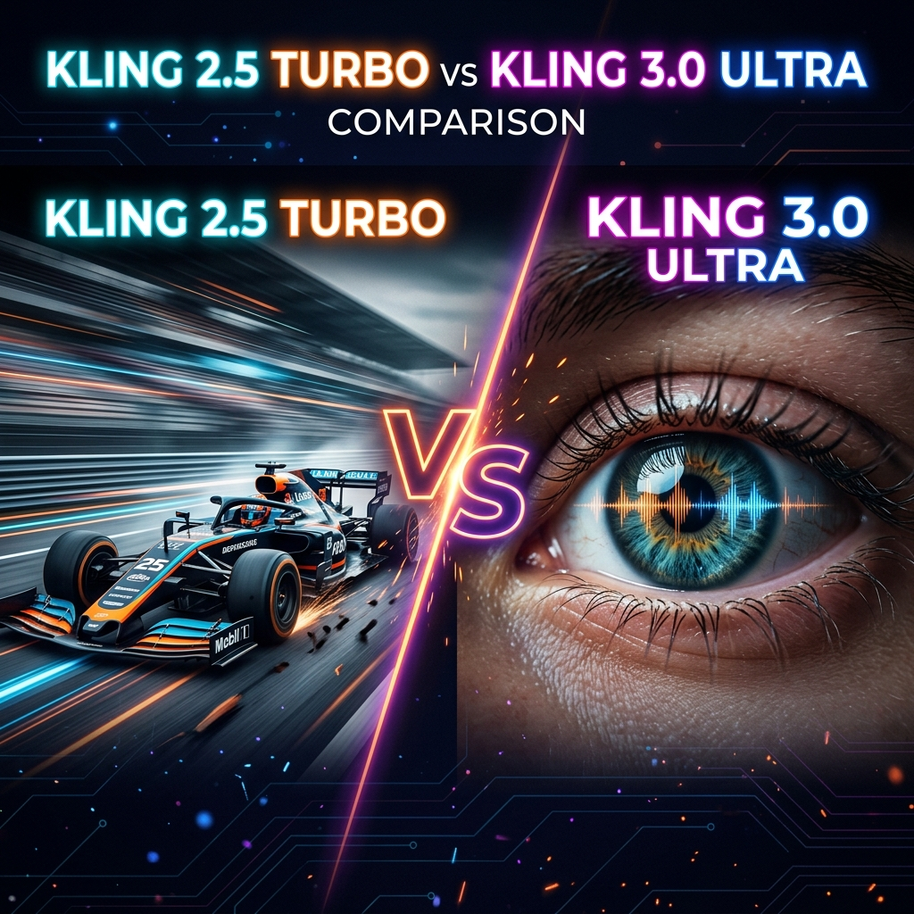
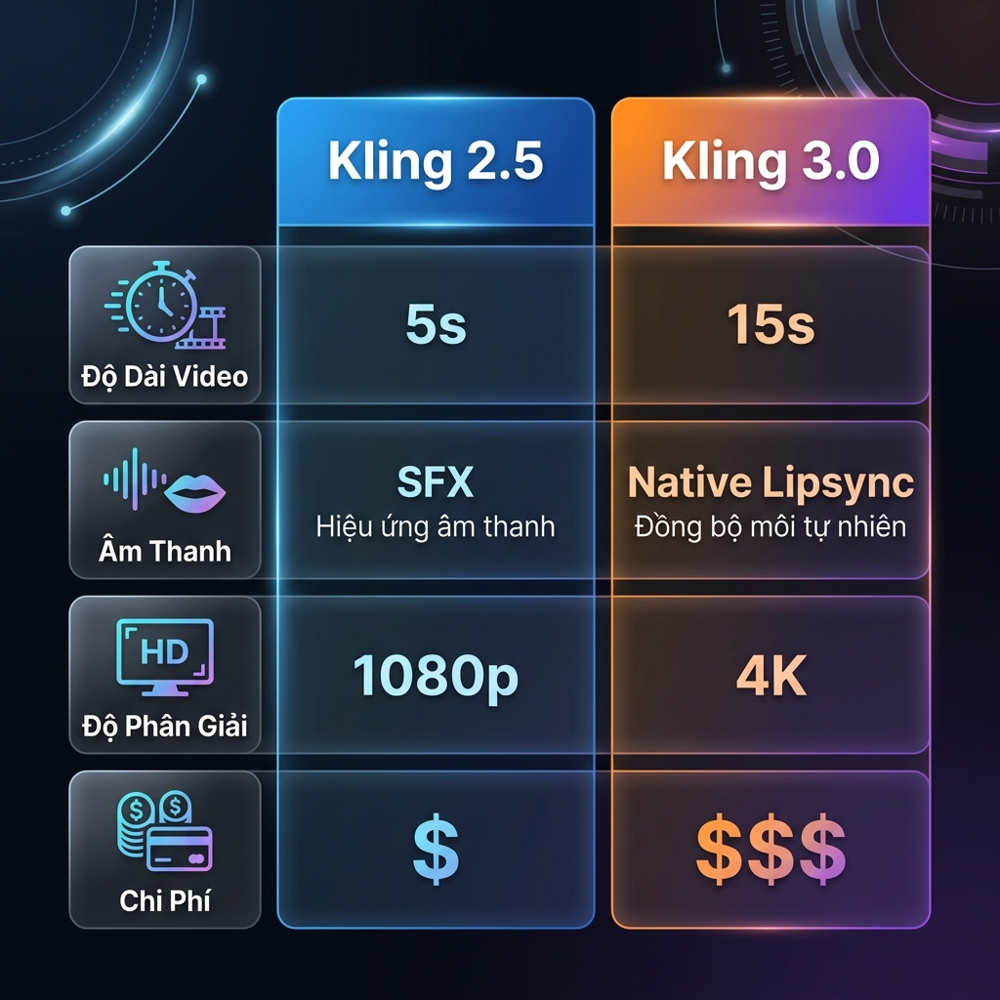

# Kling 3.0 vs Kling 2.5: Đâu Là Bản Nâng Cấp Khác Biệt?

*Kling 3.0 vs Kling 2.5: Hai triết lý, hai mục đích sử dụng hoàn toàn khác nhau trong năm 2026.*

Kuaishou vừa tung ra bản cập nhật **Kling 3.0** (tháng 2/2026), đánh dấu bước chuyển mình từ mô hình Diffusion cũ sang kiến trúc **MVL (Multi-modal Visual Language)**. Tuy nhiên, thay vì khai tử phiên bản cũ, họ vẫn giữ lại **Kling 2.5 (và biến thể Turbo)**. 

Vậy tại sao lại phải giữ lại bản cũ? Câu trả lời nằm ở chữ: **Tốc độ và Chi phí**. 

Trong bài viết này, chúng ta sẽ phân tích chuyên sâu (Deep Dive) sự khác biệt giữa 2 phiên bản này, giúp bạn quyết định xem nên chi Credits vào model nào trên Trạm Sáng Tạo cho hợp lý.

---

## 📸 Bảng So Sánh Cấu Hình Trực Quan

Trước khi đi vào chi tiết, hãy xem qua các thông số kỹ thuật cốt lõi:

*Kling 3.0 ăn đứt phần chất lượng (4K, Lipsync), trong khi Kling 2.5 Turbo thắng ở hạng mục chi phí.*

| Tính năng cốt lõi | Kling 2.5 (Turbo) | Kling 3.0 (Ultra) |
| :--- | :--- | :--- |
| **Kiến trúc lõi** | Standard Diffusion | MVL (Đa phương thức hợp nhất) |
| **Mục đích chính** | Tạo nháp, test ý tưởng, content volume lớn | Phim ảnh chuyên nghiệp, Cinematic 4K |
| **Thời lượng tối đa** | 5s - 10s | Lên tới 15s (Seamless) |
| **Âm thanh (Audio)** | Âm thanh hiệu ứng (SFX) | Âm thanh đa ngôn ngữ khớp khẩu hình |
| **Cốt truyện (Story)** | Video đơn cảnh | Multi-shot (Nhiều góc máy trong 1 gen) |
| **Độ phân giải** | Tối đa 1080p | Native 4K |
| **Tốc độ render** | Rất nhanh (Dưới 1 phút) | Chậm hơn (Khoảng 3-5 phút) |
| **Chi phí** | Rẻ (Phù hợp cày view) | Khá cao (Phù hợp sản phẩm chốt) |

---

## 🔍 Phân Tích Chuyên Sâu 3 Khác Biệt Lớn Nhất

### 1. Kiến trúc MVL và Native Audio của Kling 3.0

Sự thay đổi lớn nhất không nằm ở hình ảnh, mà nằm ở "não bộ" của mô hình. Trong khi Kling 2.5 là một mô hình sinh hình ảnh (Text-to-Video) đơn thuần, Kling 3.0 là mô hình **MVL (Multi-modal Visual Language)**.

Nó xử lý Text, Video và Audio *cùng một lúc*. 
Điều này có nghĩa là khi bạn viết prompt: *"Người đàn ông Nhật Bản nói xin chào"*, Kling 3.0 không chỉ tạo ra video người đàn ông mấp máy môi, mà còn sinh ra được **âm thanh (giọng nói) tiếng Nhật khớp với khẩu hình miệng (Lip-sync)**. Kling 2.5 không thể làm được điều này một cách tự nhiên (bạn phải dùng tool thứ 3 ép vào).

### 2. Multi-Shot: Đạo diễn trong một cú Click

Kling 2.5 gặp vật cản lớn khi tạo một bộ phim: mỗi lần bấm Gen, nó chỉ sinh ra được một shot hình góc đơn (Single-shot). Để làm phim, bạn phải tạo nhiều clip rồi tự ghép tay.

Kling 3.0 giải quyết bài toán này bằng tính năng **AI Director (Multi-shot)**. Trong 10-15s, nó có thể tự động đổi 3 góc máy (Ví dụ: Quay toàn cảnh -> Tiến vào (Zoom in) -> Quay cận mặt đặc tả). Sự liền mạch (Consistency) giữa các góc máy này được MVL giữ nguyên, không làm nhân vật bị "biến dạng".

### 3. Cuộc Chiến: Tốc Độ vs Chất Lượng

Đây là lý do Kling 2.5 Turbo vẫn còn đất sống: **Bạn không phải lúc nào cũng cần 4K và Lip-sync**.

Nếu bạn đang xây kênh TikTok làm video meme giải trí, video quotes động lực, hình nền Chill lofi... Kling 2.5 Turbo sẽ tạo ra **5 video trong lúc Kling 3.0 mới render xong 1 video**. Hơn nữa, vì số lượng tham số nhẹ hơn, chi phí tạo 1 video của bản 2.5 luôn rẻ bằng một nửa hoặc một phần ba so với bản 3.0.

---

## 🎯 Khi Nào Nên Dùng Bản Nào?

Lựa chọn model phụ thuộc hoàn toàn vào **giai đoạn của dự án** và **nền tảng đăng tải**:

**✅ Dùng Kling 2.5 Turbo khi:**
*   Storyboarding (vẽ nháp kịch bản).
*   Làm content số lượng lớn cho TikTok / Reels / Shorts (những nền tảng không đòi hỏi 4K).
*   Chỉ cần một vài chuyển động nhỏ (cinemagraph) như lá rơi, tóc bay, khói bốc.

**✅ Dùng Kling 3.0 Ultra khi:**
*   Làm phim AI ngắn, Music Video (MV).
*   Muốn có TVC quảng cáo sản phẩm độ nét cao với ánh sáng điện ảnh thật nhất.
*   Cần nhân vật thoại trực tiếp vào camera (Lip-sync).
*   Cần quay nhiều góc máy phức tạp mà vẫn giữ đúng khuôn mặt diễn viên ảo.

---

## Trải Nghiệm Thực Tế Tại Trạm Sáng Tạo

Hiện tại, cả hai model này đều đã được tối ưu hóa API và tích hợp sẵn trên [Trạm Sáng Tạo](https://tramsangtao.com). 

Bạn không cần mở nhiều tài khoản hay chờ đợi lâu.
*   Bạn có thể dùng Kling 2.5 (1 - 2 Credits/video) để test nhanh hàng loạt Prompts.
*   Khi tìm được góc ưng ý, chuyển sang Kling 3.0 (5 - 8 Credits/video) để xuất file 4K Final chốt hạ.

Với cách tiếp cận "Draft bằng 2.5, Chốt bằng 3.0", bạn vừa có chất lượng phim Hollywood, vừa tiết kiệm được đến 60% chi phí so với việc bừa bãi dùng model đắt tiền cho mọi thao tác.

> **Trải nghiệm ngay:** Vào phần [Tạo Video AI](https://tramsangtao.com/video), phần chọn Mô hình (Models), bạn có thể dễ dàng chuyển đổi giữa **Kling Turbo** và **Kling Ultra**. Newbie sẽ nhận ngay gói credits miễn phí mỗi ngày để khởi tạo dự án.
