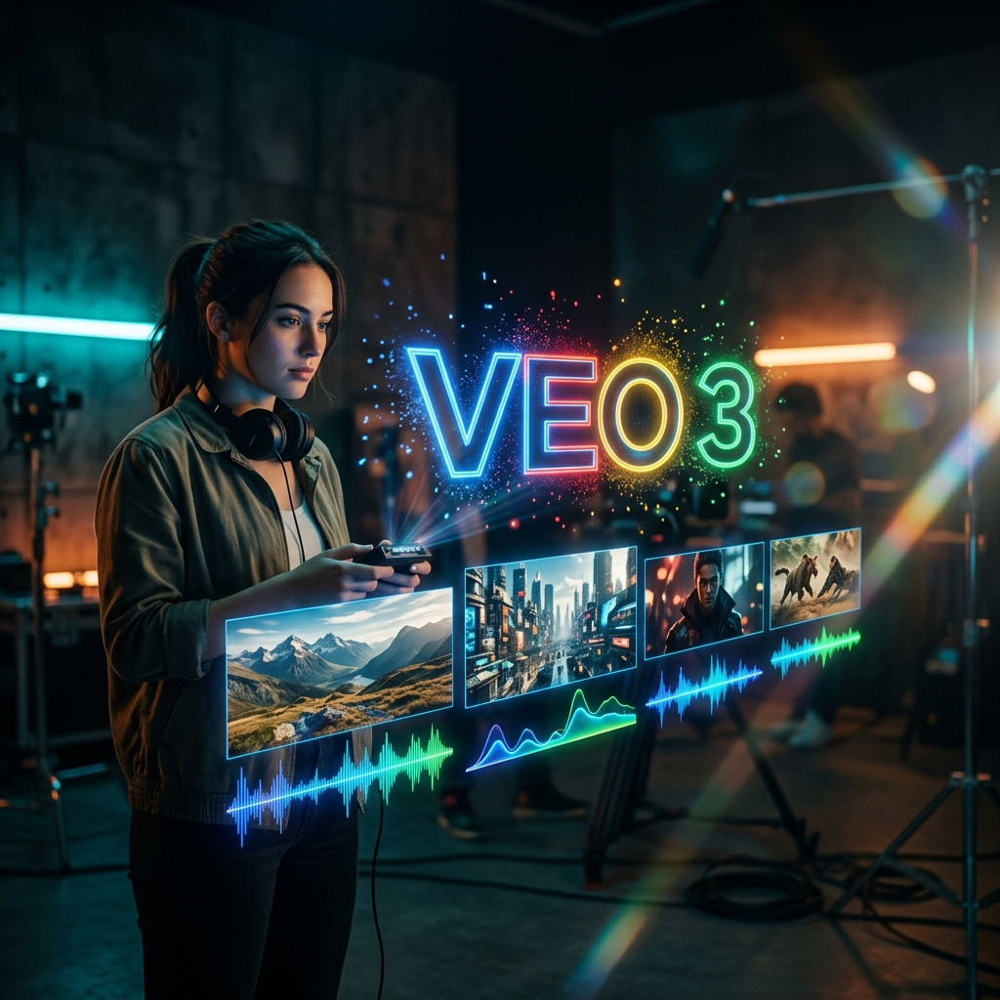
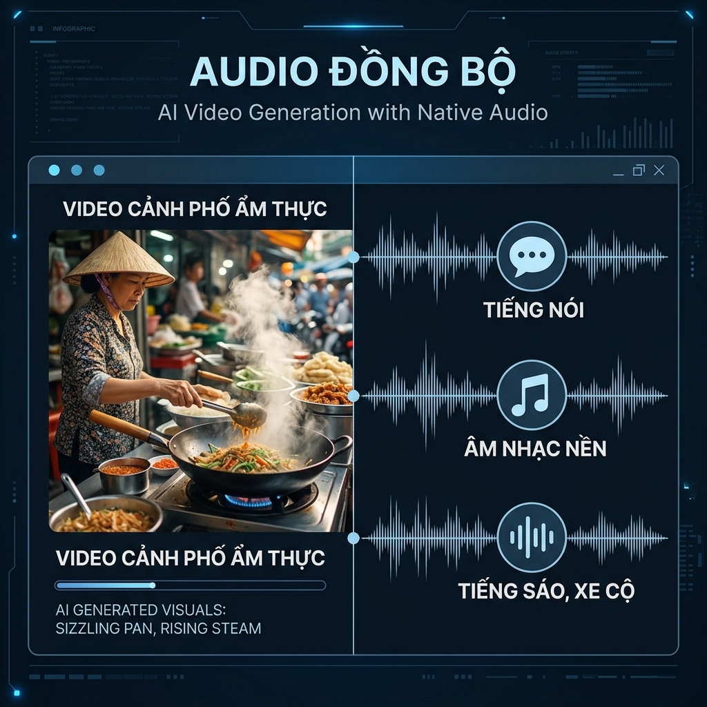
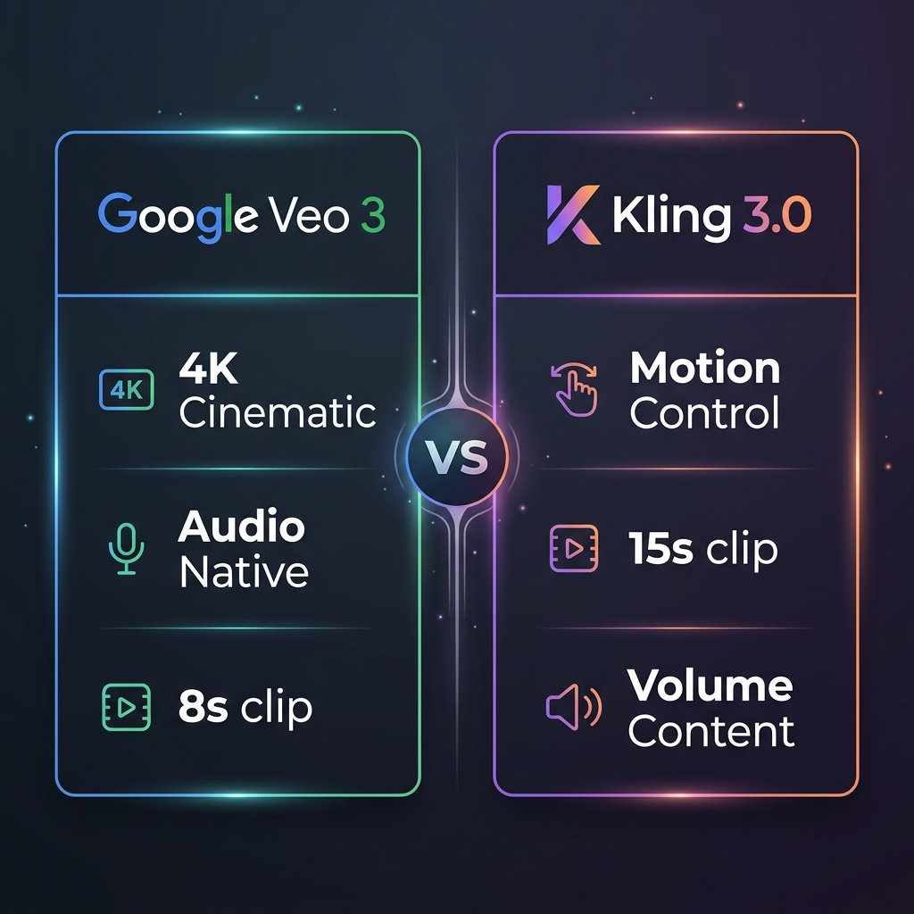
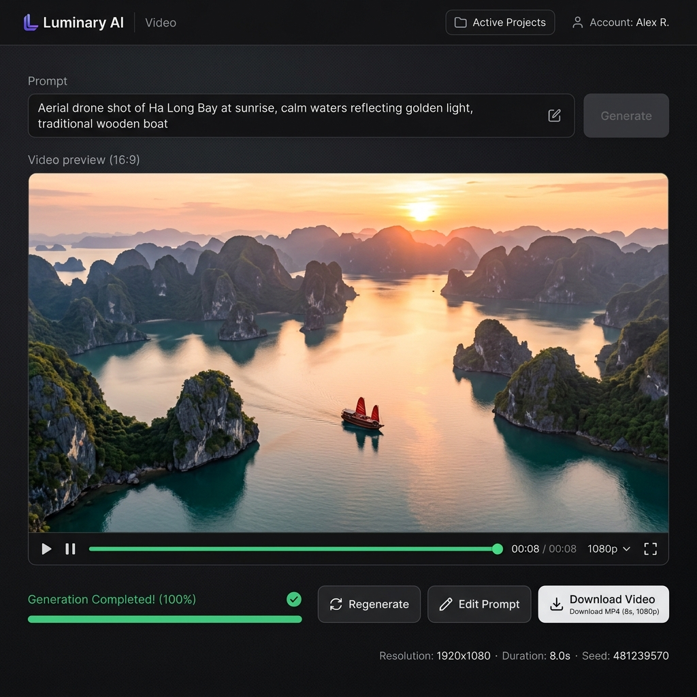

# Veo 3 Là Gì? Review Chi Tiết Model Tạo Video AI Từ Google DeepMind

Tháng 3/2026, OpenAI chính thức đóng cửa Sora vì chi phí inference quá cao. Cùng lúc đó, Google lặng lẽ cập nhật **Veo 3.1** — phiên bản ổn định nhất trong dòng video AI của họ. Thị trường AI video giờ chỉ còn 2 ông lớn thực sự: **Google Veo** và **Kling AI** (Kuaishou).

Bài viết này phân tích sâu Veo 3 từ góc nhìn người dùng thực tế: nó làm được gì, giới hạn ở đâu, giá bao nhiêu, và liệu có đáng thay thế Kling cho workflow của bạn.


*Video chính thức: "Meet Veo 3" — Google (1:11)*

---

## Veo 3 Là Gì?

**Veo 3** là model tạo video từ text/ảnh do Google DeepMind phát triển, ra mắt tại Google I/O 2025. Phiên bản hiện tại là **Veo 3.1** (cập nhật đầu 2026) với bản **Veo 3.1 Lite** ra ngày 31/03/2026 cho developer.

Điểm khác biệt lớn nhất so với mọi đối thủ:

> **Veo 3 tạo video kèm âm thanh đồng bộ** — lời thoại, tiếng động môi trường, nhạc nền — trực tiếp từ prompt. Không cần tool hậu kỳ thêm.

Nghe đơn giản, nhưng đây là tính năng mà Kling, Runway, hay Sora (khi còn sống) đều chưa làm được ở mức native.

---

## Specs Kỹ Thuật

| Thông số | Veo 3.1 | Veo 3.1 Lite |
| --- | --- | --- |
| **Độ phân giải** | Lên đến 4K | HD (1080p) |
| **Thời lượng clip** | ~8 giây/clip | ~8 giây/clip |
| **Audio** | ✅ Native (thoại + SFX + ambient) | ✅ Native |
| **Text-to-Video** | ✅ | ✅ |
| **Image-to-Video** | ✅ (Ingredients to Video) | ✅ |
| **Camera control** | Qua prompt (Dolly Zoom, Pan, Tracking) | Qua prompt |
| **Vertical video** | ✅ 9:16 | ✅ 9:16 |
| **Truy cập** | Google AI Pro/Ultra, Vertex AI | API developer |
| **SynthID** | ✅ Watermark vô hình chống deepfake | ✅ |

---

## 5 Điểm Mạnh Thực Sự Của Veo 3

### 1. Audio Đồng Bộ — Game Changer

Đây là lý do duy nhất khiến Veo 3 vượt mặt mọi đối thủ ở một số use case. Bạn có thể prompt:

*Veo 3 gen video + audio cùng lúc: không cần tool hậu kỳ.*

> "A Vietnamese street food vendor flipping banh xeo in a sizzling pan, customers chatting in the background, motorbikes passing by"

Và nhận được video **có đủ tiếng chiên xèo xèo, tiếng nói chuyện, tiếng xe máy** — không cần kiếm stock audio, không cần sync tay.

Với content creator làm Reels/Shorts, tính năng này tiết kiệm 30-60 phút hậu kỳ mỗi video.

### 2. Chất Lượng Điện Ảnh

Veo 3.1 hiểu thuật ngữ quay phim. Prompt kiểu "slow dolly forward, shallow depth of field, golden hour lighting" cho ra kết quả rất khác so với các model khác — ánh sáng mềm hơn, bokeh tự nhiên hơn, chuyển động camera mượt hơn.

### 3. Tích Hợp Hệ Sinh Thái Google

- **Gemini** — input prompt phức tạp, AI tự tối ưu trước khi gen
- **Imagen 4** — tạo ảnh tham chiếu rồi feed vào Veo
- **Flow** — ghép nhiều clip 8s thành video dài hoàn chỉnh
- **YouTube Shorts** — tạo Shorts trực tiếp từ Veo trong YouTube Studio

### 4. "Ingredients to Video" — Kiểm Soát Tốt Hơn

Upload ảnh nhân vật/sản phẩm → Veo giữ nguyên visual rồi animate. Tương tự Image-to-Video nhưng Google gọi là "Ingredients" vì cho phép upload nhiều ảnh tham chiếu cùng lúc (nhân vật, background, sản phẩm).

### 5. Vertical Video Native

Hỗ trợ 9:16 ngay từ prompt — không cần crop từ 16:9. Quan trọng cho TikTok/Reels/Shorts workflow.

---

## 4 Giới Hạn Cần Biết Trước

### 1. Thời Lượng Clip: Chỉ ~8 Giây

Đây là điểm yếu lớn nhất. Mỗi lần gen chỉ ra ~8 giây video. Muốn video 30-60 giây cần ghép 4-8 clip → phải dùng Flow hoặc edit thủ công. **Kling 3.0 cho 15 giây/clip** — gấp đôi.

### 2. Giá Cao

Veo 3.1 đầy đủ chỉ có trên Google AI Pro ($20/tháng) hoặc Ultra ($50/tháng). Vertex AI pricing tính theo API call — đắt hơn nữa cho volume lớn.

So sánh: trên Trạm Sáng Tạo, **Veo 3.1 LOW chỉ tốn 10 credits/video** (≈ 990đ trên gói Starter). Rẻ gấp 3-5 lần so với dùng trực tiếp Google.

### 3. Multi-Person Vẫn Chưa Hoàn Hảo

Cảnh có 2+ người tương tác vẫn hay bị lỗi: tay chồng lên nhau, mặt biến dạng ở close-up, anatomy sai khi nhảy/chạy. Vấn đề này mọi model đều gặp, nhưng Kling 3.0 xử lý tốt hơn ở motion control.

### 4. Prompt Tiếng Việt — Kém

Veo hiểu tiếng Anh tốt hơn rất nhiều. Prompt tiếng Việt thường cho kết quả mơ hồ hoặc bỏ qua chi tiết. Nên dùng tiếng Anh + thuật ngữ quay phim chuẩn.

---

## So Sánh Veo 3 vs Kling 3.0 (Tháng 4/2026)

| | Veo 3.1 | Kling 3.0 |
| --- | --- | --- |
| **Nhà phát triển** | Google DeepMind | Kuaishou |
| **Thời lượng clip** | ~8 giây | 3-15 giây |
| **Audio native** | ✅ Có | ✅ Có (từ 2.6+) |
| **Chất lượng hình** | Cinematic, 4K | Tốt, 1080p |
| **Motion control** | ❌ Chỉ qua prompt | ✅ Có (video tham chiếu) |
| **Image-to-Video** | ✅ | ✅ |
| **Text-to-Video** | ✅ | ✅ |
| **Giá trên TST** | 10 credits (Veo 3.1 LOW) | 15-720 credits (tùy model/độ dài) |
| **Best for** | Cinematic shorts, brand video | Social media, motion control, volume |
| **Có trên TST** | ✅ | ✅ |

**Kết luận nhanh:**
- **Cần cinematic + audio ngay**: Veo 3
- **Cần motion control + video dài hơn**: Kling 3.0
- **Cần giá rẻ nhất**: Veo 3.1 LOW (10 credits) hoặc Kling 2.5 Turbo (10 credits)

---

## Sora 2 Đã Chết — Nghĩa Là Gì?

Ngày 24/03/2026, OpenAI chính thức **đóng cửa Sora** — app lẫn API — vì chi phí inference quá lớn không thể sustain.

Điều này có 2 hệ quả:

1. **Thị trường consolidate**: Giờ chỉ còn Google Veo và Kling là 2 player chính. Runway Gen-4.5 tồn tại nhưng niche hơn.
2. **Người dùng Sora cần migrate**: Nếu bạn đang dùng Sora workflow, 2 lựa chọn thay thế trực tiếp là Veo 3 (cho chất lượng) hoặc Kling 3.0 (cho giá + volume).

Trên Trạm Sáng Tạo, **Sora 2.0 vẫn có sẵn** (20-50 credits) — đây là stock còn lại trước khi OpenAI tắt hẳn. Muốn thử Sora lần cuối thì nhanh tay.

---

## Cách Dùng Veo 3 Trên Trạm Sáng Tạo

Không cần tài khoản Google AI, không cần VPN, không cần thẻ Visa quốc tế.

**Bước 1:** Mở [tramsangtao.com/video](https://tramsangtao.com/video)

**Bước 2:** Chọn model **"Veo 3.1 LOW"** ở dropdown

**Bước 3:** Nhập prompt tiếng Anh (khuyến khích):

*Giao diện tạo video Veo 3 trên Trạm Sáng Tạo — nhập prompt, chọn ratio, bấm tạo.*

> "Aerial drone shot of Ha Long Bay at sunrise, calm waters reflecting golden light, traditional wooden boat slowly moving through limestone karsts, cinematic 4K"

**Bước 4:** Chọn aspect ratio (16:9 hoặc 9:16)

**Bước 5:** Bấm **Tạo** → chờ 30-60 giây → download

**Chi phí:** 10 credits/video. Gói Starter 99k = 2.000 credits = **200 video Veo 3**.

---

## FAQ — Câu Hỏi Thường Gặp

### Veo 3 miễn phí không?

Không hoàn toàn. Google cho dùng thử giới hạn (10 gen/tháng trên Google Vids). Muốn dùng nghiêm túc cần Google AI Pro ($20/tháng) hoặc dùng qua Trạm Sáng Tạo từ 99k.

### Veo 3 vs Kling 3.0 cái nào tốt hơn?

Tùy mục đích. Veo 3 thắng về chất lượng cinematic và audio native. Kling 3.0 thắng về motion control, thời lượng clip dài hơn (15s vs 8s), và giá linh hoạt hơn. Cả hai đều có trên Trạm Sáng Tạo.

### Veo 3 có hỗ trợ tiếng Việt không?

Hiểu cơ bản nhưng kết quả kém hơn tiếng Anh nhiều. Khuyến khích dùng prompt tiếng Anh + thuật ngữ quay phim (dolly, pan, tracking shot, golden hour).

### Veo 3 tạo video dài được không?

Mỗi clip ~8 giây. Ghép nhiều clip bằng Google Flow hoặc CapCut. Nếu cần video 30-60 giây 1 shot, Kling 3.0 phù hợp hơn (hỗ trợ extend đến 15s).

### Sora 2 còn dùng được không?

OpenAI đã tắt Sora ngày 24/03/2026. Trên Trạm Sáng Tạo vẫn còn stock Sora 2.0 (20-50 credits) nhưng khi hết là hết vĩnh viễn.

---

## Kết Luận

Veo 3 là model video AI tốt nhất của Google, và **tính năng audio native** khiến nó unique trên thị trường. Nhưng clip 8 giây, giá cao, và prompt tiếng Việt kém là 3 rào cản lớn cho người dùng Việt Nam.

Lời khuyên thực tế:

- **Dùng Veo 3.1 LOW trên Trạm Sáng Tạo** — 10 credits/video, rẻ gấp 3-5 lần Google trực tiếp
- **Kết hợp Veo + Kling** — dùng Veo cho hero shot (cảnh cinematic đẹp), Kling cho bulk content (Shorts/Reels/TikTok)
- **Prompt bằng tiếng Anh** — kèm thuật ngữ quay phim sẽ cho kết quả tốt hơn đáng kể

> **[Thử Veo 3 Ngay Trên Trạm Sáng Tạo](https://tramsangtao.com/video)** — Chỉ 10 credits/video, thanh toán MoMo, giao diện tiếng Việt. Gói Starter 99k = 200 video!

---

## Bài Viết Liên Quan

- [Kling AI Review — Từ 2.5 đến 3.0](/drafts/kling-ai-review)
- [So Sánh 7 Công Cụ Tạo Video AI Tốt Nhất 2026](/drafts/so-sanh-tool-tao-video-ai)
- [Cách Tạo Video AI Từ Ảnh — Hướng Dẫn Toàn Diện](/drafts/cach-tao-video-ai-tu-anh)
- [Seedance AI Review — Model Video Của ByteDance](/drafts/seedance-ai-review)
