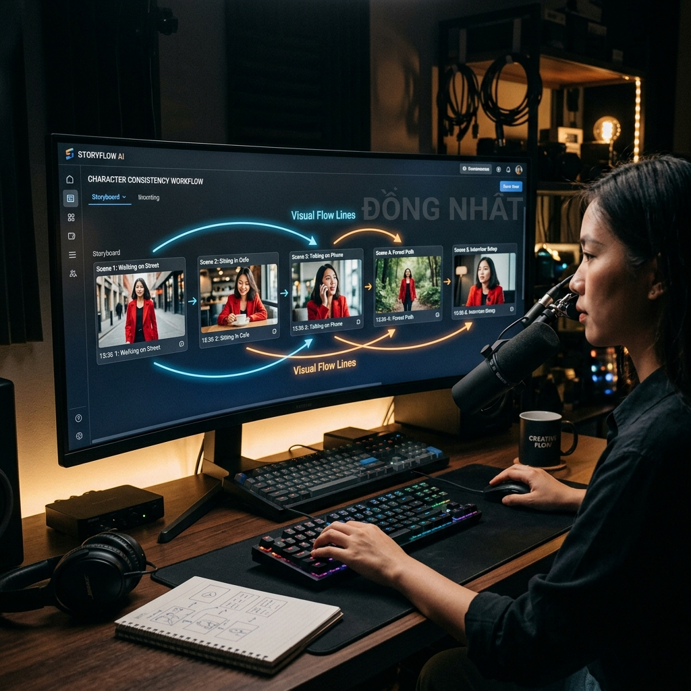
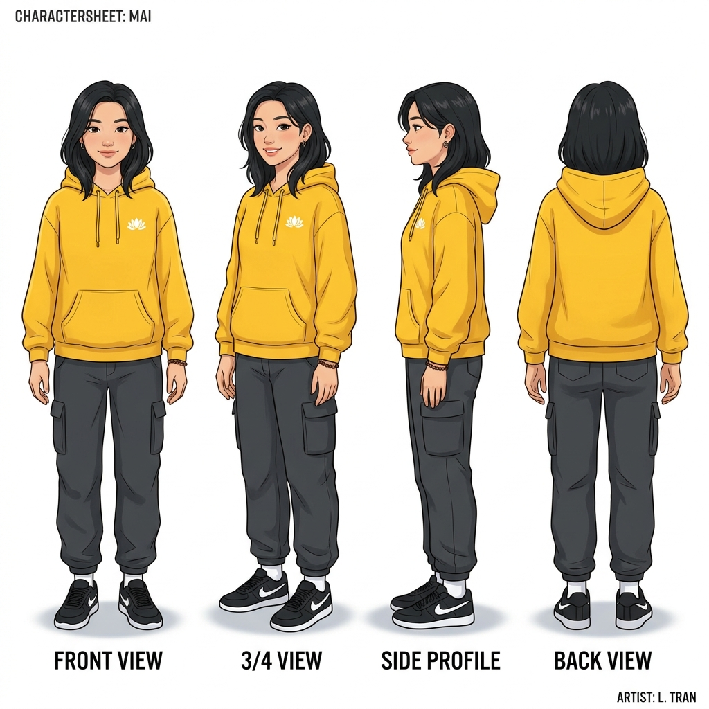
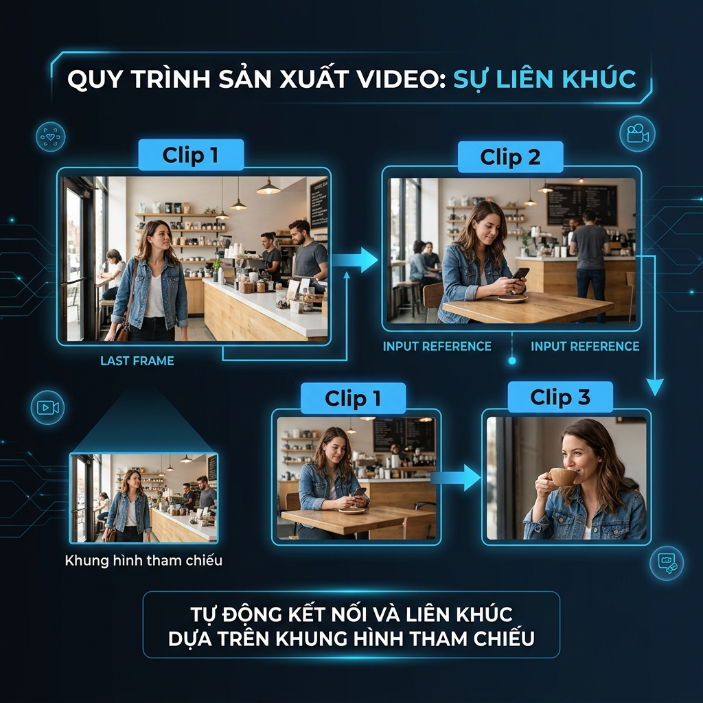

# Cách Tạo Video AI Dài Đồng Nhất Nhân Vật (Consistency Workflow 2026)

*Quy trình duy trì Character Consistency — thách thức lớn nhất khi tạo video dài bằng AI.*

Nếu bạn từng thử tạo một bộ phim ngắn hoặc video review bằng AI, bạn chắc chắn đã gặp tình cảnh này: Cảnh đầu tiên nhân vật mặc áo khoác đỏ, tóc ngắn. Sang cảnh thứ hai, áo tự nhiên biến thành áo thun, còn nhân vật trông như một người hoàn toàn khác. 

Trong năm 2026, các model AI không có "trí nhớ" bẩm sinh giữa các lần tạo (generation) khác nhau. Tuy nhiên, bằng cách áp dụng một **Workflow Sản Xuất Tiêu Chuẩn**, bạn hoàn toàn có thể "khóa" danh tính nhân vật xuyên suốt hàng chục cảnh quay. 

Bài viết này sẽ hướng dẫn bạn quy trình "Character Consistency" (Đồng nhất nhân vật) áp dụng cho các top model hiện nay như Kling 3.0 và Veo 3, thực hiện dễ dàng ngay trên Trạm Sáng Tạo.

---

## Bạn Sẽ Đạt Được Gì Sau Bài Viết Này?

*   Hiểu rõ cơ chế "Character DNA" để quản lý nhân vật xuyên suốt video.
*   Nắm được kỹ thuật "Chaining" (Bắc cầu) giúp kết nối mượt mà các chuỗi hành động.
*   Biết cách phân chia Prompt: tách biệt *nhận diện (identity)* và *hành động (action)*.
*   Áp dụng thực tế để tạo ra video dài từ 30s đến 2 phút mà nhân vật không bị "biến dạng" (drift).

**Chuẩn bị:** Bạn cần có quyền truy cập vào công cụ tạo ảnh AI (để tạo ảnh gốc) và video AI (khuyên dùng Kling 3.0 hoặc Veo 3.1). Các trượng hợp đề cập đều thao tác trên hệ thống [Trạm Sáng Tạo](https://tramsangtao.com).

---

## Bước 1: Xây Dựng "Character DNA" (ADN Nhân Vật)

Nguyên tắc đầu tiên và quan trọng nhất: **Đừng để công cụ AI Video tự tưởng tượng ra nhân vật của bạn ở bước đầu tiên.**

Bạn phải tạo ra một "Bản thiết kế" chuẩn xác trước khi bắt tay vào tạo làm chuyển động.

### Tạo Character Sheet Bằng Ảnh Tĩnh

Hãy sử dụng một mô hình Text-to-Image mạnh (như FLUX 2 Pro hoặc Nano Banana Pro) để tạo ra **Character Sheet** (Bảng thiết kế nhân vật).

*Một Character Sheet tiêu chuẩn: Chính diện, 3/4, Góc nghiêng và Sau lưng.*

**Prompt tạo Character Sheet mẫu:**
> *"Character design sheet of a young Vietnamese woman, 25 years old. She holds a consistent appearance: wearing a distinctive oversized yellow hoodie, shoulder-length straight black hair, minimal makeup. White studio background, multiple angle views (front, side, 3/4, back), clean lighting."*

### Chốt "Văn Bản Nhận Diện" (Verbatim Description)

Lưu lại một đoạn mô tả cực kỳ chính xác về nhân vật. Ví dụ:
*   *"A 25-year-old Vietnamese woman, shoulder-length straight black hair, wearing an oversized yellow hoodie."*

Đoạn văn này sẽ là bất di bất dịch. Dù nhân vật đi đâu, làm gì, đoạn văn này **bắt buộc** phải xuất hiện ở đầu mọi Prompt tạo video sau này. Nếu bạn đổi "yellow hoodie" thành "yellow jacket", AI sẽ coi đó là người khác.

---

## Bước 2: Kỹ Thuật "Bắc Cầu" (Chaining Workflow)

Quá trình làm video dài thực chất là việc kết nối các clip ngắn (từ 5s đến 15s) lại với nhau. AI coi mỗi clip là một nhiệm vụ độc lập, vì vậy bạn cần dùng hình ảnh kết thúc của clip trước làm hình ảnh bắt đầu cho clip sau. Kỹ thuật này gọi là **Chaining**.

*Sơ đồ Kỹ thuật Chaining: Khung hình cuối của Clip 1 là Đầu vào của Clip 2.*

### Cách Thực Hiện Chaining:

1.  **Shot Khởi Đầu (Thiết lập):** Cung cấp *Ảnh chân dung* trong Character Sheet làm tham chiếu. Yêu cầu hành động: "The woman opens the cafe door and walks inside."
2.  **Lấy Khung Hình Chuẩn Phân Cảnh (Reference Frame):** Trích xuất khung hình cuối cùng rõ nét nhất của clip vừa tạo.
3.  **Shot Tiếp Theo (Tiếp nối):** Upload *Reference Frame* đó thành ảnh đầu vào cho lợt Gen thứ 2. Yêu cầu hành động: "The woman sits down at a table by the window, maintaining the exact clothing."

Bằng cách dùng ảnh từ video vừa tạo ra cung cấp lại cho hệ thống, bạn ép mô hình AI lấy cấu trúc khuôn mặt và nếp nhăn quần áo từ chính phân cảnh trước, hạn chế tối đa việc "trôi dạt" (drift) thiết kế.

---

## Bước 3: Tách Biệt "Nhận Diện" và "Hành Động" Trong Prompt

Lỗi sai số 1 của người mới là viết chung Hành Động và Nhân Vật vào một câu lộn xộn. Hãy dùng cấu trúc chuẩn sau cho mọi shot, kết hợp cùng tính năng **Image-to-Video**:

### Công Thức Prompt Chuẩn

`[Văn bản Nhận diện] + [Hành động Cụ Thể] + [Góc Máy/Camera] + [Môi trường]`

**Ví dụ thực tế:**
*   **[Verbatim Identity]:** *"A 25-year-old Vietnamese woman with shoulder-length straight black hair, wearing an oversized yellow hoodie."*
*   **[Action]:** *"She is actively typing on a silver laptop, looking focused."*
*   **[Camera]:** *"Medium close-up shot, slow pan to the right."*
*   **[Environment]:** *"In a dimly lit cyber cafe with neon blue lights in the background."*

Khi ghép lại, bạn có một prompt rành mạch. Nếu cảnh sau cô ấy đứng dậy uống cà phê, bạn **giữ nguyên phần Identity**, thay đổi phần Action và Camera.

> **💡 Mẹo Nhỏ:** Hãy tận dụng tính năng **Character ID (của Kling 3.0)** hoặc **Ingredients to Video (của Veo 3)**. Thay vì chỉ viết chữ, bạn upload thẳng Character Sheet vào mục tham chiếu nâng cao. Hệ thống sẽ trích xuất (embed) khuôn mặt này áp lên mọi diễn viên ảo mà nó sinh ra.

---

## Troubleshooting: Điều Gì Xảy Ra Nếu Nhân Vật Bị "Gãy"?

Ngay cả khi làm đúng 100%, thỉnh thoảng AI vẫn tạo ra một bàn tay dị dạng hay khuôn mặt hơi sai lệch do yếu tố ngẫu nhiên (seed) trong quá trình diffusion. 

1.  **Đừng viết lại prompt liên tục:** Nếu mặt bị lệch, thử roll (gen) lại cùng prompt đó 2-3 lần (đổi seed mặc định). Thường thì lần thứ 2-3 sẽ ổn.
2.  **Sử dụng Góc Máy Khác (Cutaways):** Giống như phim điện ảnh, không phải lúc nào camera cũng chĩa thẳng vào mặt nhân vật. Nếu cảnh quay đi dạo bị fail, hãy chèn một cảnh quay đặc tả đôi giày đang bước đi, hoặc quay từ sau lưng nhân vật.
3.  **Hậu Kỳ:** Đừng cố ép AI hoàn thiện. Những lỗi nhỏ về ánh sáng có thể fix bằng Capcut hoặc Premiere. Bạn là đạo diễn, AI chỉ là người quay phim.

---

## Tóm Lại: Workflow Mẫu Dành Cho Creator

1.  Tạo **1 Ảnh Gốc Thật Đẹp** (bằng FLUX 2 Pro, Nano Banana). Tốt nhất là tạo 1 Character Sheet toàn diện.
2.  Lên kịch bản: Chia video dài thành **5-6 phân cảnh ngắn (shot)**.
3.  Mở [Trạm Sáng Tạo - Video AI](https://tramsangtao.com/video), chọn **Kling 3.0** (nếu cần tương tác vật lý phức tạp/thời lượng 15s) hoặc **Veo 3.1** (nếu cần độ nét điện ảnh và khớp tiếng).
4.  Dùng tính năng Image-to-Video.
5.  Thực hiện kỹ thuật **Chaining** (Bắc cầu ảnh) kết hợp với cấu trúc prompt Identity tách rời.
6.  Ghép nối các đoạn ngắn lại bằng Capkut hoặc ứng dụng dựng phim.

Với hệ thống cấp credits tối ưu, một bộ phim AI ngắn 1 phút (cần gen khoảng 8-10 clip nháp) tại Trạm Sáng Tạo chỉ tiêu tốn của bạn chưa tới 150 Credits.

> **Thực Hành Ngay:** Tạo nhân vật của bạn bằng [Hệ thống tạo Ảnh AI](https://tramsangtao.com/image), sau đó đưa vào không gian [Tạo Video AI](https://tramsangtao.com/video) với Kling 3.0. Dùng gói trải nghiệm để nắm bắt nhịp điệu Chaining đỉnh cao của năm 2026!

---

## Bài Viết Liên Quan

*   [Cách Tạo Video AI Từ Ảnh: Hướng Dẫn Từng Bước (2026)](/drafts/cach-tao-video-ai-tu-anh)
*   [Veo 3 Review: Ưu Nhược Điểm của "Át Chủ Bài" Từ Google](/drafts/veo3-review)
*   [Kling AI Review: Cập Nhật 3.0 — Quái Vật Video AI Mạng Xã Hội](/drafts/kling-ai-review)
*   [Cách Vận Dụng Góc Máy Cinematic Trong AI Video Generator] (Đang cập nhật)
